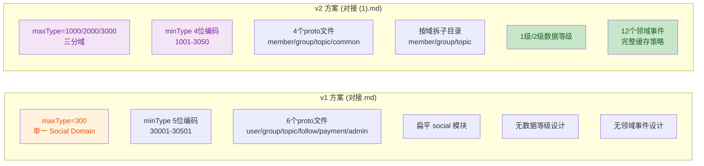

# 社交域设计方案评审报告

> **评审日期**: 2026-06-15
> **评审人**: Trae (AI Code Reviewer)
> **评审范围**:
> - [basemodel.md](../tabbit/inbox/2026/06/basemodel.md) — 基础数据模型（users/groups/topics DDL）
> - [tabbit_项目主控与Trae开发指导对接.md](../tabbit/inbox/2026/06/tabbit_项目主控与Trae开发指导对接.md) — 社交 App 设计方案 v1
> - [tabbit_项目主控与Trae开发指导对接 (1).md](../tabbit/inbox/2026/06/tabbit_项目主控与Trae开发指导对接 (1).md) — 社交 App 设计方案 v2（含数据等级设计）
> **参考资产**:
> - [协议编号注册表](../../api/协议编号注册表.md)
> - [CODE-WIKI](../../wiki/CODE-WIKI.md)
> - [ADR-0007 服务商后台与用户中台边界](../../../adr/ADR-0007-服务商后台与用户中台边界.md)
> - [PRD-02 终端用户中台系统](../../../prd/PRD-02-终端用户中台系统.md)
> - routes.yaml 路由配置
> - proto/ 目录现有结构

---

## 一、评审结论

### 总体评价：建议修改后通过

三份文档整体设计思路清晰，数据等级划分（1级/2级）合理，社交关系三层拆分（关注/群成员/内容互动）符合领域建模最佳实践。单网关 + MessagePacket + Protobuf 的架构约束遵循正确。

但存在 **3 个必须修改项**（协议编号冲突、两版方案不一致未收敛、忽略已有预留模块）和 **5 个建议修改项**，详见下文。

---

## 二、符合要求的部分

| 评价维度 | 说明 |
|---------|------|
| 数据等级设计 | 1级（强一致主数据）/ 2级（最终一致派生数据）的划分逻辑自洽，"2级数据必须能从1级重建"的原则正确 |
| 社交关系三层拆分 | user_follows / group_members / topic_reactions 三表分离，不混用，符合社交域建模最佳实践 |
| 单网关架构约束 | 明确所有业务请求走 POST /api/hello + MessagePacket + Protobuf，不新增绕过网关的 REST 接口 |
| 权限统一原则 | 提出 PermissionService 统一权限判断，不允许 handler 散写权限逻辑 |
| 缓存策略分级 | 1级用 Cache Aside + 主动失效，2级用事件驱动 + TTL 兜底，策略区分合理 |
| 高权限操作审计 | 要求审计日志 + 领域事件 + 缓存失效 + 通知四件套，完整 |
| 基础模型复用 | 基于 basemodel.md 已有 users/groups/topics 扩展，不推翻重做 |
| OpenAPI 设计 | 使用 x-cairobot-protocols 扩展字段描述逻辑协议映射，不破坏单网关架构 |
| MVP 分期建议 | P0/P1/P2 优先级划分合理，第一期聚焦核心闭环 |

---

## 三、必须修改项

### 必须修改 #1：协议编号与注册表分配范围严重冲突（P0）

**问题详情：**

v1 方案（对接.md）提议 maxType = **300**，v2 方案（对接 (1).md）提议 maxType = **1000 / 2000 / 3000**。

但现有 [协议编号注册表](../../api/协议编号注册表.md) 已明确分配以下范围：

| 编号范围 | 注册表定义用途 | v2 方案占用 | 冲突？ |
|---------|--------------|-----------|-------|
| 1000–1999 | **通用基础协议** | 成员协议组 1000 | **严重冲突** |
| 2000–2999 | **系统、健康检查、网关基础能力**（2100 已被 health/hello 占用） | 群组协议组 2000 | **严重冲突** |
| 3000–3999 | **认证与权限** | 主题协议组 3000 | **严重冲突** |
| 5000–5999 | **终端用户中台系统** | 未使用 | ✅ 推荐 |
| 9000–9999 | **App、Web 前端交互协议** | 未使用 | ✅ 备选 |

v1 方案的 maxType=300 虽然不在已分配范围内，但数值过小，不符合注册表的分段规划习惯，且未来扩展空间不足。

**修复建议：**

```text
推荐方案：使用 5000-5999 段（终端用户中台系统）

成员协议组：maxType = 5000
群组协议组：maxType = 5100
主题协议组：maxType = 5200

备选方案：使用 9000-9999 段（App/Web前端交互协议）

成员协议组：maxType = 9000
群组协议组：maxType = 9100
主题协议组：maxType = 9200
```

v1 和 v2 两份方案必须**收敛为同一个编号方案**，并在 [协议编号注册表](../../api/协议编号注册表.md) 中正式登记。

**涉及文件：**
- [tabbit_项目主控与Trae开发指导对接.md](../tabbit/inbox/2026/06/tabbit_项目主控与Trae开发指导对接.md) 第 377-411 行
- [tabbit_项目主控与Trae开发指导对接 (1).md](../tabbit/inbox/2026/06/tabbit_项目主控与Trae开发指导对接 (1).md) 第 33-107 行

---

### 必须修改 #2：两个版本方案存在重大分歧且未说明取舍（P0）

**问题详情：**

存在两份设计方案文件，核心分歧如下：

| 分歧点 | v1（对接.md） | v2（对接 (1).md） |
|-------|-------------|------------------|
| maxType | 300（单一域） | 1000/2000/3000（三分域） |
| minType 编码 | 5 位数字（30001） | 4 位数字（1001） |
| 数据等级设计 | 未涉及 | 核心设计（1级/2级） |
| 领域事件 | 未涉及 | 详细设计（12 个事件） |
| 缓存 Key 规范 | 未涉及 | 完整设计（20+ 缓存 key） |
| 协议文件划分 | 6 个 proto 文件 | 4 个 proto 文件 |
| Go 模块目录 | go/modules/social（扁平） | go/modules/social（按 member/group/topic 拆子目录） |
| PRD 撰写指令 | 有（第十三节） | 更详细（第十节） |

两份文件同时存在于收件箱，没有标注哪份是最终版、哪份是废弃稿。Trae 开发时无法判断以哪个为准。

**修复建议：**

1. 确认 v2（对接 (1).md）为最终版本（因其包含更完整的数据等级、缓存、事件设计）
2. 将 v1 标记为 `~deprecated` 或移至 `docs/drafts/`
3. 或将两份合并为一份最终方案文档，明确注明每个决策的取舍理由

**涉及文件：**
- [tabbit_项目主控与Trae开发指导对接.md](../tabbit/inbox/2026/06/tabbit_项目主控与Trae开发指导对接.md) 全文
- [tabbit_项目主控与Trae开发指导对接 (1).md](../tabbit/inbox/2026/06/tabbit_项目主控与Trae开发指导对接 (1).md) 全文

---

### 必须修改 #3：忽略项目已有预留模块和 Tars 骨架（P0）

**问题详情：**

两份方案均完全未提及 [CODE-WIKI](../../wiki/CODE-WIKI.md) 中已有的预留模块规划：

| CODE-WIKI 预留模块 | 计划阶段 | 与社交域的关系 |
|-------------------|---------|--------------|
| `go/modules/users` | MVP2 | 用户账号模块，社交域的直接依赖 |
| `go/modules/auth` | MVP2 | 认证模块，Token/权限校验的基础 |
| `go/modules/groups` | MVP2 | 群组模块，社交域的核心 |
| `go/modules/topics` | MVP2 | 主题/帖子模块，社交域的核心 |
| `go/modules/readonly` | MVP2 | 只读服务，可能承载 2级数据查询 |

同时，proto/generated/tarsgo/ 目录下已有 Tars 应用骨架：

- `CaiRobotAuthApp/` — 认证服务骨架
- `CaiRobotUserCenterApp/` — 用户中心骨架

方案中提议新建 `go/modules/social/` 并在下面按 member/group/topic 拆子模块，但这与已有的 users/auth/groups/topics 预留模块存在**职责重叠或包含关系**。

**修复建议：**

1. 在方案中明确说明社交域模块与已有预留模块的关系：
   - 方案 A：社交域作为独立新模块 `go/modules/social/`，内部复用 users/auth 的接口
   - 方案 B：直接在预留模块 `go/modules/users`、`go/modules/groups`、`go/modules/topics` 上扩展社交能力
   - 方案 C：社交域作为协调层，调用底层 users/groups/topics 模块
2. 说明 `CaiRobotAuthApp` 和 `CaiRobotUserCenterApp` 骨架是否需要改造或废弃重建
3. 在 PRD 中补充"模块依赖关系图"，避免后续实现时出现模块边界纠纷

**涉及文件：**
- [CODE-WIKI](../../wiki/CODE-WIKI.md) 中"预留模块"章节
- [tabbit_项目主控与Trae开发指导对接.md](../tabbit/inbox/2026/06/tabbit_项目主控与Trae开发指导对接.md) 第四节水"业务域模块拆分建议"
- [tabbit_项目主控与Trae开发指导对接 (1).md](../tabbit/inbox/2026/06/tabbit_项目主控与Trae开发指导对接 (1).md) 第六节"架构关系设计"

---

## 四、建议修改项

### 建议修改 #1：basemodel.md 中 topics 表的 `type` 字段语义需与方案对齐

**问题详情：**

[basemodel.md](../tabbit/inbox/2026/06/basemodel.md) 第 125 行定义 `topics.type tinyint(4) DEFAULT '1'`，无注释说明枚举值含义。v1 方案第 88 行建议 type 为"普通帖/问答帖/公告帖/付费帖/图文帖"，v2 方案未单独讨论 type 枚举。

同时 basemodel.md 中 `groups.type`（第 67 行）默认值为 `'free'`，v1 方案第 53-58 行建议枚举为 free/paid/mixed/invite，两者基本一致但需正式确认。

**建议：** 在 PRD 中明确定义 `topics.type` 和 `groups.type` 的完整枚举值映射表，写入 ADR 或数据字典。

---

### 建议修改 #2：v1 方案的 Protobuf 包路径与项目规范不一致

**问题详情：**

v1 方案第 434 行定义：

```protobuf
option go_package = "github.com/jimiechen/cairobotmvp/proto/generated/go/social/v1;socialv1";
```

但项目实际 Go module path 需要确认是否为 `github.com/jimiechen/cairobotmvp`。应检查 `go/work` 或各模块 `go.mod` 中的实际 module path。

**建议：** 统一引用项目实际的 go_module_root，不要硬编码可能错误的路径。

---

### 建议修改 #3：缺少与 PRD-02 终端用户中台系统的边界说明

**问题详情：**

[PRD-02-终端用户中台系统](../../../prd/PRD-02-终端用户中台系统.md) 已经定义了用户中台的范围和边界。社交域的用户注册、登录、资料管理功能可能与用户中台存在重叠。

[ADR-0007-服务商后台与用户中台边界](../../../adr/ADR-0007-服务商后台与用户中台边界.md) 定义了服务商后台与用户中台的边界划分，社交域需要类似的一份 ADR 来界定"社交域 vs 用户中台 vs 认证模块"的边界。

**建议：** 新增 `ADR-social-domain-boundary.md`，明确：
- 社交域负责什么（关注/群组/帖子/互动）
- 社交域不负责什么（账号安全/认证授权/用户设备管理 → 归用户中台和认证模块）
- 社交域如何调用用户中台和认证模块的接口

---

### 建议修改 #4：支付流程设计过于简化，缺少风控和异常处理

**问题详情：**

v1 方案第 189-219 行和 v2 方案第 823-843 行描述了付费群组的订单支付流程，但缺少以下关键环节：

1. **支付渠道对接**：pay_channel 字段存在但未说明对接哪些渠道（微信/支付宝/苹果 IAP？）
2. **重复支付处理**：用户多次点击支付的处理策略
3. **退款流程**：group_orders.status 含 refunded 但无退款操作协议设计
4. **金额校验**：前端传入的 amount_cent 如何防止篡改
5. **并发安全**：同一用户同时创建多个订单的防重机制
6. **权益续期**：用户再次购买同群组时的续期 vs 新购策略

**建议：** 支付相关功能在 MVP 第一期可考虑降级为"管理员手动开通权益"（即去掉 CreateGroupOrder/ConfirmGroupPayment 自动化支付），先聚焦社交核心闭环。或在 PRD 中补充支付子系统的独立设计文档。

---

### 建议修改 #5：测试验收标准不够具体，缺少负面用例

**问题详情：**

v1 方案第十二节"验收清单"和 v2 方案第十一节"验收标准"列出了验收项，但均为定性描述（如"权限合规"），缺少具体的测试场景。

根据项目 [TDD 规则](../../../../.trae/rules/tdd.md) 和 [测试规则](../../../../.trae/rules/testing.md)，需要补充：

**必须有的负面测试用例：**

| 场景 | 输入 | 期望输出 |
|-----|------|---------|
| 无 Token 访问付费帖子 | 有效 topic_id，无 token | 401/403 + 购买提示 |
| 过期付费会员访问 | 有效 token 但 expired_at < now | 403 + 续费提示 |
| 非圈主尝试管理成员 | 普通 user_id 操作 group_members | 403 无权限 |
| 自己关注自己 | follower_id == following_id | 400 参数错误 |
| 重复加入已加入群组 | user_id 已在 group_members | 409 已存在 |
| 并发点赞取消竞态 | 同时发送 ReactTopic + CancelReactTopic | 最终状态确定（乐观锁 or 幂等） |
| 删除帖子后评论 | topic status = deleted，创建评论 | 403/404 帖子不存在 |
| 超额群组加入 | groups.max_members = 100，第101人加入 | 配额满拒绝 |

**建议：** 在 PRD 中按上述格式补充完整的验收测试矩阵，覆盖正常路径和异常路径。

---

## 五、文档缺口

| 缺失文档 | 重要性 | 说明 |
|---------|-------|------|
| 社交域边界 ADR | 必须 | 界定社交域 vs 用户中台 vs 认证模块的职责边界 |
| 数据等级 ADR | 必须 | v2 方案的核心设计决策，需要正式 ADR 记录 |
| 社交域 ER 图 | 建议 | 新增 11 张表与已有 3 张表的完整关系图 |
| 协议时序图 | 建议 | 核心流程（关注/入群/阅读付费帖/支付）的完整时序图 |
| 错误码定义 | 建议 | 社交域专用错误码段分配 |
| 数据迁移计划 | 建议 | 从现有 users/groups/topics 到新增 11 张表的迁移 SQL |

---

## 六、风险提示

| 风险 ID | 风险等级 | 风险描述 | 影响 | 建议处理方式 |
|--------|---------|---------|------|------------|
| R01 | R0 | 协议编号冲突未解决，无法开始开发 | 阻塞全部协议定义工作 | 必须先确认使用 5000-5999 或 9000-9999 段 |
| R02 | R1 | 两版方案未收敛，开发无从依据 | 可能导致实现偏离 | 必须合并为唯一最终版 |
| R03 | R1 | 社交域与预留模块（users/auth/groups/topics）关系不清 | 可能导致代码结构返工 | 必须明确模块归属方案 |
| R04 | R2 | 支付流程复杂度高，MVP 范围可能膨胀 | 可能延期交付 | 建议首期简化为手动开通 |
| R05 | R2 | 11 张新增表的迁移和初始化数据策略缺失 | 可能影响环境部署 | 需补充 migration SQL |
| R06 | R3 | Proto 文件从 0 到 20+ 个 message 的生成和验证工作量较大 | 可估偏差 | 可分批交付 proto 定义 |

---

## 七、两版方案对比总结



| 对比维度 | v1 方案 | v2 方案 | 推荐采用 |
|---------|---------|---------|---------|
| 数据等级设计 | 无 | 完整（1级/2级） | **v2** |
| 领域事件设计 | 无 | 12 个事件 + 驱动链路 | **v2** |
| 缓存策略 | 无 | 20+ key + TTL + 失效策略 | **v2** |
| maxType 编号 | 300（低值但无冲突） | 1000/2000/3000（**有冲突**） | 都需修改 |
| Proto 文件粒度 | 6 文件（较细） | 4 文件（较粗） | **v1 的粒度思路** + v2 的域名 |
| 模块目录结构 | 扁平 | 按域拆子目录 | **v2** |
| PRD 指令详细度 | 有 | 更完整 | **v2** |
| 权限设计 | 有 | 更完整（+ 数据等级约束） | **v2** |

**综合建议：以 v2 为基础框架，采纳 v1 的 proto 文件粒度思路，修正协议编号，补齐缺口。**

---

## 八、最终建议

### 立即执行（阻塞后续开发）

1. **确认协议编号段** → 使用 5000-5999 或 9000-9999，更新两份方案
2. **合并两份方案为唯一最终版** → 废弃 v1 或标注 deprecated
3. **明确社交域与预留模块的关系** → 新增 ADR 界定边界

### PRD 撰写前完成

4. 补充社交域 ER 图（14 张表关系）
5. 补充错误码段分配
6. 补充核心流程时序图（至少 4 个）
7. 确定支付模块是否纳入 MVP 首期

### Trae 开发前完成

8. 更新 [协议编号注册表](../../api/协议编号表.md) 登记社交域全部 max/min
9. 新增 `docs/adr/ADR-social-data-level-and-cache-strategy.md`
10. 新增 `docs/adr/ADR-social-domain-boundary.md`
11. 新增 `docs/prd/PRD-social-app-mvp.md`

---

*本报告由 Trae 依据 [.trae/rules/review.md](../../../../.trae/rules/review.md) 评审规则生成*
