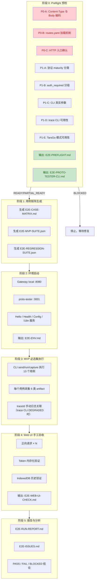

# CaiRobot MVP E2E 验收实施方案（V3 最终版）

> **文档版本**：V3
> **基于**：三轮评审反馈合并修订
> **产物目录**：`docs/reports/testing/e2e-acceptance/`
> **状态**：待主控确认后执行

***

## 一、评审历程与修订总览

### 1.1 三轮评审问题清单

| 轮次 | 问题编号  | 问题摘要                                                                  | 处理状态                                           |
| -- | ----- | --------------------------------------------------------------------- | ---------------------------------------------- |
| R1 | R1-01 | routes.yaml 双副本不一致，Gateway 内嵌副本包名错误、缺 6000 段路由                        | V2 已修复 → V3 进一步修正措辞                            |
| R1 | R1-02 | auth\_required 未纳入用例设计，Config/I18n 正向用例缺 Token 前置条件                   | V2 已修复                                         |
| R1 | R1-03 | 协议 maturity（草案 vs 已启用）未区分，草案协议直接标 P0 不稳                               | V2 已修复                                         |
| R1 | R1-04 | E2E-017 TarsGoInvoker 用例缺前提条件                                         | V2 已修复（conditional 型）                          |
| R1 | R1-05 | 22 个用例单次验收偏多                                                          | V2 已修复（MVP 12 + 回归 27）                         |
| R1 | R1-06 | HTTP 入口未验证是否真实存在 POST /api/hello                                      | V2 已修复                                         |
| R1 | R1-07 | invalidate 事件用例缺少触发方式                                                 | V2 已修复                                         |
| R1 | R1-08 | 产物目录 `docs/e2e-acceptance/` 不符合 docs 规范                               | V2 已修复为 `docs/reports/testing/e2e-acceptance/` |
| R1 | R1-09 | CLI 参数为占位符，需以 --help 为准                                               | V2 已修复                                         |
| R2 | R2-01 | **Content-Type 未明确**：Gateway 强制 `application/octet-stream`，方案仍假设 JSON | V3 已修复                                         |
| R2 | R2-02 | **trace CLI 当前退化**：exit code 4，API 未就绪（T8 pending）                    | V3 已修复                                         |
| R2 | R2-03 | **routes.yaml 加载机制描述不准确**：非内嵌，是文件系统读取 + 环境变量覆盖                        | V3 已修复                                         |

### 1.2 项目事实基线（已通过代码验证）

以下事实均从项目实际代码中提取，不再依赖推测：

| #    | 事实项                     | 实际值                                                                               | 证据来源                                                                                                                                |
| ---- | ----------------------- | --------------------------------------------------------------------------------- | ----------------------------------------------------------------------------------------------------------------------------------- |
| F-01 | Gateway HTTP 入口         | `POST /api/hello`                                                                 | [http\_server.go:50](go/gateway/proto-gateway/internal/server/http_server.go#L50)                                                   |
| F-02 | Gateway Content-Type 要求 | **必须** `application/octet-stream`，否则返回 **415**                                    | [http\_server.go:40-44](go/gateway/proto-gateway/internal/server/http_server.go#L40-L44)                                            |
| F-03 | HTTP body 编码            | Protobuf binary `MessagePacket`（`proto.Marshal`）                                  | [message\_packet.go:117](go/gateway/proto-gateway/internal/adapter/message_packet.go#L117)                                          |
| F-04 | MessagePacket.data 类型   | `bytes`（Protobuf bytes 字段）                                                        | [message.proto:35](proto/base/message.proto#L35)                                                                                    |
| F-05 | traceId 来源              | `packet.Extend["traceId"]`；缺失时 Gateway 自动生成 UUID v4                               | [message\_packet.go:66-74](go/gateway/proto-gateway/internal/adapter/message_packet.go#L66-L74)                                     |
| F-06 | routes.yaml 加载机制        | `os.ReadFile(path)` 从文件系统读取                                                       | [routes.go:42](go/gateway/proto-gateway/internal/config/routes.go#L42)                                                              |
| F-07 | routes.yaml 默认路径        | `configs/gateway/routes.yaml`                                                     | [main.go:26](go/gateway/proto-gateway/cmd/server/main.go#L26)                                                                       |
| F-08 | routes.yaml 覆盖方式        | `GATEWAY_ROUTES_PATH` 环境变量                                                        | [routes.go:61-66](go/gateway/proto-gateway/internal/config/routes.go#L61-L66)                                                       |
| F-09 | 开发副本路径                  | `go/gateway/proto-gateway/configs/gateway/routes.yaml`                            | 仅开发/测试便利副本，非 Go embed                                                                                                               |
| F-10 | 开发副本差异                  | 仅 2 条路由（Health + Hello），Hello 的 proto 包名错误指向 health 包                             | 与主配置对比                                                                                                                              |
| F-11 | Invoker 切换方式            | `GATEWAY_INVOKER_MODE` 环境变量：`local`（默认）/ `tars`（未实现，直接 os.Exit(1)）                | [main.go:15-18](go/gateway/proto-gateway/cmd/server/main.go#L15-L18) + [invoker.go](go/gateway/proto-gateway/tarsclient/invoker.go) |
| F-12 | TarsGoInvoker 状态        | `Invoke()` 固定返回 `(10500, nil, errors.New("tars invoker is not implemented yet"))` | [invoker.go](go/gateway/proto-gateway/tarsclient/invoker.go)                                                                        |
| F-13 | protocols.json 路径       | `typescript/proto-tester/src/data/protocols.json`                                 | 存在，14 条协议条目                                                                                                                         |
| F-14 | 协议 maturity 分布          | 已启用 2 条（Health 2097/2098）；草案 12 条（Hello + Config/I18n 全部）                         | protocols.json status 字段                                                                                                            |
| F-15 | auth\_required 分布       | 4 条 true（GetAppConfigs/AppConfigVersion/GetLangPack/GetLangDifference）；4 条 false  | [routes.yaml](configs/gateway/routes.yaml)                                                                                          |
| F-16 | proto-tester 默认端口       | `127.0.0.1:3001`                                                                  | README.md                                                                                                                           |
| F-17 | CLI send 参数             | `--max`, `--min`, `--payload`, `--gateway`, `--token`, `--outputDir`              | [send.ts](typescript/proto-tester/src/cli/commands/send.ts)                                                                         |
| F-18 | CLI run 参数              | `--suite`(必填), `--parallel`, `--env`, `--gateway`                                 | [run.ts](typescript/proto-tester/src/cli/commands/run.ts)                                                                           |
| F-19 | CLI capture 参数          | `--scenario`(必填), `--video`, `--screenshot`                                       | [capture.ts](typescript/proto-tester/src/cli/commands/capture.ts)                                                                   |
| F-20 | CLI trace 参数            | `--id`(必填), `--since`, `--outputDir`                                              | [trace.ts](typescript/proto-tester/src/cli/commands/trace.ts)                                                                       |
| F-21 | trace CLI 当前状态          | **DEGRADED**：后端 `/api/dev/trace` API 未就绪，固定返回 exit code **4**                     | [trace.ts](typescript/proto-tester/src/cli/commands/trace.ts)                                                                       |
| F-22 | proto-tester data 编码    | send.ts 将 payload 做 `JSON.stringify → UTF-8 bytes` 放入 MessagePacket.data          | [send.ts:70](typescript/proto-tester/src/cli/commands/send.ts#L70)                                                                  |
| F-23 | Config admin event      | 有事件构造器和序列化方法，**无 Publish 实现**                                                     | [event.go](go/services/config/admin/event.go)                                                                                       |
| F-24 | I18n admin event        | 定义了 Publisher 接口但**无实现类**（仅有 NoopAuditWriter）                                     | [event.go](go/services/i18n/admin/event.go)                                                                                         |
| F-25 | SDK pubsub 层            | 只有 Subscribe/onMessage 处理逻辑，**无 Publish 方法**；发布需由 admin 层调 Redis PUBLISH          | [pubsub.go](go/services/config/sdk/pubsub.go)                                                                                       |

***

## 二、执行阶段划分



***

## 三、阶段 0：Preflight 预检（详细任务定义）

### 3.1 P0-A：Content-Type 与请求体编码检查

**目标**：确认 Gateway 对 Content-Type 和 body 编码的硬性要求，以及 proto-tester 当前行为是否兼容。

**输入文件**：

* [http\_server.go](go/gateway/proto-gateway/internal/server/http_server.go)

* [message\_packet.go](go/gateway/proto-gateway/internal/adapter/message_packet.go)

* [message.proto](proto/base/message.proto)

* [send.ts](typescript/proto-tester/src/cli/commands/send.ts)

* proto-tester `src/lib/messagePacket*`

**输出字段**：

```yaml
contentTypeCheck:
  requiredContentType: application/octet-stream          # 预期值
  unsupportedStatusCode: 415                              # 预期值
  evidenceFile: go/gateway/proto-gateway/internal/server/http_server.go
  evidenceLine: ~40-44                                    # 实际行号

bodyEncoding:
  requestBodyFormat: protobuf binary MessagePacket         # 预期值
  unmarshalMethod: proto.Unmarshal                         # 预期值
  marshalMethod: proto.Marshal                             # 预期值
  messagePacketProtoPath: proto/base/message.proto
  dataType: bytes                                         # .proto 定义

protoTesterEncoding:
  setsOctetStreamHeader: true/false                       # 待确认
  protobufSerializesMessagePacket: true/false             # 待确认
  payloadEncodingInData: "json-string-utf8-bytes" or "protobuf-message-bytes"  # 待确认
  compatibleWithGateway: true/false/BLOCKED               # 待确认
  incompatibleAction: "标记所有正向用例 BLOCKED 并给出修复建议"
```

**阻断规则**：

* 如果 proto-tester 发送 `Content-Type: application/json` 或 JSON body → **BLOCKED**，所有正向用例暂停，先修复 proto-tester 发送逻辑

* 如果 proto-tester data 使用 JSON-string-bytes 而 Gateway 下游期望 protobuf-message-bytes → 标记 **E2E-REG-025 为 P0 FAIL**，给出修复建议

***

### 3.2 P0-B：routes.yaml 加载机制与一致性检查

**目标**：确认 Gateway 配置加载的真实机制，消除"内嵌配置"的误导描述。

**输入文件**：

* [main.go](go/gateway/proto-gateway/cmd/server/main.go)

* [routes.go](go/gateway/proto-gateway/internal/config/routes.go)

* \[configs/gateway/routes.yaml]（主配置）

* \[go/gateway/proto-gateway/configs/gateway/routes.yaml]（开发副本）

* Makefile、CI 配置（如有）

**输出字段**：

```yaml
gatewayRoutesLoading:
  mechanism: os.ReadFile(path)           # 文件系统读取
  defaultPath: configs/gateway/routes.yaml
  overrideEnvVar: GATEWAY_ROUTES_PATH
  runtimeSource: filesystem              # 非 Go embed
  goEmbed: false

developmentCopy:
  path: go/gateway/proto-gateway/configs/gateway/routes.yaml
  usage: "仅作为开发/测试便利副本，除非 GATEWAY_ROUTES_PATH 指向它，否则不应作为运行时配置来源"
  routeCount: 2                          # Health + Hello
  missingRoutes: ["6000 段 Config/I18n 全部 6 条"]
  helloProtoPackageError: "request_proto/response_proto 错误指向 com.mineplanet.pojo.health 而非 hello"

consistencyRisk:
  level: P2                              # 只要 CI/Makefile 使用默认主配置，不直接阻断
  mitigation: "CI 和 Makefile 应显式锁定使用 configs/gateway/routes.yaml"

thisRunConfig:
  gatewayRoutesPathEnvSet: true/false    # 本轮启动是否设置 GATEWAY_ROUTES_PATH
  thisRunActualPath:                     # 本轮实际使用的路径
  thisRunRouteCount:                     # 本轮实际加载的路由数
```

**判定规则**：

1. 使用默认 `configs/gateway/routes.yaml` 且完整 → 继续
2. `GATEWAY_ROUTES_PATH` 指向开发副本且缺 6000 段路由 → Config/I18n 用例 **BLOCKED**
3. Makefile/CI 使用开发副本 → 上升为 **P1 风险**

**差异表模板**：

| command\_name      |   max:min | 主配置存在 | 开发副本存在 | request\_proto 一致 | response\_proto 一致 | auth\_required 一致 | target 一致 | 结论       |
| ------------------ | --------: | ----- | ------ | ----------------- | ------------------ | ----------------- | --------- | -------- |
| ServiceHealthCheck | 2100:2097 | Y     | Y      | Y                 | Y                  | Y                 | Y         | 一致       |
| HelloWorld         | 2100:2101 | Y     | Y      | **N**（包名错误）       | **N**（包名错误）        | Y                 | Y         | 开发副本包名错误 |
| GetAppConfigs      | 6000:6001 | Y     | **N**  | -                 | -                  | -                 | -         | 开发副本缺失   |
| ...                |       ... | ...   | ...    | ...               | ...                | ...               | ...       | ...      |

***

### 3.3 P0-C：Gateway HTTP 入口确认

**目标**：确认 HTTP Server 注册的所有 path、method、body 格式。

**输入文件**：[http\_server.go](go/gateway/proto-gateway/internal/server/http_server.go)

**输出表**：

| Path         | Method | Handler               | Body Format                                  | Auth Location                                      | TraceId Source                                | Evidence               |
| ------------ | ------ | --------------------- | -------------------------------------------- | -------------------------------------------------- | --------------------------------------------- | ---------------------- |
| `/api/hello` | POST   | MessagePacket handler | Protobuf binary (`application/octet-stream`) | Bearer Token in Header (for auth\_required routes) | `extend["traceId"]` auto-generated if missing | http\_server.go:L40-77 |

***

### 3.4 P1-D：协议 maturity 分类

**来源**：[protocols.json](typescript/proto-tester/src/data/protocols.json) 的 `status` 字段

**预期分类**：

| Status | 数量 | 协议                                              | 可进入 MVP         | 失败判定                          |
| ------ | -- | ----------------------------------------------- | --------------- | ----------------------------- |
| 已启用    | 2  | ServiceHealthCheck Request+Response (2097/2098) | 是               | FAIL                          |
| 草案     | 12 | HelloWorld + Config(×4) + I18n(×6)              | Handler 已实现时可进入 | Handler 未实现时 BLOCKED，不得判 FAIL |

***

### 3.5 P1-E：auth\_required 分组

**来源**：[routes.yaml](configs/gateway/routes.yaml) 的 `auth_required` 字段

**分组结果**：

| auth\_required | 路由                                                                                          | 正向用例 Token 要求           | 负向用例                                      |
| -------------- | ------------------------------------------------------------------------------------------- | ----------------------- | ----------------------------------------- |
| false          | ServiceHealthCheck (2097), HelloWorld (2101), GetAppLanguage (6003)                         | 不需要，但可携带                | 无需额外负向                                    |
| true           | GetAppConfigs (6001), AppConfigVersion (6009), GetLangPack (6005), GetLangDifference (6007) | **必须携带有效 Bearer Token** | 缺失 Token (→ 401/403)、错误 Token (→ 401/403) |

***

### 3.6 P1-F：CLI 真实参数确认

**已确认的 CLI 参数对照表**（来自源码分析，Trae 执行时以实际 `--help` 输出为准）：

| 子命令     | 关键参数             | 必填    | 说明                                      |
| ------- | ---------------- | ----- | --------------------------------------- |
| send    | `--max`, `--min` | 是     | 协议 maxType/minType                      |
| send    | `--payload`      | 否     | 业务载荷 JSON                               |
| send    | `--gateway`      | 否     | Gateway URL（默认 `http://localhost:8080`） |
| send    | `--token`        | 否     | Bearer Token                            |
| send    | `--outputDir`    | 否     | 输出目录（默认 `./proto-tester-reports`）       |
| run     | `--suite`        | **是** | YAML 用例集文件（`.yaml/.yml`）                |
| run     | `--parallel`     | 否     | 并行度（默认 1）                               |
| capture | `--scenario`     | **是** | 场景 YAML 文件                              |
| capture | `--video`        | 否     | 录屏开关                                    |
| trace   | `--id`           | **是** | TraceID                                 |
| trace   | `--since`        | 否     | 时间窗口（默认 `"5m"`）                         |

**退出码约定**：

* send: 0=成功 / 1=业务失败 / 2=传输失败 / 3=参数错误或 prod 拦截

* run: 0=全通过 / 1=有失败

* capture: 0=成功 / 3=参数错误或 dev server 未运行 / 5=Playwright 缺失

* trace: **4 = API 不可达（当前固定值，T8 pending）**

***

### 3.7 P1-G：trace CLI 可用性检查

**已知事实**：trace CLI 当前 DEGRADED，exit code = 4。

**预检动作**：执行一次 `proto-tester trace --id e2e-preflight-test`（参数名以 --help 为准）

**输出字段**：

```yaml
traceCliCheck:
  status: DEGRADED                    # 预期值（待执行确认）
  exitCode: 4                         # 预期值
  backendApi: "/api/dev/trace"
  backendApiReady: false              # 预期值
  manualLogSearchRequired: true       # 预期值
  fallbackMethod: "grep traceId gateway.log + grep traceId service.log"
  t8Pending: true
  degradedNote: "trace CLI DEGRADED 不导致 E2E-MVP-009 自动 FAIL，改用手动日志关联"
```

***

### 3.8 P1-H：TarsGo 模式可用性检查

**已知事实**：TarsGo 模式当前不可用。

| 检查项                         | 结果                       | 影响                  |
| --------------------------- | ------------------------ | ------------------- |
| `GATEWAY_INVOKER_MODE=tars` | os.Exit(1)，未实现           | TarsGo 用例全部 BLOCKED |
| TarsGoInvoker.Invoke()      | 固定返回 10500 错误            | 同上                  |
| go/tars/system              | 有 adapter + service，相对完善 | local 模式下可用         |
| go/tars/config              | 仅 main.go + e2e\_test.go | 回归证据仅限 Go e2e\_test |
| go/tars/i18n                | 仅 main.go + e2e\_test.go | 同上                  |

**结论**：本轮 E2E 仅在 **local 模式** 下执行。TarsGo 相关用例标记 **BLOCKED**，fallback 证据为已有 `e2e_test.go`。

***

### 3.9 阶段 0 产出物

| 文件                        | 内容                                              |
| ------------------------- | ----------------------------------------------- |
| `E2E-PREFLIGHT.md`        | 以上 8 项预检的完整结论 + READY/PARTIAL\_READY/BLOCKED 判定 |
| `E2E-PROTO-TESTER-CLI.md` | CLI 四子命令 help 原文 + 最小可执行示例 + artifact 输出能力      |

***

## 四、MVP 必选集（13 个用例）

### 4.1 用例清单

| Case ID     | 名称                              | Priority | Maturity | auth\_required | 类型    | 前置条件                                   |
| ----------- | ------------------------------- | -------- | -------- | -------------- | ----- | -------------------------------------- |
| E2E-MVP-001 | Preflight 预检                    | P0       | -        | -              | 门禁    | 必须最先执行                                 |
| E2E-MVP-002 | Health 正向调用                     | P0       | 已启用      | false          | 正向    | 路由存在 + octet-stream                    |
| E2E-MVP-003 | Hello 正向调用                      | P0       | 草案       | false          | 正向    | Handler 已实现 + octet-stream             |
| E2E-MVP-004 | Config 正向（有效 Token）             | P0/P1    | 草案       | **true**       | 正向    | 路由存在 + 有效 Token + octet-stream         |
| E2E-MVP-005 | Config 缺失 Token                 | P0       | 草案       | **true**       | 负向    | 路由存在 + octet-stream                    |
| E2E-MVP-006 | Config 错误 Token                 | P0       | 草案       | **true**       | 负向    | 路由存在 + octet-stream                    |
| E2E-MVP-007 | I18n 无 Token 正向（GetAppLanguage） | P0/P1    | 草案       | false          | 正向    | 选择 auth=false 的 I18n 路由 + octet-stream |
| E2E-MVP-008 | I18n 有 Token 正向（GetLangPack）    | P0/P1    | 草案       | **true**       | 正向    | 路由存在 + 有效 Token + octet-stream         |
| E2E-MVP-009 | 不存在的 maxType/minType            | P0       | -        | -              | 负向    | Gateway 可运行 + 合法 protobuf body         |
| E2E-MVP-010 | traceId 贯穿验证                    | P0       | -        | -              | 日志关联  | 至少一个正向协议成功执行                           |
| E2E-MVP-011 | CLI run/capture/trace 能力验证      | P0       | -        | -              | 工具验证  | CLI 可运行                                |
| E2E-MVP-012 | 错误 Content-Type 返回 415          | P0       | -        | -              | 负向入口  | Gateway 可运行                            |
| E2E-MVP-013 | Web UI Token 内存化 + 发送验证         | P1       | -        | -              | UI 验证 | Web UI 可启动                             |

### 4.2 核心用例详细定义

#### E2E-MVP-002：Health 正向调用（已启用协议基准链路）

```yaml
caseId: E2E-MVP-002
name: Health 正向调用
priority: P0
maturity: 已启用
auth_required: false
target: proto-tester -> Gateway -> Health Module
routeSource: configs/gateway/routes.yaml
command_name: ServiceHealthCheck
maxType: 2100
minType: 2097
request_proto: com.mineplanet.pojo.health.ServiceHealthCheckRequest
response_proto: com.mineplanet.pojo.health.ServiceHealthCheckResponse
prerequisites:
  - Gateway 运行在 local 模式，监听 :8080
  - Gateway 加载的 routes.yaml 包含 2100:2097 路由
  - proto-tester 可发送 application/octet-stream + protobuf binary body
request:
  method: POST
  path: /api/hello
  headers:
    Content-Type: application/octet-stream            # P0 断言点
    # Authorization: 不需要（auth_required=false）
  httpBody:
    encoding: protobuf-binary
    messageType: com.mineplanet.pojo.MessagePacket
  messagePacket:
    maxType: 2100
    minType: 2097
    extend:
      traceId: e2e-mvp-002-{timestamp}
    platform: PLAT_UNKNOWN  # 或项目实际默认值
    data: "<ServiceHealthCheckRequest protobuf bytes>"
expected:
  httpStatus: 200
  contentType: application/octet-stream              # 或项目实际响应 Content-Type
  responsePacket:
    maxType: 2100
    minType: 2098
assertions:
  - name: "Content-Type must be application/octet-stream"
    expected: "application/octet-stream"
    actual: "从 response.raw.json 提取"
  - name: "HTTP status must be 200"
    expected: 200
  - name: "Gateway must not return 415"
    expected: "no 415"
  - name: "response must be decodable as MessagePacket"
    expected: "decoded successfully"
  - name: "Gateway receive log contains traceId"
    expected: "found in gateway.log"
  - name: "Service handler log contains traceId"
    expected: "found in service.log"
blockedWhen:
  - proto-tester 无法发送 octet-stream body
  - Gateway 未加载 2100:2097 路由
  - Health 服务不可达
artifacts:
  - request.raw.json      # 含 raw HTTP body base64
  - response.raw.json     # 含 raw response body base64
  - trace.log
  - gateway.log
  - service.log
  - assertion.json
```

#### E2E-MVP-004：Config 正向（有效 Token）

```yaml
caseId: E2E-MVP-004
name: Config 配置读取链路 - 有效 Token
priority: P0
maturity: 草案
auth_required: true
token_required: true
prerequisites:
  - Gateway 实际加载配置中存在 6000:6001 路由（即使用的是主配置而非开发副本）
  - 已获取有效 Bearer Token
  - Token 只允许脱敏写入 artifacts
routeSource: configs/gateway/routes.yaml
command_name: GetAppConfigs
maxType: 6000
minType: 6001
request:
  headers:
    Content-Type: application/octet-stream
    Authorization: "Bearer <REDACTED>"
  messagePacket:
    maxType: 6000
    minType: 6001
    extend:
      traceId: e2e-mvp-004-{timestamp}
    data: "<AppConfigsReq protobuf bytes 或 json-string-utf8-bytes（以预检结论为准）>"
expected:
  httpStatus: 200  # 或项目定义的成功状态
assertions:
  - "request header Content-Type must be application/octet-stream"
  - "Authorization header present and valid"
  - "Gateway auth passes, does not return 401/403"
  - "Config service invoked"
  - "response.data decodable"
  - "traceId贯穿 Gateway 和 Config service 日志"
blockedWhen:
  - Gateway 实际加载 routes.yaml 中没有 6000:6001 路由（如使用了开发副本）
  - Config 服务 Handler 未实现
  - 无法获取有效测试 Token
```

#### E2E-MVP-005 / 006：Config Token 负向用例

```yaml
# E2E-MVP-005: 缺失 Token
caseId: E2E-MVP-005
name: Config 配置读取链路 - 缺失 Token
priority: P0
auth_required: true
request:
  authorization: absent
  # 其他字段同 E2E-MVP-004，请求体格式仍必须是合法 protobuf MessagePacket
expected:
  httpStatus: 401 或 403   # 以项目实际鉴权错误码为准
assertions:
  - "Gateway returns stable auth error"
  - "Config downstream service NOT invoked"
  - "Gateway log contains traceId even for rejected requests"

# E2E-MVP-006: 错误 Token
caseId: E2E-MVP-006
name: Config 配置读取链路 - 错误 Token
priority: P0
auth_required: true
request:
  authorization: "Bearer invalid-token-xyz"
expected:
  httpStatus: 401 或 403
assertions:
  - "Gateway returns stable auth error"
  - "Config downstream service NOT invoked"
```

#### E2E-MVP-012：错误 Content-Type 返回 415（新增 P0 入口用例）

```yaml
caseId: E2E-MVP-012
name: 错误 Content-Type 应返回 415
priority: P0
target: Gateway HTTP entrance guard
request:
  method: POST
  path: /api/hello
  headers:
    Content-Type: application/json             # 故意使用错误 Content-Type
  body:
    type: json
    value: { "maxType": 2100, "minType": 2097, "data": "" }
expected:
  httpStatus: 415                               # Unsupported Media Type
assertions:
  - "Gateway returns 415 Unsupported Media Type"
  - "Gateway rejects BEFORE MessagePacket unmarshal"
  - "No downstream service invoked"
  - "Gateway log contains rejection evidence if logging exists"
artifacts:
  - request.raw.json
  - response.raw.json
  - gateway.log
  - assertion.json
```

#### E2E-MVP-009：traceId 贯穿验证（适配 trace CLI DEGRADED）

```yaml
caseId: E2E-MVP-009
name: traceId 贯穿验证
priority: P0
type: e2e-log-correlation
traceCli:
  status: "来自 E2E-PREFLIGHT.md 结论（预期: DEGRADED）"
  degradedWhen:
    - trace backend /api/dev/trace API not available
    - trace command returns exit code 4
  blockedWhen:
    - 无法生成 traceId
    - Gateway 日志不可访问
    - 服务日志不可访问
request:
  protocol: "选择一个可成功执行的正向协议（推荐 E2E-MVP-002 Health）"
  traceId: e2e-mvp-009-{timestamp}
execution:
  - "使用 proto-tester send 发起请求"
  - "保存 request.raw.json + response.raw.json"
  - "如果 trace CLI READY: 执行 trace 命令并保存 trace-cli.log"
  - "如果 trace CLI DEGRADED: 使用 grep 手动检索日志"
manualFallback:                              # trace CLI DEGRASED 时的替代方案
  commands:
    - "grep 'e2e-mvp-009-' <gateway.log>"
    - "grep 'e2e-mvp-009-' <service.log>"
assertions:
  - "request.raw.json contains traceId in extend"
  - "Gateway receive log contains traceId"
  - "Gateway decode/route log contains traceId"
  - "Service handler/usecase log contains traceId（或记录 blocked reason）"
  - "trace CLI DEGRADED does NOT cause automatic FAIL"
artifacts:
  - request.raw.json
  - response.raw.json
  - trace-cli.log 或 trace-degraded.md     # 二选一
  - trace.log                               # grep 结果
  - gateway.log
  - service.log
  - assertion.json
```

***

## 五、完整回归集（27 个用例）

### 5.1 MVP 必选集延续（13 个）

同第四节，Case ID 为 E2E-MVP-001 \~ E2E-MVP-013。

### 5.2 新增/保留回归用例（14 个）

| Case ID     | 类型     | 场景                           | Priority | 条件                      |
| ----------- | ------ | ---------------------------- | -------- | ----------------------- |
| E2E-REG-014 | 保留     | 字段缺失（MessagePacket 必填校验）     | P1       | -                       |
| E2E-REG-015 | 保留     | 字段类型错误                       | P1       | -                       |
| E2E-REG-016 | 保留     | 下游服务不可达（超时/拒绝连接）             | P1       | -                       |
| E2E-REG-017 | 保留     | LocalInvoker 模式验证            | P1       | local 模式可用              |
| E2E-REG-018 | **修订** | TarsGoInvoker 条件型验证          | P1       | conditional，大概率 BLOCKED |
| E2E-REG-019 | **修订** | Config/I18n invalidate 事件兼容性 | P1       | integration-or-blocked  |
| E2E-REG-020 | 保留     | IndexedDB 请求历史保存             | P2       | Web UI 可用               |
| E2E-REG-021 | 保留     | Token 刷新后清空（内存化验证）           | P2       | Web UI 可用               |
| E2E-REG-022 | 保留     | `--env prod` 被 CLI 拦截        | P2       | CLI 可用                  |
| E2E-REG-023 | **新增** | 并发请求 traceId 不串用             | P1       | -                       |
| E2E-REG-024 | **新增** | Gateway timeout\_ms 超时处理     | P1       | 可模拟慢响应                  |
| E2E-REG-025 | **升级** | MessagePacket data 编码一致性验证   | P0       | 见下方详述                   |
| E2E-REG-026 | **新增** | 大 payload / 边界 payload       | P2       | -                       |
| E2E-REG-027 | **新增** | Local 与 TarsGo 双模式一致性        | P1       | conditional，需两者都可用      |

#### E2E-REG-025：data 编码一致性验证（P0 升级）

```yaml
caseId: E2E-REG-025
name: MessagePacket 与 data 字段编码一致性验证
priority: P0                                      # 从 P1 升级为 P0
goal:
  - "确认 HTTP body 是 protobuf binary MessagePacket"
  - "确认 HTTP header 是 Content-Type: application/octet-stream"
  - "确认 MessagePacket.data 内部业务 payload 编码方式"
  - "确认 proto-tester send.ts 编码行为与 Gateway/TarsGo 解码逻辑是否一致"
sourceFiles:
  - proto/base/message.proto
  - go/gateway/proto-gateway/internal/server/http_server.go
  - go/gateway/proto-gateway/internal/adapter/message_packet.go
  - typescript/proto-tester/src/cli/commands/send.ts
  - typescript/proto-tester/src/lib/messagePacket*
checks:
  - "send.ts 是否设置 Content-Type: application/octet-stream"
  - "send.ts 是否对 MessagePacket 执行 protobuf 序列化"
  - "send.ts 是否将 payload JSON.stringify 后作为 UTF-8 bytes 放入 data"
  - "Gateway adapter 是否按 protobuf message bytes 解码 data"
  - "TarsGo/module handler 是否期望 data 是 protobuf business message bytes"
expected:
  compatible: "以实际代码判定"
  ifIncompatible: "标记 P0 FAIL，并在 E2E-ISSUES.md 给出修复建议"
assertions:
  - "request.raw.json 保存 HTTP raw body base64"
  - "request.raw.json 保存 MessagePacket.data raw bytes base64"
  - "decodedPayload 能按实际编码方式解码"
  - "如果 data 是 JSON-string-bytes，应明确记录这是当前兼容设计还是缺陷"
```

#### E2E-REG-018：invalidate 事件兼容性（修订版）

```yaml
caseId: E2E-REG-018
name: Config/I18n invalidate 事件兼容性
priority: P1
type: integration-or-blocked
triggerDiscovery:                                # 先发现触发方式
  - "搜索 config/i18n admin event 相关代码"
  - "搜索 SDK pubsub/watch 相关代码"
  - "判断可用触发方式：admin API / service event / SDK watch / mock pubsub / 无"
structuredPayload:
  tenant_id: default
  scope: config 或 i18n
  env: dev
  module_keys: ["<真实 module key>"]
  lang_codes: ["zh-CN", "en"]
  version: "<测试版本号>"
  timestamp: "<当前时间戳>"
  trace_id: "e2e-reg-018-actual"
legacyPayload:
  format: "以项目旧格式测试代码为准"
constraints:
  - "禁止扩展 redisx.Client.Publish"
  - "禁止把字段级校验塞到 admin 层"
  - "如果只能通过 mock pubsub 验证，说明这不是完整 Gateway E2E"
expected:
  structured: handleStructured
  legacy: handleLegacy + WARN 日志
blockedWhen:
  - "无可用发布入口（admin event 无 Publish、SDK 只有 Subscribe）"
  - "无 SDK watch/pubsub 测试入口"
  - "无 mock pubsub 支持"
```

***

## 六、原始报文采集规范

### 6.1 request.raw\.json 模板（修订版：octet-stream + base64）

```json
{
  "caseId": "E2E-MVP-002",
  "timestamp": "2026-06-05T12:00:00+08:00",
  "gateway": "http://127.0.0.1:8080/api/hello",
  "method": "POST",
  "headers": {
    "Content-Type": "application/octet-stream",
    "Authorization": "Bearer ***REDACTED***"
  },
  "httpBody": {
    "encoding": "protobuf-binary",
    "messageType": "com.mineplanet.pojo.MessagePacket",
    "rawBytesBase64": "<base64 encoded raw HTTP body>",
    "sizeBytes": 0
  },
  "messagePacket": {
    "maxType": 2100,
    "minType": 2097,
    "extend": {
      "traceId": "e2e-mvp-002-actual-trace-id"
    },
    "data": {
      "fieldType": "bytes",
      "encoding": "<由预检确认: protobuf-message-bytes 或 json-string-utf8-bytes>",
      "rawBytesBase64": "<base64 encoded MessagePacket.data>",
      "decodedPayload": {}
    }
  }
}
```

### 6.2 response.raw\.json 模板（修订版）

```json
{
  "caseId": "E2E-MVP-002",
  "timestamp": "2026-06-05T12:00:01+08:00",
  "httpStatus": 200,
  "headers": {
    "Content-Type": "application/octet-stream"
  },
  "httpBody": {
    "encoding": "protobuf-binary",
    "rawBytesBase64": "<base64 encoded raw response body>",
    "sizeBytes": 0
  },
  "messagePacket": {
    "maxType": 2100,
    "minType": 2098,
    "extend": {
      "traceId": "e2e-mvp-002-actual-trace-id"
    },
    "data": {
      "fieldType": "bytes",
      "encoding": "<项目实际编码>",
      "rawBytesBase64": "<base64>"
    }
  },
  "businessResult": {
    "code": "<项目实际 code>",
    "message": "<项目实际 message>"
  }
}
```

### 6.3 assertion.json 模板

```json
{
  "caseId": "E2E-MVP-002",
  "status": "PASS",
  "traceId": "e2e-mvp-002-actual-trace-id",
  "assertions": [
    {
      "name": "Content-Type must be application/octet-stream",
      "expected": "application/octet-stream",
      "actual": "<actual value>",
      "passed": true
    },
    {
      "name": "HTTP status must be 200",
      "expected": 200,
      "actual": 200,
      "passed": true
    },
    {
      "name": "Gateway log contains traceId",
      "expected": "traceId found",
      "actual": "found in gateway.log",
      "passed": true
    },
    {
      "name": "Service log contains traceId",
      "expected": "traceId found",
      "actual": "found in service.log",
      "passed": true
    }
  ],
  "failureReason": "",
  "blockedReason": "",
  "artifactPaths": {
    "request": "artifacts/E2E-MVP-002/request.raw.json",
    "response": "artifacts/E2E-MVP-002/response.raw.json",
    "trace": "artifacts/E2E-MVP-002/trace.log",
    "gatewayLog": "artifacts/E2E-MVP-002/gateway.log",
    "serviceLog": "artifacts/E2E-MVP-002/service.log"
  }
}
```

***

## 七、traceId 日志关联规范

### 7.1 trace CLI 就绪时的关联流程

```text
1. proto-tester send 生成请求，携带 traceId
2. proto-tester trace --id <traceId> 查询
3. 保存 trace-cli.log 作为主要证据
4. 补充 grep gateway.log / service.log 作为交叉验证
```

### 7.2 trace CLI DEGRADED 时的关联流程（当前预期）

```text
1. proto-tester send 生成请求，携带 traceId
2. 保存 request.raw.json + response.raw.json
3. 生成 trace-degraded.md 记录退化状态
4. 手动执行 grep:
   grep "<traceId>" <gateway.log路径>
   grep "<traceId>" <service.log路径>
5. 将 grep 输出保存到 trace.log
6. 按 8 层检查点逐一确认:
   [proto-tester] -> [gateway:receive] -> [gateway:decode]
   -> [gateway:route] -> [invoker] -> [service:handler]
   -> [service:response] -> [gateway:response]
```

### 7.3 trace.log 结构模板

```text
caseId: E2E-MVP-009
traceId: e2e-mvp-009-actual-trace-id
status: PASS
traceCliStatus: DEGRADED    # 或 READY
fallbackMethod: manual_grep  # 或 cli_trace

[proto-tester]
timestamp=...
request generated
traceId=e2e-mvp-009-actual-trace-id

[gateway:receive]
timestamp=...
POST /api/hello
Content-Type=application/octet-stream
traceId=e2e-mvp-009-actual-trace-id

[gateway:decode]
timestamp=...
MessagePacket decoded (protobuf unmarshal)
maxType=...
minType=...
traceId=e2e-mvp-009-actual-trace-id

[gateway:route]
timestamp=...
route matched: command_name=...
target=...
traceId=e2e-mvp-009-actual-trace-id

[service:handler]
timestamp=...
handler invoked
traceId=e2e-mvp-009-actual-trace-id

[service:response]
timestamp=...
response returned
traceId=e2e-mvp-009-actual-trace-id
```

***

## 八、验收判定门禁

### 8.1 Preflight 门禁

| 条件                                                                    | 判定                           |
| --------------------------------------------------------------------- | ---------------------------- |
| Gateway Content-Type 确认为 `application/octet-stream` 且 proto-tester 兼容 | 继续                           |
| Gateway Content-Type 确认但不兼容                                           | **BLOCKED**，先修复 proto-tester |
| `/api/hello` 不存在且无替代入口                                                | **BLOCKED**                  |
| proto-tester CLI 不可运行                                                 | **BLOCKED**                  |
| 协议元数据无法读取                                                             | **BLOCKED**                  |
| trace CLI DEGRADED                                                    | **继续**（标注 DEGRADED，改用手动日志关联） |
| TarsGo 模式不可用                                                          | **继续**（TarsGo 用例标记 BLOCKED）  |
| Gateway 使用默认主配置且完整                                                    | **继续**                       |
| Gateway 使用开发副本且缺路由                                                    | Config/I18n 用例 **BLOCKED**   |

### 8.2 MVP 必选集门禁

| 条件                                                                    | 判定                    |
| --------------------------------------------------------------------- | --------------------- |
| 已启用协议（Health）P0 用例 PASS                                               | 必须                    |
| `auth_required=true` 的正向用例携带有效 Token 后 PASS                           | 必须                    |
| `auth_required=true` 的缺失/错误 Token 用例返回稳定鉴权错误                          | 必须                    |
| Content-Type 415 负向用例 PASS                                            | 必须                    |
| traceId 至少贯穿 proto-tester → Gateway receive → route → Service handler | 必须                    |
| request.raw\.json 和 response.raw\.json 存在                             | 必须（缺失则该用例不得判 PASS）    |
| 草案协议 Handler 未实现                                                      | **BLOCKED**（不得判 FAIL） |

### 8.3 最终结论矩阵

| MVP 必选集              | 完整回归集           | 最终结论            |
| -------------------- | --------------- | --------------- |
| 全部 PASS，无 P0 BLOCKED | 可选执行或不执行        | **PASS**        |
| 存在 P0 FAIL           | -               | **FAIL**        |
| 存在 P0 BLOCKED        | -               | **BLOCKED**     |
| 全部 PASS              | 有 P1/P2 FAIL    | **PASS（附带改进项）** |
| 全部 PASS              | 有 P1/P2 BLOCKED | **PASS（附带阻塞项）** |

***

## 九、产物目录结构

```
docs/reports/testing/e2e-acceptance/
├── E2E-PREFLIGHT.md                  # 阶段 0 预检报告
├── E2E-PROTO-TESTER-CLI.md           # CLI 真实参数文档
├── E2E-DISCOVERY.md                  # 项目事实发现（可选）
├── E2E-ACCEPTANCE-PLAN.md            # 验收计划总纲
├── E2E-CASE-MATRIX.md                # 全量用例矩阵（MVP + 回归）
├── E2E-MVP-SUITE.json                # MVP 必选集（CLI run 输入）
├── E2E-REGRESSION-SUITE.json         # 完整回归集（CLI run 输入）
├── E2E-ENV.md                        # 环境启动记录
├── E2E-WEB-UI-CHECK.md               # Web UI 手工验收记录
├── E2E-RUN-REPORT.md                 # 执行报告
├── E2E-ISSUES.md                     # FAIL/BLOCKED 分析
└── artifacts/
    ├── E2E-MVP-001/
    │   ├── request.raw.json
    │   ├── response.raw.json
    │   ├── trace.log
    │   ├── gateway.log
    │   ├── service.log
    │   └── assertion.json
    ├── E2E-MVP-002/
    │   └── ...
    ├── ...
    └── E2E-REG-027/
        └── ...
```

***

## 十、风险与遗留事项

### 10.1 已知风险

| ID   | 风险                                                  | 等级 | 影响                     | 缓解措施                                 |
| ---- | --------------------------------------------------- | -- | ---------------------- | ------------------------------------ |
| R-01 | proto-tester data 编码可能为 JSON-string-bytes，与服务端期望不一致 | P0 | 所有正向用例可能无法正确解码业务数据     | E2E-REG-025 专门验证，预检时确认               |
| R-02 | trace CLI DEGRADED（T8 pending），无法自动化拉取链路日志          | P1 | traceId 贯穿验证需手动 grep   | 已纳入 E2E-MVP-009 设计，DEGRADED 时不判 FAIL |
| R-03 | routes.yaml 开发副本与主配置不一致                             | P2 | 开发者本地测试可能使用错误路由表       | 预检时记录，CI/Makefile 锁定主配置              |
| R-04 | TarsGo 模式未实现（os.Exit(1)）                            | P1 | TarsGo 用例全部 BLOCKED    | fallback 到 e2e\_test.go 证据           |
| R-05 | Config/I18n invalidate 事件无 Publish 入口               | P1 | E2E-REG-018 可能 BLOCKED | 先做 triggerDiscovery，无入口则 BLOCKED     |
| R-06 | 草案协议（Hello/Config/I18n）Handler 可能未完全对接              | P1 | 对应用例可能 BLOCKED         | 按 maturity 规则，未实现则 BLOCKED 不判 FAIL   |

### 10.2 不在本轮范围内的事项

| 事项                              | 原因                            | 建议后续处理                                         |
| ------------------------------- | ----------------------------- | ---------------------------------------------- |
| 修复 proto-tester data 编码（如确认为缺陷） | 属于 proto-tester 工具自身修复，不是验收范畴 | 单独 Issue，修复后重新跑 E2E-REG-025                    |
| 接入 `/api/dev/trace` 后端 API      | T8 待办                         | trace CLI 从 DEGRADED 升级为 READY 后复测 E2E-MVP-009 |
| 实现 TarsGoInvoker                | S1 阶段待办                       | TarsGo 实现后复测 E2E-REG-017/027                   |
| 同步修正开发副本 routes.yaml            | 开发体验优化                        | P2 整理项，不影响本轮融资收                                |
| 扩展 redisx.Client.Publish        | 明确禁止                          | 通过 mock pubsub 或 admin 层直连 Redis 验证            |

***

## 十一、执行提示词（给 Trae IDE 的最终版本）

以下是可直接粘贴给 Trae IDE 的精简执行提示词。建议**分批交付**：先只执行阶段 0，确认预检结论后再继续。

### 第一批：仅执行阶段 0 Preflight

```text
请执行 cairobotmvp E2E 验收的阶段 0 Preflight，不要启动服务，不要跑 E2E 请求。

工作目录：/Volumes/MacintoshHD/Users/jemoo/git/traeMVP/cairobotmvp
产物目录：docs/reports/testing/e2e-acceptance/

请完成以下 8 项预检，输出 E2E-PREFLIGHT.md 和 E2E-PROTO-TESTER-CLI.md：

P0-A: Content-Type 与 Body 编码
  - 读取 http_server.go，确认 Gateway 强制要求 Content-Type: application/octet-stream
  - 读取 message_packet.go，确认 body 为 Protobuf binary MessagePacket
  - 读取 send.ts 和 messagePacket lib，确认 proto-tester 当前编码行为
  - 判断 proto-tester 是否与 Gateway 兼容

P0-B: routes.yaml 加载机制
  - 读取 main.go + routes.go，确认 Gateway 通过 os.ReadFile 从文件系统读取
  - 确认默认路径、GATEWAY_ROUTES_PATH 环境变量覆盖
  - 对比主配置和开发副本，输出差异表
  - 修正措辞：不再是"内嵌配置"，而是"开发/测试便利副本"

P0-C: HTTP 入口确认
  - 确认 POST /api/hello 是否真实注册
  - 确认 Method、Content-Type 要求、traceId 来源

P1-D: 协议 maturity 分类
  - 从 protocols.json 提取 status 字段
  - 按已启用/草案/废弃/未知分类

P1-E: auth_required 分组
  - 从 routes.yaml 提取 auth_required
  - 分为无需 Token 组和必须 Token 组

P1-F: CLI 真实参数
  - 读取 CLI 源码或执行 --help
  - 输出四子命令真实参数表

P1-G: trace CLI 可用性
  - 读取 trace.ts 或执行 trace 命令
  - 确认 READY / DEGRADED / FAILED

P1-H: TarsGo 模式可用性
  - 确认 GATEWAY_INVOKER_MODE=tars 的行为
  - 判断 TarsGo 用例应 BLOCKED 还是可执行

最终输出：
1. E2E-PREFLIGHT.md（含 READY/PARTIAL_READY/BLOCKED 结论）
2. E2E-PROTO-TESTER-CLI.md
3. 等待确认后再进入阶段 1
```

### 第二\~六批（阶段 1\~5）：Preflight 通过后按顺序执行

见第四\~七节各阶段的详细任务定义。

***

## 十二、变更记录

| 版本 | 日期                    | 变更内容                                                                              |
| -- | --------------------- | --------------------------------------------------------------------------------- |
| V1 | 2026-06-05 初稿         | 原始验收方案，22 用例，无预检                                                                  |
| V2 | 2026-06-05 第一次修订      | 新增阶段 0 预检、auth 分组、maturity 分级、MVP/回归拆分、产物目录修正                                     |
| V3 | 2026-06-05 第二次修订（本文档） | 新增 Content-Type P0 门禁、trace CLI DEGRADED 处理、routes.yaml 加载机制修正、data 编码一致性验证升级为 P0 |

