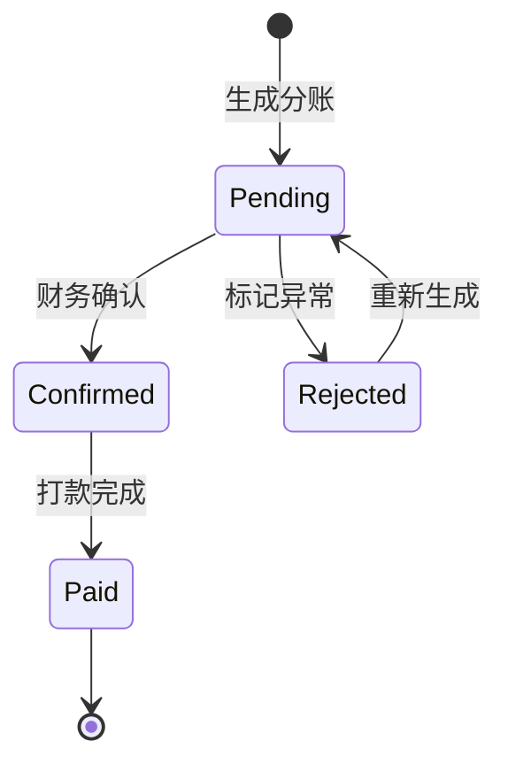

# 运营后台 PRD 评审意见

> **评审文件**: `docs/tabbit/inbox/2026/06/tabbit_项目主控与运营后台prd.md`
> **评审日期**: 2026-06-15
> **评审依据**: 项目规则 `.trae/rules/review.md`、已有 PRD/ADR/协议注册表/CODE-WIKI
> **关联文档**: PRD-10-Admin管理后台MVP.md（已通过）、PRD-social-app-mvp.md（草案）、ADR-010-admin-boundary-sdk.md、ADR-social-data-level-and-cache-strategy.md

---

## 一、结论

**建议修改** — PRD 整体结构完整、模块覆盖全面，但存在以下必须修复的问题后方可进入开发阶段：

1. 与已通过的 **PRD-10（Admin 管理后台 MVP）范围边界不清**
2. **广场虚拟成员规则的权限伪代码未对齐社交域 Permission Service 已定义的 7 个能力方法**
3. **日志字段表输出中断**，DDL 存在但文档不完整
4. **分账管理模块缺少与社交域订单模型的字段对齐验证**
5. **13 个模块的体量超出首期 MVP 可交付范围**

---

## 二、符合要求的部分

### 2.1 文档结构规范
- 包含背景、目标、非目标、用户角色、功能模块、核心业务规则、验收标准等 PRD 必要章节
- 每个模块均按"目标 → 关联表 → 列表字段 → 操作列 → 筛选列 → 高级筛选列"统一结构编写，格式一致性好
- 明确标注了建议文档落点路径（`docs/prd/PRD-admin-backend.md` 等）

### 2.2 大群组广场虚拟成员关系设计
- §3 虚拟成员规则设计思路清晰：普通成员不落 `group_members`，仅管理员/嘉宾写入
- `member_blocks` 独立于 `group_members` 的设计合理，解耦了可见性控制与群组角色
- 权限判断规则（§3.4）给出了推导逻辑的伪代码框架

### 2.3 操作审计体系设计完备
- §18.7 审计操作清单覆盖了全部高风险操作（29 项）
- §18.8 日志字段设计详尽（28 个字段），包含 before/after 数据快照、脱敏标记、二次确认记录
- §18.9 高风险操作分级合理（low / medium / high / critical 四级）
- §18.10 脱敏规则覆盖了密码、手机号、邮箱、银行卡、私信正文、敏感配置等场景
- §18.11~§18.12 权限模型（菜单 + 按钮 + 数据 + 审计 + 二次确认）和编码规范清晰

### 2.4 缓存与事件联动设计
- §18.15 给出了每个业务操作对应的缓存 Key 删除策略和领域事件名称，与 ADR-social-data-level-and-cache-strategy.md 的数据分级策略一致

### 2.5 全局枚举字典清单完整
- §17 定义了 31 个 dict_type，覆盖用户、群组、成员、主题、评论、订单、支付、消息、配置、广告、模板、审计等全域枚举
- 枚举值与 PRD-social-app-mvp.md 中定义的状态值基本一致

---

## 三、必须修改项

### 3.1 [P0] 与 PRD-10（Admin 管理后台 MVP）的范围重叠未界定

**问题描述**:

已通过评审的 [PRD-10](file:///Volumes/MacintoshHD/Users/jemoo/git/traeMVP/cairobotmvp/docs/prd/PRD-10-Admin管理后台MVP.md) 已定义 Admin 后台的技术栈为 go-admin v2.2.0 + Vue 2 + Element UI，首期范围为：
- 配置管理 CRUD（`app_configs` 表）
- 多语言管理 CRUD（`i18n_strings` / `i18n_packages` 表）
- 前端页面 + SDK 联动

本 PRD 的 **§11 多语言维护**、**§12 App 配置管理**、**§16 全局枚举字典管理** 与 PRD-10 范围高度重叠。但本 PRD 未说明：

1. 本 PRD 是 PRD-10 的**扩展/替代**还是**独立新增**？
2. 已实现的 Config/I18n 插件是否需要重构？
3. 本 PRD 引入的 `sys_dict_type` / `sys_dict_data` 表是否属于 go-admin 内置表？如果是，不应重复定义 DDL

**影响**: 开发时无法判断哪些是增量开发、哪些是存量改造。

**修改建议**:
- 在 §1 产品定位或 §18 PRD 正文中增加一节"**与 PRD-10 的关系**"，明确：
  - 复用 PRD-10 已完成的框架基础（go-admin 初始化、登录鉴权、Config/I18n 插件）
  - 本 PRD 新增的是**社交域运营管理模块**（用户/群组/主题/评论/订单/分账/消息/广告）
  - 多语言和 App 配置模块仅做**范围声明**，不重新设计（除非有变更点需注明）

---

### 3.2 [P0] 广场虚拟成员权限伪代码未对齐社交域 Permission Service

**问题描述**:

本 PRD §3.4 定义了 6 个权限判断函数：

```go
CanViewGroup(userID, plazaGroupID)
CanReadTopic(userID, topicID)
CanCommentTopic(userID, topicID)
CanManageGroup(operatorID, plazaGroupID)
CanManageMember(operatorID, plazaGroupID, targetUserID)
IsBlockedBetween(userA, userB)
```

但根据 CODE-WIKI 第 26 章（社交域）和 PRD-social-app-mvp.md，Permission Service 已定义 **7 个能力方法**。两者在方法签名和语义上可能不一致。

**具体差异待确认**:
- `CanReadTopic` 在社交域中可能拆分为 `CanViewTopicDetail` + `CanViewTopicSummary`
- 缺少 `CanCreateTopic` / `CanJoinGroup` 等写操作权限
- 广场虚拟成员的"默认具备普通成员身份"这一特殊逻辑需要在每个方法中作为前置条件注入

**修改建议**:
- 将 §3.4 的伪代码替换为对 [PRD-social-app-mvp.md](file:///Volumes/MacintoshHD/Users/jemoo/git/traeMVP/cairobotmvp/docs/prd/PRD-social-app-mvp.md) 中 Permission Service 7 个方法的**广场特化补充说明**，而非独立定义新接口
- 标注："以下为广场群组的权限判断**补充规则**，基础能力方法见社交域 Permission Service"

---

### 3.3 [P0] §18.7 日志字段表输出中断，文档不完整

**问题描述**:

原文第 1401~1403 行：

```
1401→ | 操
1402→
1403→日志字段建议可以继续补充如下：
```

日志字段建议表格在"操"字处截断，随后用自然语言续写了完整版。这种**中断+续写**的形式不符合正式 PRD 规范，且可能导致阅读者混淆两个版本的表格。

**修改建议**:
- 删除第 1393~1403 行的不完整表格
- 仅保留 1405 行之后的完整版日志字段表（28 字段版本）

---

### 3.4 [P1] 分账管理的表结构与社交域订单模型未对齐

**问题描述**:

§10 分账管理建议新增 `group_settlements` 和 `group_settlement_items` 两张表，但：

1. PRD-social-app-mvp.md 中 `group_orders` 表的字段定义（如 `original_amount_cent` / `pay_amount_cent` / `currency`）与本 PRD §9 订单列表字段一致，但 **分账单的字段来源** 未明确映射
2. `platform_rate`（平台分成比例）的数据来源不明：是来自 `group_plans` 的固定配置？还是全局配置？
3. `owner_amount_cent` 的计算公式未给出：是 `gross - refund - platform`？扣税逻辑呢？

**修改建议**:
- 在 §10.2 后增加"**分账计算规则**"小节，明确：
  - 平台分成比例的配置来源（群组方案 vs 全局默认 vs 手动调整）
  - 收益计算公式（含退款扣减、税费预留）
  - 分账触发条件（手动 vs 定时 vs 订单事件驱动）

---

### 3.5 [P1] 首期 13 个模块超出 MVP 可交付范围

**问题描述**:

§18.5 功能模块列出 14 项（含操作日志），加上每个模块的列表/操作/筛选/高级筛选设计，总工作量巨大。对比 PRD-10 首期仅完成 Config + I18n 两套 CRUD 就经历了三轮评审。

特别是以下模块在社交域代码（`go/modules/social`）**尚未实现**的情况下无法并行开发：

| 依赖社交域的模块 | 依赖原因 |
|---|---|
| 用户治理 | 需要 `AdminUserService` → social member usecase |
| 群组管理 | 需要 `AdminGroupService` → social group usecase |
| 主题管理 | 需要 `AdminTopicService` → social topic usecase |
| 评论管理 | 需要 `AdminCommentService` → social comment usecase |
| 订单管理 | 需要 `AdminOrderService` → social order usecase |
| 分账管理 | 需要订单模型稳定 |
| 消息中心 | 需要 social message 模型 |

**修改建议**:
- 将 14 个模块分为 **P0（首期）/ P1（二期）/ P2（三期）**：
  - **P0 首期**：全局枚举字典 + App 配置（复用 PRD-10 基础扩展）+ 操作日志审计框架 + 用户管理（只读+禁用）
  - **P1 二期**：群组管理 + 主题管理 + 评论管理 + 消息中心（依赖 social 域实现后启动）
  - **P2 三期**：订单管理 + 分账管理 + 广告 Banner + 模板消息 + 多语言（依赖支付和广告域）
- 在 §18.3 非目标中明确首期不含 P1/P2 模块

---

### 3.6 [P1] §18.14 "业务服务型"操作的 service 封装粒度未明确

**问题描述**:

§18.14 列出了 8 个 Admin Service：

```text
AdminUserService
AdminGroupService
AdminTopicService
AdminCommentService
AdminOrderService
AdminSettlementService
AdminConfigService
AdminAuditService
```

但未说明：
1. 这些 Service 放在哪个包路径下？`go/admin/services/`？`go/modules/social/admin/`？还是独立 `go/services/admin-social/`？
2. 这些 Service 是调用 social usecase 的**内部封装**，还是走 **gRPC/HTTP 协议调用**？
3. 与 ADR-010（Admin 边界 SDK）的关系：Admin 写操作是否也通过 pub/sub 通知业务服务？

**修改建议**:
- 增加"**后台服务架构**"一节，画出 Admin Service → Social Usecase / Social Protocol 的调用关系图
- 明确包路径约定
- 明确进程内调用 vs 进程间调用的判定标准（同进程 vs 微服务部署时）

---

### 3.7 [P1] 消息中心管理（§15）的隐私权限设计不足

**问题描述**:

§15.1 提到"运营人员通常只具备查看和处理异常消息的权限，不应随意查看用户私信全文"，但：
1. §15.3 列表字段中包含"内容摘要"和"标题"，未区分**系统消息**与**用户私信**的字段可见性
2. §15.4 操作列包含"撤回消息"和"删除消息"，这些操作对用户私信的权限门槛应高于系统消息
3. 缺少**消息类型级别的字段访问控制矩阵**

**修改建议**:
- 增加"**消息隐私控制矩阵**"表格：

| 消息类型 | 内容可见性 | 撤回权限 | 删除权限 | 所需角色 |
|---|---|---|---|---|
| system | 全文可见 | 安全管理员 | 安全管理员 | 运营管理员+ |
| order_status | 全文可见 | 不可撤回 | 仅删 | 客服/财务 |
| group_status | 全文可见 | 不可撤回 | 仅删 | 运营管理员 |
| like/comment | 摘要可见 | 不可撤回 | 仅删 | 内容审核员 |
| private_text | **仅摘要**（需审计权限看全文） | 安全管理员 | 安全管理员 | 安全审计员 |

---

### 3.8 [P2] 广告/Banner 资源表的媒体上传流程未涉及

**问题描述**:

§13 关联表包含 `media_assets`（图片/视频资源），但整个 PRD 未提及：
1. 图片/视频的上传入口（是集成到后台？还是复用 OSS 直传？）
2. 素材尺寸规格限制
3. 视频格式和大小限制
4. CDN 分发策略

**修改建议**:
- 在 §13 中增加"**素材管理说明**"或引用独立的素材管理规范文档
- 如首期不做素材管理，应在 §18.3 非目标中注明

---

## 四、建议修改项

### 4.1 建议将 §17 全局枚举字典清单独立为 `docs/api/enums-dictionary.md`

当前 `docs/api/enums-dictionary.md` 文件不存在。§17 的 31 个 dict_type 是跨模块共享的基础数据，应：
- 落盘为独立文档，供前后端、App、后台共同引用
- 每个 dict_type 补充 `dict_sort`（排序值）和 `is_default`（是否默认值）
- 与 PRD-social-app-mvp.md 中的枚举定义做**双向交叉引用**

### 4.2 建议补充分账状态机图

§10 分账管理的状态流转（pending → confirmed → paid / rejected）涉及财务关键路径，建议增加 Mermaid 状态图：



### 4.3 建议增加各模块间的导航关系说明

当前各模块的操作列中有大量"跳转"操作（如"跳转用户详情"、"跳转订单列表并按用户筛选"），但未定义：
- 跳转时的参数传递方式（URL query? 还是路由参数?）
- 跨模块筛选条件的保持策略
- 面包屑导航路径

建议在 §18.13 菜单结构之后增加"**模块间导航规范**"小节。

### 4.4 建议 §18.8 的 DDL 补充索引优化说明

`admin_operation_logs` 表定义了 7 个索引，对于高频写入的日志表：
- 建议确认主键使用 `char(32)` 的理由（UUID? ULID? 是否有序？）
- 建议考虑分区策略（按月分区？）——运营日志量级可能较大
- JSON 字段（`before_data` / `after_data` / `changed_fields`）的查询需求决定了是否需要生成列

### 4.5 建议明确 go-admin 版本的 Vue 2 + Element UI 前端工程归属

PRD 提到前端使用 Vue 2 + Element UI，但项目主技术栈前端是 ReactJS（ADR-0005）。需明确：
- 运营后台前端是否作为 **go-admin-ui** 的定制分支维护？
- 还是独立于 `web/` 目录？
- UI 设计规范是否有单独的设计稿或 Design Token？

### 4.6 建议补充导出功能的通用规范

多个模块（订单 §9.4、分账 §10.4、枚举 §16.5、操作日志）都有"导出"操作，但未统一定义：
- 导出格式（CSV / Excel / JSON）
- 单次导出行数上限
- 异步导出 vs 同步导出的判定标准（数据量阈值）
- 导出文件的存储和下载方式

---

## 五、测试缺口

本 PRD 作为产品需求文档，本身不直接包含测试用例。但从工程角度，以下测试维度在 PRD 中**未被提及**，建议补充到 §18.16 验收标准中：

| 测试维度 | 缺失内容 | 建议 |
|---|---|---|
| **权限测试** | 各角色的菜单/按钮/数据权限边界用例 | 补充"超级管理员可看到所有按钮，客服人员看不到禁用用户按钮"类验收条目 |
| **审计测试** | 操作日志的 before/after 数据准确性 | 补充"禁用用户后日志中 before.status=active, after.status=banned"类条目 |
| **广场虚拟成员测试** | 不落库情况下的权限推导正确性 | 补充"新建 active 用户后无需写 group_members 即可在广场发帖"类条目 |
| **并发安全测试** | 高风险操作的二次确认竞态条件 | 补充"两个管理员同时点击禁用同一用户，仅执行一次"类条目 |
| **脱敏测试** | 日志中敏感数据的掩码正确性 | 补充"操作日志中手机号显示为 138****5678"类条目 |
| **缓存一致性测试** | 后台操作后的缓存失效和事件发布 | 补充"后台禁用用户后，App 端立即无法用该 token 访问"类条目 |

---

## 六、文档缺口

| 缺失文档 | 说明 | 优先级 |
|---|---|---|
| **`docs/admin/audit-log-spec.md`** | §18.17 建议落点中提到但尚未创建。应包含：日志字段定义、脱敏规则、二次确认流程、保留周期、归档策略 | P0 |
| **`docs/admin/menu-permissions.md`** | §18.17 建议落点中提到但尚未创建。应包含：go-admin 菜单树 JSON、按钮权限码全量列表、角色-权限矩阵 | P0 |
| **`docs/adr/ADR-plaza-virtual-membership.md`** | §18.17 建议落点中提到但尚未创建。广场虚拟成员是跨社交域和运营后台的核心架构决策，必须有独立 ADR | P0 |
| **`docs/api/enums-dictionary.md`** | §17 的内容需要落盘为独立 API 文档 | P1 |
| **`docs/api/admin-social-openapi.yaml`** | §18.17 建议落点中提到。后台管理接口的 OpenAPI 定义（注意：不走 MessagePacket 通道，走 go-admin REST） | P1 |

---

## 七、风险提示

### 7.1 [R0] 社交域代码未实现，运营后台开发顺序阻塞

`go/modules/social/` 目录尚不存在，社交域仅有文档设计。运营后台的用户/群组/主题/评论/订单/消息管理等 **7 个核心模块**全部依赖社交域服务层。

**风险等级: R0（不确认不能继续）**

**建议**: 先明确开发顺序 —— 是先实现 social 域核心 usecase 再开发 admin 管理？还是在 admin 中先做独立 CRUD（后续再对接 service 层）？

### 7.2 [R1] go-admin v2.2.0 + Vue 2 技术栈的生命周期风险

Vue 2 已于 2023 年 12 月底停止官方维护（EOL）。Element UI for Vue 2 也已停止更新。
如果运营后台是一个长期维护的系统，Vue 2 技术栈的安全补丁和生态兼容性将成为持续风险。

**风险等级: R1（日报重点标记）**

**建议**: 在 ADR 中记录此技术债务，或在 PRD 非目标中注明"MVP 之后评估迁移至 Vue 3 + Element Plus"。

### 7.3 [R1] 4000-4999 协议段预留冲突

协议编号注册表中 4000-4999 预留给"服务商后台系统"。如果运营后台的部分高权限操作需要走 MessagePacket 通道（如从外部系统触发的管理操作），则可能与"服务商后台"冲突。

**风险等级: R1（日报重点标记）**

**建议**: 明确运营后台的管理操作**全部走 go-admin HTTP REST**，不走 MessagePacket。如有例外（如从 App 端发起的管理审批），需提前分配协议编号。

### 7.4 [R2] 分账涉及的合规性未涉及

分账管理涉及资金流（平台分成 → 群主收益 → 打款），但 PRD 未提及：
- 税务处理（个税代扣代缴）
- 资金监管要求
- 打款渠道（银行代付 / 第三方支付）
- 对账机制

**风险等级: R2（日报记录）**

**建议**: 首期分账仅做"手动结算 + 报表导出"，实际打款留待二期并引入财务合规评审。

### 7.5 [R2] 操作日志的数据增长预估缺失

`admin_operation_logs` 表每条记录约 28 个字段（含 3 个 JSON 字段），在高频操作场景下（如批量审核主题、批量删除评论），日增数据量可能达到万级以上。

**风险等级: R2（日报记录）**

**建议**: 在 DDL 或运维规范中补充数据保留策略（如：90 天在线，超期归档至冷存储）。

---

## 八、总结评价

| 维度 | 评分 | 说明 |
|---|---|---|
| **完整性** | ★★★★☆ | 13 个模块全覆盖，字段/操作/筛选设计详尽；但与 PRD-10 边界不清 |
| **一致性** | ★★★☆☆ | 枚举值与社交域 PRD 基本一致；但权限伪代码未对齐 Permission Service |
| **可行性** | ★★★☆☆ | 依赖社交域实现，首期范围过大需分期；审计/脱敏/二次确认设计成熟 |
| **规范性** | ★★★★☆ | 符合项目 PRD 模板要求；存在文档输出中断瑕疵 |
| **可测试性** | ★★☆☆☆ | 验收标准偏宏观，缺少权限/审计/并发/脱敏等维度的具体测试条目 |

### 必须在开发前完成的动作：

1. **明确与 PRD-10 的关系**（消除范围重叠歧义）
2. **对齐广场权限设计与社交域 Permission Service**（避免接口分裂）
3. **修复日志字段表中断问题**（文档完整性）
4. **制定模块分期计划**（P0/P1/P2）
5. **创建 3 份缺失文档**（审计规范、菜单权限、广场虚拟成员 ADR）
