### **验收阶段应按“用例矩阵 → proto-tester 执行 → 原始报文采集 → traceId 日志关联 → 结果归档”的闭环推进，Trae IDE 需要先从仓库真实协议与 routes.yaml 中反查 maxType/minType，再用 proto-tester 对 Gateway 到 TarsGo 服务链路做端到端验证。**

下面我按“验收负责人”的视角，重新梳理一套可直接交给 Trae IDE 执行的端到端测试方案。重点是：不凭空写死协议号，必须让 Trae 从项目实际的 `.proto`、`protocols.json`、`routes.yaml`、Gateway、TarsGo 服务日志中提取真实数据；每个用例都要保留请求原始报文、响应原始报文、traceId、日志片段和结论。

### **一、验收目标**

本轮验收的目标不是只验证 proto-tester 能不能发请求，而是验证整个协议链路是否真实可用：

```mermaid
flowchart LR
    A[proto-tester Web UI / CLI] --> B[HTTP POST /api/hello]
    B --> C[Gateway MessagePacket 解析]
    C --> D[routes.yaml maxType/minType 路由]
    D --> E[LocalInvoker 或 TarsGoInvoker]
    E --> F[TarsGo Service Handler]
    F --> G[Usecase / Config / I18n / Health]
    G --> H[响应 MessagePacket]
    H --> I[proto-tester 响应解析]
    I --> J[采集 raw request / raw response / traceId / logs]
```



验收必须覆盖以下几个层面：协议构造是否正确、Gateway 是否能正确解析 MessagePacket、maxType/minType 是否能命中路由、Local/TarsGo 模式是否行为一致、服务层返回是否符合预期、traceId 是否贯穿全链路、异常请求是否有稳定错误码与日志，以及 proto-tester 的 Web UI 和 CLI 是否都能完成同类验证。

### **二、交给 Trae IDE 的总提示词**

下面这段可以直接复制给 Trae IDE 作为验收总任务提示词。

```text
你现在接收项目验收阶段，目标是使用 typescript/proto-tester 协议测试客户端，对当前项目完成端到端测试，并输出可审计的验收报告。

请严格基于仓库实际代码、配置和协议文件执行，不要臆造 maxType、minType、接口名或字段名。你需要先扫描以下内容：

1. Gateway 入口：
   - go/gateway/proto-gateway/
   - HTTP 路由，尤其是 POST /api/hello
   - MessagePacket 编解码逻辑
   - LocalInvoker / TarsGoInvoker 实现

2. 协议与路由：
   - 所有 .proto 文件
   - 生成的 protocols.json
   - routes.yaml
   - Tars IDL 或 TarsGo 服务定义

3. 服务模块：
   - go/modules/hello
   - go/modules/health
   - go/services/config
   - go/services/i18n
   - go/tars/system
   - go/tars/config
   - go/tars/i18n

4. proto-tester：
   - typescript/proto-tester/README.md
   - CLI send / trace / run / capture 子命令
   - Web UI 请求构造、响应解析、请求历史、traceId 展示逻辑
   - Token 内存化实现
   - CSP 与本地绑定配置

请完成以下验收工作：

A. 启动本地验收环境
- Gateway 使用 local 模式启动在 :8080
- proto-tester 默认绑定 127.0.0.1:3001
- 如项目支持 TarsGo 模式，也需要至少执行一轮 TarsGo 模式链路验证
- 启动必要的 config、i18n、health、hello 服务
- 记录每个服务的启动命令、端口、日志路径和进程状态

B. 生成端到端测试用例矩阵
- 每个用例必须包含：caseId、目标模块、协议名、maxType/minType、请求 payload、预期响应、预期错误码、traceId 断言、日志断言
- maxType/minType 必须来自 routes.yaml 或协议生成产物
- payload 字段必须来自 .proto 或 protocols.json
- 不允许用伪造字段替代真实字段

C. 使用 proto-tester 执行测试
- 使用 Web UI 至少手工执行关键正向用例
- 使用 CLI 执行全部用例
- 使用 send / trace / run / capture 子命令完成请求发送、trace 查询、批量运行和报文采集
- 每个用例都要采集 raw request、raw response、traceId、Gateway 日志、服务日志

D. 输出验收产物
请生成以下文件：
1. docs/e2e-acceptance/E2E-ACCEPTANCE-PLAN.md
2. docs/e2e-acceptance/E2E-CASE-MATRIX.md
3. docs/e2e-acceptance/E2E-RUN-REPORT.md
4. docs/e2e-acceptance/artifacts/{caseId}/request.raw.json
5. docs/e2e-acceptance/artifacts/{caseId}/response.raw.json
6. docs/e2e-acceptance/artifacts/{caseId}/trace.log
7. docs/e2e-acceptance/artifacts/{caseId}/gateway.log
8. docs/e2e-acceptance/artifacts/{caseId}/service.log
9. docs/e2e-acceptance/artifacts/{caseId}/assertion.json

E. 验收报告要求
- 每个用例必须标记 PASS / FAIL / BLOCKED
- FAIL 必须说明失败点、实际响应、对应日志、建议修复方向
- BLOCKED 必须说明阻塞原因，例如服务未启动、协议缺失、路由缺失、token 缺失
- 最终报告需要给出是否通过验收的明确结论
- 不允许只输出“测试通过”，必须附带原始请求、响应和 traceId 证据
```

### **三、端到端用例矩阵重新梳理**

下面是建议的验收用例矩阵。Trae IDE 执行时需要把其中的“协议名、maxType/minType、payload 字段”替换成仓库实际值。这里先给出验收结构，不伪造具体协议号。

| 用例 ID | 目标链路 | 验证重点 | 执行方式 | 结果证据 |
|---|---|---|---|---|
| E2E-001 | proto-tester → Gateway → Hello | 基础正向调用 | Web UI + CLI send | request / response / trace |
| E2E-002 | proto-tester → Gateway → Health | 健康检查链路 | CLI send | response / health logs |
| E2E-003 | proto-tester → Gateway → Config | 配置读取链路 | CLI send | response / config logs |
| E2E-004 | proto-tester → Gateway → I18n | 多语言模板渲染 | CLI send | response / i18n logs |
| E2E-005 | Gateway routes.yaml | maxType/minType 正确路由 | CLI run | gateway route logs |
| E2E-006 | MessagePacket | 请求报文头完整性 | CLI capture | raw request |
| E2E-007 | MessagePacket | 响应报文结构完整性 | CLI capture | raw response |
| E2E-008 | traceId | 全链路日志贯穿 | CLI trace | trace log |
| E2E-009 | Bearer Token | 有效 token 访问 | Web UI + CLI | status / logs |
| E2E-010 | Bearer Token | 缺失 token 拒绝 | CLI send | error response |
| E2E-011 | Bearer Token | 错误 token 拒绝 | CLI send | error response |
| E2E-012 | 协议解析 | 缺失必填字段 | CLI send | error code |
| E2E-013 | 协议解析 | 字段类型错误 | CLI send | error code |
| E2E-014 | 路由异常 | 不存在 maxType/minType | CLI send | route error |
| E2E-015 | 服务异常 | 下游服务不可达 | CLI run | gateway fallback logs |
| E2E-016 | LocalInvoker | local 模式调用 | CLI run | local logs |
| E2E-017 | TarsGoInvoker | TarsGo 模式调用 | CLI run | tars logs |
| E2E-018 | Config/I18n 失效通知 | invalidate 事件兼容性 | CLI send / logs | pub/sub logs |
| E2E-019 | proto-tester 历史记录 | IndexedDB 历史保存 | Web UI | UI 截图/记录 |
| E2E-020 | Token 内存化 | 刷新后 token 清空 | Web UI | UI 行为记录 |
| E2E-021 | CLI env 约束 | `--env prod` 被拦截 | CLI run | block result |
| E2E-022 | 批量回归 | 全部用例批量执行 | CLI run | run report |

### **四、核心用例详细模板**

#### **E2E-001：Hello 基础正向调用**

这个用例用于验证最基础的协议链路：proto-tester 能构造 MessagePacket，Gateway 能解析并路由，Hello 模块能返回业务响应，traceId 能贯穿日志。

```yaml
caseId: E2E-001
name: Hello 基础正向调用
priority: P0
target: proto-tester -> Gateway -> Hello Service
entrypoint: POST /api/hello
protocolSource:
  proto: 由 Trae 从 .proto 中识别
  protocolsJson: typescript/proto-tester 生成产物
  route: routes.yaml
request:
  maxType: 从 routes.yaml 提取
  minType: 从 routes.yaml 提取
  traceId: 自动生成或手工指定
  payload: 使用 protocols.json 中 Hello 请求结构
expected:
  httpStatus: 200
  businessCode: 成功错误码或成功码，以项目常量为准
  responsePayload: 能被 proto-tester 正确解析
assertions:
  - Gateway 日志包含 traceId
  - Hello 服务日志包含同一个 traceId
  - 响应 MessagePacket 中 maxType/minType 与请求链路匹配
  - response.data 可按对应 response proto 解码
artifacts:
  - request.raw.json
  - response.raw.json
  - trace.log
  - gateway.log
  - service.log
  - assertion.json
```

#### **E2E-002：Health 健康检查链路**

Health 用例用于验收基础依赖检查，包括 Config、I18n、MySQL、Redis 等 checker 是否有稳定输出。若本地依赖未启用，需要标记 BLOCKED，而不是直接判 FAIL。

```yaml
caseId: E2E-002
name: Health 健康检查链路
priority: P0
target: proto-tester -> Gateway -> Health Module
request:
  maxType: 从 routes.yaml 提取
  minType: 从 routes.yaml 提取
  payload: 使用 Health 请求 proto
expected:
  httpStatus: 200
  responsePayload:
    status: healthy 或项目定义的健康状态字段
assertions:
  - health.Checker 被调用
  - Config/I18n/MySQL/Redis 检查项有明确状态
  - traceId 同时出现在 Gateway 和 Health 日志
blockedWhen:
  - 本地 MySQL/Redis 未启动且项目要求强依赖
  - Health 协议未在 routes.yaml 注册
```

#### **E2E-003：Config 配置读取链路**

这个用例用于验证配置服务是否能够通过 Gateway 正常访问，并确认 admin 层不做字段级校验、业务校验复用 service 层的边界没有被破坏。

```yaml
caseId: E2E-003
name: Config 配置读取链路
priority: P0
target: proto-tester -> Gateway -> Config Service
request:
  maxType: 从 routes.yaml 提取
  minType: 从 routes.yaml 提取
  payload:
    tenant_id: 使用项目默认租户或测试租户
    env: dev 或 test
    module_key: 使用仓库测试数据中的真实 key
expected:
  httpStatus: 200
  responsePayload: 返回配置项或明确的 not found 业务错误
assertions:
  - Config service 层处理请求
  - Gateway 不绕过 service 校验
  - traceId 贯穿 Gateway 和 Config service
  - 错误响应使用统一错误码
```

#### **E2E-004：I18n 多语言模板渲染链路**

该用例验证 i18n 服务对语言码、模板参数、租户和环境的处理是否符合预期。

```yaml
caseId: E2E-004
name: I18n 多语言模板渲染链路
priority: P0
target: proto-tester -> Gateway -> I18n Service
request:
  maxType: 从 routes.yaml 提取
  minType: 从 routes.yaml 提取
  payload:
    tenant_id: default
    lang_code: zh-CN 或 en
    template_key: 使用真实测试模板 key
    params: 使用模板所需参数
expected:
  httpStatus: 200
  responsePayload: 返回渲染后的文案
assertions:
  - ValidateLangString 或 service 层校验逻辑被复用
  - 不支持语言码时返回稳定错误码
  - traceId 贯穿 Gateway 和 I18n service
```

#### **E2E-008：traceId 全链路日志贯穿**

这个用例非常关键。验收时不能只看响应成功，还必须证明同一个 traceId 出现在 proto-tester、Gateway、Invoker、TarsGo 服务日志中。

```yaml
caseId: E2E-008
name: traceId 全链路贯穿
priority: P0
target: proto-tester -> Gateway -> TarsGo Service
request:
  traceId: 手工指定，例如 e2e-008-${timestamp}
  maxType: 任意一个已注册正向协议
  minType: 任意一个已注册正向协议
expected:
  traceIdPropagation: true
assertions:
  - request.raw.json 中包含 traceId
  - response.raw.json 中包含同一 traceId，或响应头/日志可关联该 traceId
  - Gateway 收到请求日志包含该 traceId
  - 路由分发日志包含该 traceId
  - 下游服务处理日志包含该 traceId
  - proto-tester trace 命令可查询到该 traceId 关联记录
```

#### **E2E-014：不存在 maxType/minType 的路由异常**

这个用例用于确认 Gateway 对错误协议路由的处理是否稳定。它不是安全测试，而是协议健壮性验收。

```yaml
caseId: E2E-014
name: 不存在 maxType/minType 的路由异常
priority: P1
target: Gateway routes.yaml
request:
  maxType: 使用一个未在 routes.yaml 注册的测试值
  minType: 使用一个未在 routes.yaml 注册的测试值
  payload: 空对象或合法 MessagePacket data
expected:
  httpStatus: 400 或项目定义的协议错误状态
  businessCode: 路由不存在或协议不支持错误码
assertions:
  - Gateway 返回稳定错误码
  - Gateway 日志包含 route not found 或等价信息
  - 不应调用任何下游服务
  - traceId 仍应进入 Gateway 日志
```

#### **E2E-018：Config / I18n invalidate 事件兼容性**

根据当前 Code Wiki，invalidate 事件应支持结构化 JSON，同时兼容旧的逗号分隔格式。这个用例主要通过日志确认消费端升级策略是否符合预期。

```yaml
caseId: E2E-018
name: Config/I18n invalidate 事件兼容性
priority: P1
target: Config/I18n SDK 消费端
structuredPayload:
  tenant_id: default
  scope: config 或 i18n
  env: dev
  module_keys:
    - 使用真实 module key
  lang_codes:
    - zh-CN
    - en
  version: 使用测试版本号
  timestamp: 当前时间戳
  trace_id: e2e-018-${timestamp}
legacyPayload: 使用项目旧格式要求的逗号分隔字符串
expected:
  structured: handleStructured
  legacy: handleLegacy + WARN 日志
assertions:
  - JSON payload 能被 json.Unmarshal 正确解析
  - tenant_id 非空时进入 handleStructured
  - legacy payload 进入降级分支
  - 降级分支保留 WARN 日志
  - 不要求 redisx.Client 扩展 Publish
```

### **五、proto-tester CLI 执行提示词**

这段提示词用于让 Trae IDE 先发现 CLI 的真实命令格式，再执行。因为当前文档只说明 proto-tester 有 `send / trace / run / capture` 四个子命令，但没有展示具体参数，所以必须让 Trae 读取 README 和源码后再运行。

```text
请进入 typescript/proto-tester，读取 README.md、package.json、CLI 源码和测试文件，确认 send / trace / run / capture 四个子命令的真实参数格式。

然后执行以下工作：

1. 输出 proto-tester CLI 命令帮助信息
   - 记录 send 的参数
   - 记录 trace 的参数
   - 记录 run 的参数
   - 记录 capture 的参数

2. 根据 protocols.json 和 routes.yaml 自动生成 e2e case 输入文件
   - 不要手写不存在的协议号
   - 不要手写不存在的字段
   - 所有 payload 字段必须来自真实 proto schema

3. 对每个用例执行 CLI 请求
   - 正向用例使用 send
   - 批量用例使用 run
   - 报文采集使用 capture
   - traceId 查询使用 trace

4. 为每个 case 生成 artifacts 目录
   - request.raw.json
   - response.raw.json
   - trace.log
   - gateway.log
   - service.log
   - assertion.json

5. 最后生成 E2E-RUN-REPORT.md
   - 每个 case 必须有 PASS / FAIL / BLOCKED
   - 每个 case 必须有 traceId
   - 每个 case 必须有原始请求和原始响应路径
```

如果 Trae 需要落到命令层，可以要求它生成类似下面的命令计划，但实际参数必须以仓库 CLI 为准：

```bash
cd typescript/proto-tester

# 先确认真实 CLI 参数
npm run cli -- --help
npm run cli -- send --help
npm run cli -- trace --help
npm run cli -- run --help
npm run cli -- capture --help

# 构建协议元数据
npm run build
npm run gen:protocols

# 执行单用例
npm run cli -- send \
  --gateway http://127.0.0.1:8080/api/hello \
  --token "$PROTO_TESTER_TOKEN" \
  --case docs/e2e-acceptance/cases/E2E-001.json \
  --output docs/e2e-acceptance/artifacts/E2E-001

# 采集原始报文
npm run cli -- capture \
  --case docs/e2e-acceptance/cases/E2E-001.json \
  --output docs/e2e-acceptance/artifacts/E2E-001

# 查询 traceId
npm run cli -- trace \
  --trace-id "$TRACE_ID" \
  --output docs/e2e-acceptance/artifacts/E2E-001/trace.log

# 批量运行
npm run cli -- run \
  --suite docs/e2e-acceptance/e2e-suite.json \
  --output docs/e2e-acceptance/artifacts
```

### **六、Web UI 手工验收提示词**

proto-tester 不应只跑 CLI。Web UI 至少要覆盖关键正向链路、token 内存化、请求历史和响应解析。

```text
请使用 proto-tester Web UI 完成手工验收，并记录操作截图或文本证据。

验收步骤：

1. 启动 proto-tester Web UI
   - 确认绑定地址为 127.0.0.1:3001
   - 确认不是公网监听
   - 确认 CSP connect-src 只允许本地或内网 Gateway

2. 配置 Gateway 地址
   - 使用 http://127.0.0.1:8080/api/hello
   - 输入测试 Bearer Token
   - 刷新页面后确认 token 被清空，不持久化到 LocalStorage、SessionStorage 或 IndexedDB

3. 从协议列表选择 Hello 正向协议
   - 协议列表必须来自 protocols.json
   - 自动生成或手工填写合法 payload
   - 发送请求
   - 记录 raw request、raw response、traceId

4. 从协议列表选择 Health / Config / I18n 协议
   - 分别执行正向请求
   - 记录每个请求的 traceId 和响应解析结果

5. 验证请求历史
   - 确认请求历史写入 IndexedDB
   - 确认 token 没有写入 IndexedDB
   - 确认历史中能查看请求 payload、响应摘要和 traceId

6. 输出 Web UI 验收记录
   - 页面访问地址
   - 操作步骤
   - 每个用例的 traceId
   - 请求历史验证结果
   - token 内存化验证结果
```

### **七、原始报文采集规范**

每个用例必须保留原始请求和原始响应。不要只保留格式化后的业务对象，因为验收时需要证明 MessagePacket 层面的字段也正确。

#### **request.raw.json 模板**

```json
{
  "caseId": "E2E-001",
  "timestamp": "2026-06-05T09:59:58+08:00",
  "gateway": "http://127.0.0.1:8080/api/hello",
  "method": "POST",
  "headers": {
    "Authorization": "Bearer ***REDACTED***",
    "Content-Type": "application/json",
    "X-Trace-Id": "e2e-001-actual-trace-id"
  },
  "messagePacket": {
    "maxType": "从 routes.yaml 实际提取",
    "minType": "从 routes.yaml 实际提取",
    "extend": {
      "traceId": "e2e-001-actual-trace-id"
    },
    "dataEncoding": "按项目实际记录，例如 base64/protobuf/json",
    "dataRaw": "原始 data 内容或 base64"
  },
  "decodedPayload": {
    "请由 proto-tester 根据 protocols.json 解码后写入": true
  }
}
```

#### **response.raw.json 模板**

```json
{
  "caseId": "E2E-001",
  "timestamp": "2026-06-05T09:59:58+08:00",
  "httpStatus": 200,
  "headers": {
    "Content-Type": "application/json"
  },
  "messagePacket": {
    "maxType": "实际响应 maxType",
    "minType": "实际响应 minType",
    "extend": {
      "traceId": "e2e-001-actual-trace-id"
    },
    "dataEncoding": "按项目实际记录",
    "dataRaw": "原始响应 data"
  },
  "decodedPayload": {
    "请由 proto-tester 根据 response proto 解码后写入": true
  },
  "businessResult": {
    "code": "项目实际 code",
    "message": "项目实际 message"
  }
}
```

#### **assertion.json 模板**

```json
{
  "caseId": "E2E-001",
  "status": "PASS",
  "traceId": "e2e-001-actual-trace-id",
  "assertions": [
    {
      "name": "HTTP status should be expected",
      "expected": 200,
      "actual": 200,
      "passed": true
    },
    {
      "name": "Gateway log should contain traceId",
      "expected": "traceId exists",
      "actual": "found in gateway.log",
      "passed": true
    },
    {
      "name": "Service log should contain traceId",
      "expected": "traceId exists",
      "actual": "found in service.log",
      "passed": true
    },
    {
      "name": "Response should be decodable by proto-tester",
      "expected": "decoded successfully",
      "actual": "decoded successfully",
      "passed": true
    }
  ],
  "notes": ""
}
```

### **八、traceId 日志关联规范**

traceId 是本轮验收的核心证据。每个用例都需要按以下顺序检查日志。

```text
请对每个 caseId 的 traceId 执行日志关联检查：

1. 在 proto-tester 执行输出中查找 traceId
2. 在 Gateway 接收请求日志中查找 traceId
3. 在 Gateway MessagePacket 解析日志中查找 traceId
4. 在 routes.yaml 路由命中日志或 Invoker 调用日志中查找 traceId
5. 在 LocalInvoker 或 TarsGoInvoker 日志中查找 traceId
6. 在目标服务 Handler / Usecase 日志中查找 traceId
7. 在响应返回日志中查找 traceId
8. 将上述日志片段保存到 artifacts/{caseId}/trace.log
```

建议 `trace.log` 使用下面的结构：

```text
caseId: E2E-001
traceId: e2e-001-actual-trace-id
status: PASS

[proto-tester]
timestamp=...
raw request generated
traceId=e2e-001-actual-trace-id

[gateway:receive]
timestamp=...
POST /api/hello
traceId=e2e-001-actual-trace-id

[gateway:decode]
timestamp=...
MessagePacket decoded
maxType=...
minType=...
traceId=e2e-001-actual-trace-id

[gateway:route]
timestamp=...
route matched
target=...
traceId=e2e-001-actual-trace-id

[service:handler]
timestamp=...
handler invoked
traceId=e2e-001-actual-trace-id

[service:response]
timestamp=...
response returned
traceId=e2e-001-actual-trace-id
```

### **九、验收报告结构**

让 Trae IDE 输出 `E2E-RUN-REPORT.md` 时，建议使用下面的结构。

```markdown
# E2E Run Report

## 1. Environment

- Date:
- Commit:
- Branch:
- Gateway mode: local / tarsgo
- Gateway endpoint:
- proto-tester version:
- Node version:
- Go version:
- TarsGo status:
- MySQL status:
- Redis status:

## 2. Services

| Service | Command | Port | Status | Log Path |
|---|---|---|---|---|
| Gateway |  | 8080 |  |  |
| proto-tester |  | 3001 |  |  |
| Config |  |  |  |  |
| I18n |  |  |  |  |
| Health |  |  |  |  |

## 3. Case Results

| Case ID | Target | TraceId | Status | Artifacts |
|---|---|---|---|---|
| E2E-001 | Hello |  | PASS/FAIL/BLOCKED | artifacts/E2E-001 |
| E2E-002 | Health |  | PASS/FAIL/BLOCKED | artifacts/E2E-002 |

## 4. Failures

### E2E-xxx

- Expected:
- Actual:
- Request:
- Response:
- Gateway log:
- Service log:
- Root cause:
- Suggested fix:

## 5. Acceptance Decision

- Overall result: PASS / FAIL / BLOCKED
- Required fixes before acceptance:
- Optional improvements:
```

### **十、验收判定标准**

这轮验收建议采用下面的硬性标准。只要 P0 用例失败，就不应判定通过。

| 等级 | 用例范围 | 通过要求 | 失败处理 |
|---|---|---|---|
| P0 | Hello、Health、Config、I18n、traceId、Token | 必须全部 PASS | 不通过验收 |
| P1 | 异常路由、字段错误、批量运行、invalidate | 允许少量 BLOCKED | 需说明原因 |
| P2 | UI 历史、覆盖率、体验类检查 | 建议 PASS | 可作为优化项 |

P0 通过标准必须同时满足：请求能发出、Gateway 能解析、routes.yaml 能命中、服务能处理、响应能解码、traceId 能关联、原始报文已归档。仅仅 HTTP 200 不能视为通过。

### **十一、给 Trae IDE 的分阶段执行提示词**

#### **阶段 1：仓库扫描与协议反查**

```text
请先不要执行测试。请扫描仓库并输出协议验收准备报告：

1. 找出所有 .proto 文件路径
2. 找出 protocols.json 的生成脚本和生成产物路径
3. 找出 routes.yaml 路径
4. 列出 routes.yaml 中所有 maxType/minType 与目标服务映射
5. 列出 proto-tester 支持的协议清单
6. 列出 Gateway POST /api/hello 的处理流程
7. 列出 LocalInvoker 和 TarsGoInvoker 的切换方式
8. 输出可用于 E2E 测试的真实协议候选列表

要求：
- 不允许臆造协议号
- 所有结论必须引用仓库文件路径
- 输出 docs/e2e-acceptance/E2E-DISCOVERY.md
```

#### **阶段 2：生成用例矩阵**

```text
请基于 E2E-DISCOVERY.md 生成端到端测试用例矩阵。

要求：
1. 至少覆盖 Hello、Health、Config、I18n、MessagePacket、traceId、Bearer Token、异常路由
2. 每个用例必须包含真实 maxType/minType
3. 每个 payload 必须符合对应 proto schema
4. 每个用例必须定义 expected response 和日志断言
5. 输出 docs/e2e-acceptance/E2E-CASE-MATRIX.md
6. 同时生成 docs/e2e-acceptance/e2e-suite.json，供 proto-tester CLI run 使用
```

#### **阶段 3：启动环境**

```text
请启动本地 E2E 验收环境。

要求：
1. 执行 make bootstrap 或项目实际初始化命令
2. 启动 Gateway local 模式，监听 :8080
3. 启动 proto-tester，监听 127.0.0.1:3001
4. 启动 Config、I18n、Health、Hello 相关服务
5. 如支持 TarsGo 模式，请记录如何切换并准备第二轮验证
6. 检查端口、进程和健康状态
7. 输出 docs/e2e-acceptance/E2E-ENV.md
```

#### **阶段 4：执行 CLI 自动化用例**

```text
请使用 proto-tester CLI 执行全部 E2E 用例。

要求：
1. 先输出 CLI help，确认 send / trace / run / capture 参数
2. 使用 run 执行 e2e-suite.json
3. 对每个用例调用 capture 保存 request.raw.json 和 response.raw.json
4. 对每个 traceId 调用 trace 保存 trace.log
5. 同步截取 Gateway 和服务日志
6. 生成 assertion.json
7. 输出 docs/e2e-acceptance/E2E-RUN-REPORT.md
```

#### **阶段 5：执行 Web UI 手工验收**

```text
请使用 proto-tester Web UI 执行手工验收。

要求：
1. 打开 127.0.0.1:3001
2. 配置 Gateway 为 127.0.0.1:8080/api/hello
3. 输入测试 Bearer Token
4. 执行 Hello、Health、Config、I18n 至少 4 个正向请求
5. 记录每个请求的 raw request、raw response 和 traceId
6. 刷新页面，验证 token 已清空
7. 检查 IndexedDB 请求历史，确认 token 未持久化
8. 输出 docs/e2e-acceptance/E2E-WEB-UI-CHECK.md
```

#### **阶段 6：失败分析与修复建议**

```text
请分析所有 FAIL 和 BLOCKED 用例。

要求：
1. FAIL 用例必须给出 root cause
2. BLOCKED 用例必须给出阻塞原因
3. 如果是协议不匹配，指出 .proto / protocols.json / routes.yaml 的差异
4. 如果是 Gateway 路由问题，指出 routes.yaml 或 Invoker 问题
5. 如果是服务响应问题，指出 Handler / Usecase / Service 层问题
6. 如果是 traceId 缺失，指出在哪一层丢失
7. 输出 docs/e2e-acceptance/E2E-ISSUES.md
```

### **十二、特别需要 Trae 注意的项目边界**

当前 Code Wiki 里有几个边界点，验收时要专门检查，不要让测试方案破坏这些约束。

第一，`redisx.Client` 接口不要为了测试而扩展 `Publish`。如果需要验证 Config/I18n invalidate，应通过项目已有发布通道、已有 service 层能力、测试桩或日志验证完成，而不是修改公共 Redis 客户端接口职责。

第二，admin 层不应做字段级校验。验收 Config/I18n 时，应该检查 admin 是否复用 service 层的 `ValidateSchema`、`ValidateValue`、`ValidateLangString` 等逻辑，而不是让 admin 自己判断 `field_type` 或写 JSON validator 分支。

第三，proto-tester 是内部协议测试工具，默认应绑定 `127.0.0.1:3001`，不要为了验收把它暴露到公网。Bearer Token 必须脱敏记录，不能写入报告明文。

第四，CLI 的 `--env prod` 如果在 blocklist 中，应有明确拦截结果。这个用例应验证工具的环境保护逻辑是否生效。

### **十三、建议最终交付目录**

```text
docs/e2e-acceptance/
├── E2E-DISCOVERY.md
├── E2E-ACCEPTANCE-PLAN.md
├── E2E-CASE-MATRIX.md
├── E2E-ENV.md
├── E2E-WEB-UI-CHECK.md
├── E2E-RUN-REPORT.md
├── E2E-ISSUES.md
├── e2e-suite.json
└── artifacts/
    ├── E2E-001/
    │   ├── request.raw.json
    │   ├── response.raw.json
    │   ├── trace.log
    │   ├── gateway.log
    │   ├── service.log
    │   └── assertion.json
    ├── E2E-002/
    │   └── ...
    └── E2E-022/
        └── ...
```

这样验收完成后，你能拿到的不只是“测试通过”的口头结果，而是一套可以复盘、可以审计、可以定位问题的端到端证据链：每个用例都有真实协议、真实报文、真实响应、真实 traceId 和对应日志。

*内容由 AI 生成仅供参考*