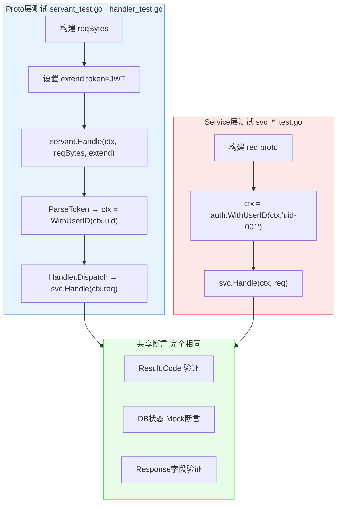
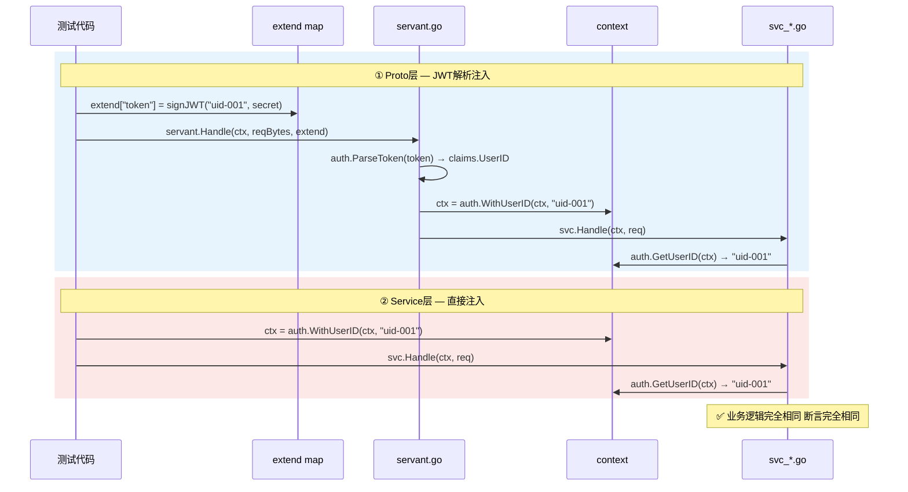
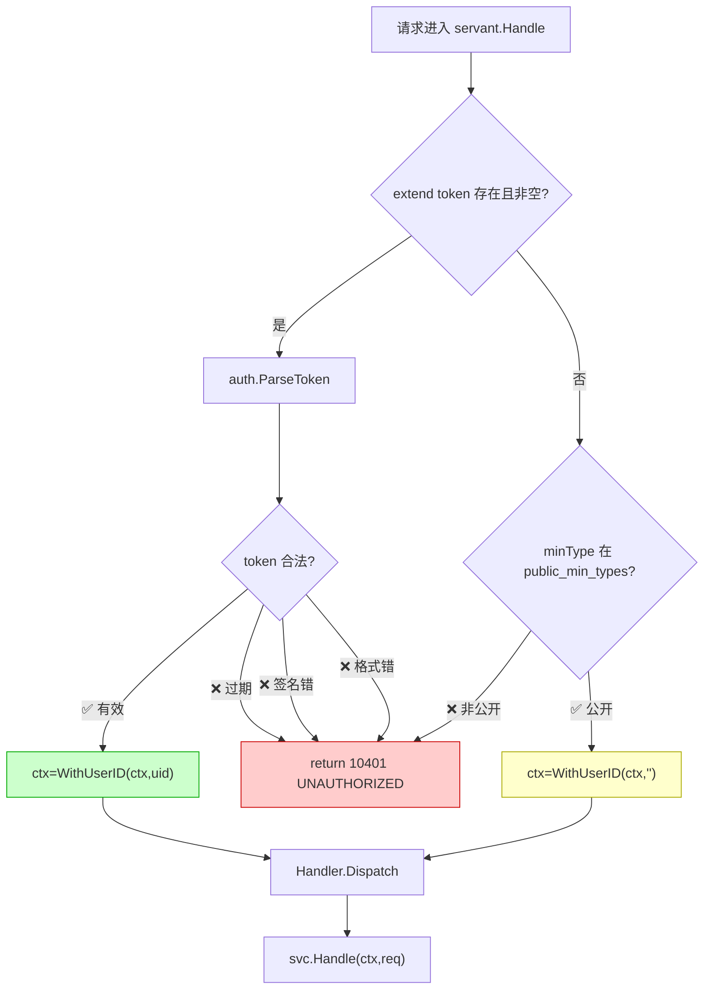
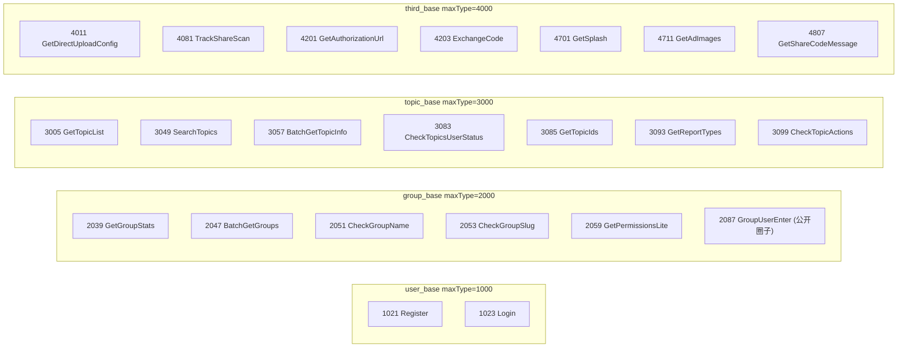
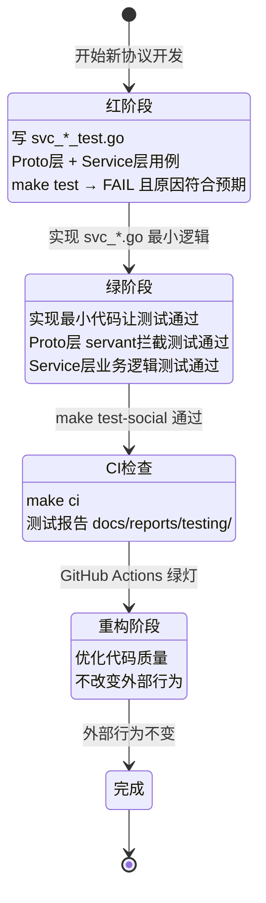

# Social Service 完整测试用例规范

> **文档编号**: TEST-SPEC-SOCIAL-003  
> **版本**: v1.0  
> **创建日期**: 2026-06-16  
> **协议覆盖**: user_base(21) · group_base(32) · topic_base(21) · inbox_base(9) · third_base(10)  
> **测试框架**: Go testing · testify/assert · Mock Repository  

---

## 1. 两层测试架构总览

### 1.1 调用链与测试层对应关系



### 1.2 userId 注入差异（唯一区别）



### 1.3 Auth 决策流程



### 1.4 公开接口清单 (public_min_types)



---

## 2. 测试用例规范

### 2.1 TC-ID 命名规范

```
TC-{minType}-{序号3位}
示例: TC-1021-001 = UserRegisterRequest 第1个用例
```

### 2.2 用例类型标签

| 标签 | 说明 | 两层差异 |
| --- | --- | --- |
| `PUBLIC` | 公开接口，无需认证 | 无差异，两层完全相同 |
| `AUTH-OK` | 有效JWT，正常认证路径 | Proto: JWT→解析；Service: 直接注入 |
| `AUTH-NO` | 无token/空token → 10401 | Proto: servant拦截；Service: 空ctx触发校验 |
| `AUTH-EXP` | 过期token → 10401 | Proto: servant拦截；Service: 等价AUTH-NO |
| `AUTH-TAM` | 签名篡改 → 10401 | Proto: servant拦截；Service: 等价AUTH-NO |
| `VALID-ERR` | 参数校验失败 | 无差异，业务层返回错误码 |
| `PERM-OK` | 权限检查通过 | userId来源不同，权限逻辑相同 |
| `PERM-NO` | 权限不足 | userId来源不同，权限拒绝相同 |
| `BIZ-RULE` | 业务规则约束 | 无差异 |
| `DB-FAIL` | DB层返回error | 无差异，返回系统error |
| `CONCUR` | 并发安全 | Service层为主 |

### 2.3 userId 注入方式对照速查

| 场景 | Proto层 | Service层 | 预期 |
| --- | --- | --- | --- |
| 正常认证 | `extend["token"]=signJWT("uid-001",secret)` | `auth.WithUserID(ctx,"uid-001")` | 正常执行 |
| 公开接口 | 不含token字段 | `context.Background()` | 正常执行 |
| 无token(受保护) | `extend["token"]=""` | `context.Background()` | 10401 |
| Token过期 | `extend["token"]=expiredJWT` | 等价无token | 10401 |
| 签名篡改 | `extend["token"]=tampered` | 等价无token | 10401 |
| userID不存在 | `signJWT("ghost",secret)` | `WithUserID(ctx,"ghost")` | 业务层NOT_FOUND |

---

## 3. user_base (maxType=1000) 测试用例


### 1000 user_base

| TC-ID | 类型 | 场景 | Proto层:userId来源 | Service层:userId来源 | 输入要点 | 预期Code | 核心断言 |
| --- | --- | --- | --- | --- | --- | --- | --- |

### 1021 UserRegisterRequest

| TC-ID | 类型 | 场景 | Proto层:userId来源 | Service层:userId来源 | 输入要点 | 预期Code | 核心断言 |
| --- | --- | --- | --- | --- | --- | --- | --- |
| TC-1021-001 | PUBLIC | 正常注册成功 | 无需token (公开接口) | 无需userId (公开接口) | username=testuser,pwd=pass123,email=t@e.com | 10200 SUCCESS | users表写入 · password已哈希 · salt非空 · uid生成 |
| TC-1021-002 | VALID-ERR | 用户名少于4字符 | 无需token (公开接口) | 无需userId (公开接口) | username=ab | 10610 NAME_TOO_SHORT | DB未写入 |
| TC-1021-003 | VALID-ERR | 用户名超过50字符 | 无需token (公开接口) | 无需userId (公开接口) | username=51chars | 10611 NAME_TOO_LONG | DB未写入 |
| TC-1021-004 | BIZ-RULE | 用户名已被占用 | 无需token (公开接口) | 无需userId (公开接口) | username=existingUser | 10612 NAME_ALREADY_TAKEN | repo.ExistsByUsername调用1次 · DB未写入 |
| TC-1021-005 | BIZ-RULE | 手机号已存在 | 无需token (公开接口) | 无需userId (公开接口) | phone=13800001111(已存在) | 10617 PHONE_ALREADY_EXISTS | DB未写入 |
| TC-1021-006 | DB-FAIL | DB写入失败 | 无需token (公开接口) | 无需userId (公开接口) | repo.CreateUser返回error | 10500 INTERNAL_ERROR(error≠nil) | resp=nil · err非nil |
| TC-1021-007 | CONCUR | 并发注册相同用户名 | 无需token (公开接口) | 无需userId (公开接口) | goroutine×2 同时注册 | 10612 NAME_ALREADY_TAKEN | 只有一次成功,另一次ALREADY_TAKEN |

### 1023 UserLoginRequest

| TC-ID | 类型 | 场景 | Proto层:userId来源 | Service层:userId来源 | 输入要点 | 预期Code | 核心断言 |
| --- | --- | --- | --- | --- | --- | --- | --- |
| TC-1023-001 | PUBLIC | 用户名+密码登录成功 | 无需token (公开接口) | 无需userId (公开接口) | username=user1,password=correct | 10200 SUCCESS | 返回非空access_token · refresh_token · expires_at |
| TC-1023-002 | BIZ-RULE | 密码错误 | 无需token (公开接口) | 无需userId (公开接口) | password=wrong | 10602 INVALID_CREDENTIALS | token为空 |
| TC-1023-003 | BIZ-RULE | 用户不存在 | 无需token (公开接口) | 无需userId (公开接口) | username=ghost | 10601 USER_NOT_FOUND | - |
| TC-1023-004 | BIZ-RULE | 用户被封禁 | 无需token (公开接口) | 无需userId (公开接口) | user.status=banned | 10603 USER_BLOCKED | token为空 |

### 1025 UserLogoutRequest

| TC-ID | 类型 | 场景 | Proto层:userId来源 | Service层:userId来源 | 输入要点 | 预期Code | 核心断言 |
| --- | --- | --- | --- | --- | --- | --- | --- |
| TC-1025-001 | AUTH-OK | 正常登出 | extend["token"]=signJWT(uid,secret) | auth.WithUserID(ctx,"uid-001") | - | 10200 SUCCESS | session失效 · last_login更新 |
| TC-1025-002 | AUTH-NO | 无token访问 | extend["token"]="" (空/缺失) | context.Background() (空userId) | - | 10401 UNAUTHORIZED | Handler未被调用 |
| TC-1025-003 | AUTH-EXP | 过期token | extend["token"]=expiredJWT | context.Background() (空userId) | - | 10401 UNAUTHORIZED | servant层拦截 |

### 1027 RefreshTokenRequest

| TC-ID | 类型 | 场景 | Proto层:userId来源 | Service层:userId来源 | 输入要点 | 预期Code | 核心断言 |
| --- | --- | --- | --- | --- | --- | --- | --- |
| TC-1027-001 | AUTH-OK | 正常刷新token | extend["token"]=signJWT(uid,secret) | auth.WithUserID(ctx,"uid-001") | refresh_token=valid | 10200 SUCCESS | 返回新access_token · expires_at延期 |
| TC-1027-002 | AUTH-NO | 无token | extend["token"]="" (空/缺失) | context.Background() (空userId) | - | 10401 UNAUTHORIZED | - |
| TC-1027-003 | BIZ-RULE | refresh_token无效 | extend["token"]=signJWT(uid,secret) | auth.WithUserID(ctx,"uid-001") | refresh_token=invalid | 10401 UNAUTHORIZED | 新token为空 |
| TC-1027-004 | BIZ-RULE | refresh_token已过期 | extend["token"]=signJWT(uid,secret) | auth.WithUserID(ctx,"uid-001") | refresh_token=expired | 10401 UNAUTHORIZED | - |

### 1029 GetUserInfoRequest

| TC-ID | 类型 | 场景 | Proto层:userId来源 | Service层:userId来源 | 输入要点 | 预期Code | 核心断言 |
| --- | --- | --- | --- | --- | --- | --- | --- |
| TC-1029-001 | AUTH-OK | 获取自己信息 | extend["token"]=signJWT(uid,secret) | auth.WithUserID(ctx,"uid-001") | user_id=uid-001 | 10200 SUCCESS | 返回UserInfo · phone已脱敏 · email已脱敏 |
| TC-1029-002 | AUTH-OK | 获取他人信息(允许) | extend["token"]=signJWT(uid,secret) | auth.WithUserID(ctx,"uid-001") | user_id=uid-002 | 10200 SUCCESS | 返回公开字段 · 敏感字段脱敏 |
| TC-1029-003 | AUTH-NO | 无token | extend["token"]="" (空/缺失) | context.Background() (空userId) | - | 10401 UNAUTHORIZED | - |
| TC-1029-004 | BIZ-RULE | 用户不存在 | extend["token"]=signJWT(uid,secret) | auth.WithUserID(ctx,"uid-001") | user_id=ghost | 10601 USER_NOT_FOUND | - |
| TC-1029-005 | DB-FAIL | DB查询失败 | extend["token"]=signJWT(uid,secret) | auth.WithUserID(ctx,"uid-001") | repo.GetUserByID返回error | 10500 INTERNAL_ERROR(error≠nil) | resp=nil |

### 1031 UpdateUserInfoRequest

| TC-ID | 类型 | 场景 | Proto层:userId来源 | Service层:userId来源 | 输入要点 | 预期Code | 核心断言 |
| --- | --- | --- | --- | --- | --- | --- | --- |
| TC-1031-001 | AUTH-OK | 更新昵称 | extend["token"]=signJWT(uid,secret) | auth.WithUserID(ctx,"uid-001") | nickname=新昵称 | 10200 SUCCESS | users.nickname更新 |
| TC-1031-002 | AUTH-NO | 无token | extend["token"]="" (空/缺失) | context.Background() (空userId) | - | 10401 UNAUTHORIZED | DB未写入 |
| TC-1031-003 | BIZ-RULE | 手机号已被占用 | extend["token"]=signJWT(uid,secret) | auth.WithUserID(ctx,"uid-001") | phone=existingPhone | 10617 PHONE_ALREADY_EXISTS | DB未更新 |
| TC-1031-004 | VALID-ERR | 昵称超长 | extend["token"]=signJWT(uid,secret) | auth.WithUserID(ctx,"uid-001") | nickname=51chars | 10611 NAME_TOO_LONG | DB未更新 |
| TC-1031-005 | PERM-NO | 修改他人信息 | extend["token"]=signJWT(uid,secret) | auth.WithUserID(ctx,"uid-001") | user_id≠operator | 10403 FORBIDDEN | DB未更新 |

### 1039 BlockUserRequest

| TC-ID | 类型 | 场景 | Proto层:userId来源 | Service层:userId来源 | 输入要点 | 预期Code | 核心断言 |
| --- | --- | --- | --- | --- | --- | --- | --- |
| TC-1039-001 | AUTH-OK | 正常拉黑用户 | extend["token"]=signJWT(uid,secret) | auth.WithUserID(ctx,"uid-001") | target_user_id=uid-002 | 10200 SUCCESS | member_blocks写入 · status=active |
| TC-1039-002 | AUTH-NO | 无token | extend["token"]="" (空/缺失) | context.Background() (空userId) | - | 10401 UNAUTHORIZED | - |
| TC-1039-003 | BIZ-RULE | 拉黑自己 | extend["token"]=signJWT(uid,secret) | auth.WithUserID(ctx,"uid-001") | target_user_id=uid-001(自己) | 10400 BAD_REQUEST | DB未写入 |
| TC-1039-004 | BIZ-RULE | 重复拉黑 | extend["token"]=signJWT(uid,secret) | auth.WithUserID(ctx,"uid-001") | 已有active block记录 | 10409 CONFLICT | DB未重复写入 |
| TC-1039-005 | DB-FAIL | DB写入失败 | extend["token"]=signJWT(uid,secret) | auth.WithUserID(ctx,"uid-001") | repo.CreateBlock返回error | 10500 INTERNAL_ERROR(error≠nil) | resp=nil |

### 1041 UnblockUserRequest

| TC-ID | 类型 | 场景 | Proto层:userId来源 | Service层:userId来源 | 输入要点 | 预期Code | 核心断言 |
| --- | --- | --- | --- | --- | --- | --- | --- |
| TC-1041-001 | AUTH-OK | 取消拉黑 | extend["token"]=signJWT(uid,secret) | auth.WithUserID(ctx,"uid-001") | target_user_id=uid-002 | 10200 SUCCESS | member_blocks.status=cancelled |
| TC-1041-002 | AUTH-NO | 无token | extend["token"]="" (空/缺失) | context.Background() (空userId) | - | 10401 UNAUTHORIZED | - |
| TC-1041-003 | BIZ-RULE | 原本未拉黑 | extend["token"]=signJWT(uid,secret) | auth.WithUserID(ctx,"uid-001") | 无block记录 | 10404 NOT_FOUND | - |

### 1043 GetBlockListRequest

| TC-ID | 类型 | 场景 | Proto层:userId来源 | Service层:userId来源 | 输入要点 | 预期Code | 核心断言 |
| --- | --- | --- | --- | --- | --- | --- | --- |
| TC-1043-001 | AUTH-OK | 获取拉黑列表 | extend["token"]=signJWT(uid,secret) | auth.WithUserID(ctx,"uid-001") | page=1,page_size=20 | 10200 SUCCESS | 返回列表+total |
| TC-1043-002 | AUTH-NO | 无token | extend["token"]="" (空/缺失) | context.Background() (空userId) | - | 10401 UNAUTHORIZED | - |
| TC-1043-003 | VALID-ERR | page_size超限 | extend["token"]=signJWT(uid,secret) | auth.WithUserID(ctx,"uid-001") | page_size=1000 | 10400 BAD_REQUEST | - |

### 1045 GetUserStatsRequest

| TC-ID | 类型 | 场景 | Proto层:userId来源 | Service层:userId来源 | 输入要点 | 预期Code | 核心断言 |
| --- | --- | --- | --- | --- | --- | --- | --- |
| TC-1045-001 | AUTH-OK | 获取用户统计 | extend["token"]=signJWT(uid,secret) | auth.WithUserID(ctx,"uid-001") | user_id=uid | 10200 SUCCESS | 返回topics_count · groups_count等 |
| TC-1045-002 | AUTH-NO | 无token | extend["token"]="" (空/缺失) | context.Background() (空userId) | - | 10401 UNAUTHORIZED | - |

### 1047 GetBlockCountRequest

| TC-ID | 类型 | 场景 | Proto层:userId来源 | Service层:userId来源 | 输入要点 | 预期Code | 核心断言 |
| --- | --- | --- | --- | --- | --- | --- | --- |
| TC-1047-001 | AUTH-OK | 获取拉黑数量 | extend["token"]=signJWT(uid,secret) | auth.WithUserID(ctx,"uid-001") | - | 10200 SUCCESS | count≥0 |
| TC-1047-002 | AUTH-NO | 无token | extend["token"]="" (空/缺失) | context.Background() (空userId) | - | 10401 UNAUTHORIZED | - |

### 1049 BatchGetUserInfoRequest

| TC-ID | 类型 | 场景 | Proto层:userId来源 | Service层:userId来源 | 输入要点 | 预期Code | 核心断言 |
| --- | --- | --- | --- | --- | --- | --- | --- |
| TC-1049-001 | AUTH-OK | 批量获取用户信息 | extend["token"]=signJWT(uid,secret) | auth.WithUserID(ctx,"uid-001") | user_ids=[uid1,uid2] | 10200 SUCCESS | 返回UserInfo列表,长度=2 |
| TC-1049-002 | AUTH-NO | 无token | extend["token"]="" (空/缺失) | context.Background() (空userId) | - | 10401 UNAUTHORIZED | - |
| TC-1049-003 | VALID-ERR | user_ids为空 | extend["token"]=signJWT(uid,secret) | auth.WithUserID(ctx,"uid-001") | user_ids=[] | 10400 BAD_REQUEST | - |
| TC-1049-004 | BIZ-RULE | 部分用户不存在 | extend["token"]=signJWT(uid,secret) | auth.WithUserID(ctx,"uid-001") | uid_valid+uid_ghost | 10200 SUCCESS | 只返回存在的用户 |

### 1051 UpgradeMembershipRequest

| TC-ID | 类型 | 场景 | Proto层:userId来源 | Service层:userId来源 | 输入要点 | 预期Code | 核心断言 |
| --- | --- | --- | --- | --- | --- | --- | --- |
| TC-1051-001 | AUTH-OK | 升级会员 | extend["token"]=signJWT(uid,secret) | auth.WithUserID(ctx,"uid-001") | level=premium | 10200 SUCCESS | users.membership_level=premium |
| TC-1051-002 | AUTH-NO | 无token | extend["token"]="" (空/缺失) | context.Background() (空userId) | - | 10401 UNAUTHORIZED | - |
| TC-1051-003 | VALID-ERR | 无效会员等级 | extend["token"]=signJWT(uid,secret) | auth.WithUserID(ctx,"uid-001") | level=godmode | 10400 BAD_REQUEST | - |

### 1053 GetNotificationSettingsRequest

| TC-ID | 类型 | 场景 | Proto层:userId来源 | Service层:userId来源 | 输入要点 | 预期Code | 核心断言 |
| --- | --- | --- | --- | --- | --- | --- | --- |
| TC-1053-001 | AUTH-OK | 获取通知设置 | extend["token"]=signJWT(uid,secret) | auth.WithUserID(ctx,"uid-001") | - | 10200 SUCCESS | 返回settings对象 |
| TC-1053-002 | AUTH-NO | 无token | extend["token"]="" (空/缺失) | context.Background() (空userId) | - | 10401 UNAUTHORIZED | - |

### 1055 UpdateNotificationSettingsRequest

| TC-ID | 类型 | 场景 | Proto层:userId来源 | Service层:userId来源 | 输入要点 | 预期Code | 核心断言 |
| --- | --- | --- | --- | --- | --- | --- | --- |
| TC-1055-001 | AUTH-OK | 关闭推送通知 | extend["token"]=signJWT(uid,secret) | auth.WithUserID(ctx,"uid-001") | push_enabled=false | 10200 SUCCESS | DB更新push_enabled=false |
| TC-1055-002 | AUTH-NO | 无token | extend["token"]="" (空/缺失) | context.Background() (空userId) | - | 10401 UNAUTHORIZED | DB未写入 |

### 1074 GetIMUserSigRequest

| TC-ID | 类型 | 场景 | Proto层:userId来源 | Service层:userId来源 | 输入要点 | 预期Code | 核心断言 |
| --- | --- | --- | --- | --- | --- | --- | --- |
| TC-1074-001 | AUTH-OK | 获取IM签名 | extend["token"]=signJWT(uid,secret) | auth.WithUserID(ctx,"uid-001") | - | 10200 SUCCESS | sig非空 · expire_time>now |
| TC-1074-002 | AUTH-NO | 无token | extend["token"]="" (空/缺失) | context.Background() (空userId) | - | 10401 UNAUTHORIZED | - |
| TC-1074-003 | BIZ-RULE | 用户未注册IM | extend["token"]=signJWT(uid,secret) | auth.WithUserID(ctx,"uid-001") | user.im_registered=0 | 10500 INTERNAL_ERROR(error≠nil) | sig为空(需先注册IM) |

### 1091 GetUserConfigRequest

| TC-ID | 类型 | 场景 | Proto层:userId来源 | Service层:userId来源 | 输入要点 | 预期Code | 核心断言 |
| --- | --- | --- | --- | --- | --- | --- | --- |
| TC-1091-001 | AUTH-OK | 获取用户配置 | extend["token"]=signJWT(uid,secret) | auth.WithUserID(ctx,"uid-001") | key=theme | 10200 SUCCESS | 返回config value |
| TC-1091-002 | AUTH-NO | 无token | extend["token"]="" (空/缺失) | context.Background() (空userId) | - | 10401 UNAUTHORIZED | - |
| TC-1091-003 | BIZ-RULE | key不存在 | extend["token"]=signJWT(uid,secret) | auth.WithUserID(ctx,"uid-001") | key=nonexist | 10404 NOT_FOUND | - |

### 1093 UpdateUserConfigRequest

| TC-ID | 类型 | 场景 | Proto层:userId来源 | Service层:userId来源 | 输入要点 | 预期Code | 核心断言 |
| --- | --- | --- | --- | --- | --- | --- | --- |
| TC-1093-001 | AUTH-OK | 更新配置 | extend["token"]=signJWT(uid,secret) | auth.WithUserID(ctx,"uid-001") | key=theme,value=dark | 10200 SUCCESS | DB upsert成功 |
| TC-1093-002 | AUTH-NO | 无token | extend["token"]="" (空/缺失) | context.Background() (空userId) | - | 10401 UNAUTHORIZED | - |

### 1095 BatchUpdateUserConfigRequest

| TC-ID | 类型 | 场景 | Proto层:userId来源 | Service层:userId来源 | 输入要点 | 预期Code | 核心断言 |
| --- | --- | --- | --- | --- | --- | --- | --- |
| TC-1095-001 | AUTH-OK | 批量更新配置 | extend["token"]=signJWT(uid,secret) | auth.WithUserID(ctx,"uid-001") | configs=[{k1:v1},{k2:v2}] | 10200 SUCCESS | DB批量upsert · 条数=2 |
| TC-1095-002 | AUTH-NO | 无token | extend["token"]="" (空/缺失) | context.Background() (空userId) | - | 10401 UNAUTHORIZED | - |
| TC-1095-003 | VALID-ERR | configs为空 | extend["token"]=signJWT(uid,secret) | auth.WithUserID(ctx,"uid-001") | configs=[] | 10400 BAD_REQUEST | - |

### 1097 DeleteUserConfigRequest

| TC-ID | 类型 | 场景 | Proto层:userId来源 | Service层:userId来源 | 输入要点 | 预期Code | 核心断言 |
| --- | --- | --- | --- | --- | --- | --- | --- |
| TC-1097-001 | AUTH-OK | 删除配置 | extend["token"]=signJWT(uid,secret) | auth.WithUserID(ctx,"uid-001") | key=theme | 10200 SUCCESS | DB删除成功 |
| TC-1097-002 | AUTH-NO | 无token | extend["token"]="" (空/缺失) | context.Background() (空userId) | - | 10401 UNAUTHORIZED | - |

### 1099 DismissPopupRequest

| TC-ID | 类型 | 场景 | Proto层:userId来源 | Service层:userId来源 | 输入要点 | 预期Code | 核心断言 |
| --- | --- | --- | --- | --- | --- | --- | --- |
| TC-1099-001 | AUTH-OK | 关闭弹窗 | extend["token"]=signJWT(uid,secret) | auth.WithUserID(ctx,"uid-001") | popup_id=welcome | 10200 SUCCESS | dismiss记录写入DB |
| TC-1099-002 | AUTH-NO | 无token | extend["token"]="" (空/缺失) | context.Background() (空userId) | - | 10401 UNAUTHORIZED | - |

---

## 4. group_base (maxType=2000) 测试用例


### 2005 CreateGroupRequest

| TC-ID | 类型 | 场景 | Proto层:userId来源 | Service层:userId来源 | 输入要点 | 预期Code | 核心断言 |
| --- | --- | --- | --- | --- | --- | --- | --- |
| TC-2005-001 | AUTH-OK | 创建免费圈子成功 | extend["token"]=signJWT(uid,secret) | auth.WithUserID(ctx,"uid-001") | name=MyGroup,type=free,cover=url | 10200 SUCCESS | groups写入 · creator成为owner成员 |
| TC-2005-002 | AUTH-NO | 无token | extend["token"]="" (空/缺失) | context.Background() (空userId) | - | 10401 UNAUTHORIZED | - |
| TC-2005-003 | VALID-ERR | 名称为空 | extend["token"]=signJWT(uid,secret) | auth.WithUserID(ctx,"uid-001") | name='' | 10702 NAME_EMPTY | DB未写入 |
| TC-2005-004 | VALID-ERR | 名称超50字符 | extend["token"]=signJWT(uid,secret) | auth.WithUserID(ctx,"uid-001") | name=51chars | 10703 NAME_TOO_LONG | DB未写入 |
| TC-2005-005 | VALID-ERR | 封面图为空 | extend["token"]=signJWT(uid,secret) | auth.WithUserID(ctx,"uid-001") | cover='' | 10708 COVER_EMPTY | DB未写入 |
| TC-2005-006 | BIZ-RULE | 名称已存在 | extend["token"]=signJWT(uid,secret) | auth.WithUserID(ctx,"uid-001") | name=existingGroup | 10711 NAME_ALREADY_EXISTS | DB未写入 |
| TC-2005-007 | BIZ-RULE | 付费圈子无支付配置 | extend["token"]=signJWT(uid,secret) | auth.WithUserID(ctx,"uid-001") | type=paid,pay_config=nil | 10704 PAY_CONFIG_EMPTY | DB未写入 |
| TC-2005-008 | BIZ-RULE | 付费圈子创建超上限 | extend["token"]=signJWT(uid,secret) | auth.WithUserID(ctx,"uid-001") | type=paid,已有N个付费圈子 | 10709 PAID_CREATION_LIMIT | DB未写入 |
| TC-2005-009 | BIZ-RULE | 免费圈子创建超上限 | extend["token"]=signJWT(uid,secret) | auth.WithUserID(ctx,"uid-001") | type=free,已有N个免费圈子 | 10710 FREE_CREATION_LIMIT | DB未写入 |

### 2009 UpdateGroupRequest

| TC-ID | 类型 | 场景 | Proto层:userId来源 | Service层:userId来源 | 输入要点 | 预期Code | 核心断言 |
| --- | --- | --- | --- | --- | --- | --- | --- |
| TC-2009-001 | PERM-OK | 圈主更新圈子 | extend["token"]=signJWT(uid,secret) | auth.WithUserID(ctx,"uid-001") | group_id=gid,name=NewName | 10200 SUCCESS | DB更新 · cache失效 |
| TC-2009-002 | AUTH-NO | 无token | extend["token"]="" (空/缺失) | context.Background() (空userId) | - | 10401 UNAUTHORIZED | - |
| TC-2009-003 | PERM-NO | 非圈主/管理员更新 | extend["token"]=signJWT(uid,secret) | auth.WithUserID(ctx,"uid-001") | operator=普通成员 | 10714 UPDATE_PERM_DENIED | DB未更新 |
| TC-2009-004 | BIZ-RULE | 圈子不存在 | extend["token"]=signJWT(uid,secret) | auth.WithUserID(ctx,"uid-001") | group_id=noexist | 10701 GROUP_NOT_FOUND | - |

### 2011 DeleteGroupRequest

| TC-ID | 类型 | 场景 | Proto层:userId来源 | Service层:userId来源 | 输入要点 | 预期Code | 核心断言 |
| --- | --- | --- | --- | --- | --- | --- | --- |
| TC-2011-001 | PERM-OK | 圈主删除圈子 | extend["token"]=signJWT(uid,secret) | auth.WithUserID(ctx,"uid-001") | group_id=gid | 10200 SUCCESS | groups.status=deleted |
| TC-2011-002 | AUTH-NO | 无token | extend["token"]="" (空/缺失) | context.Background() (空userId) | - | 10401 UNAUTHORIZED | - |
| TC-2011-003 | PERM-NO | 非圈主删除 | extend["token"]=signJWT(uid,secret) | auth.WithUserID(ctx,"uid-001") | operator=admin | 10719 ONLY_OWNER_CAN_DELETE | DB未更新 |
| TC-2011-004 | BIZ-RULE | 圈子已被删除 | extend["token"]=signJWT(uid,secret) | auth.WithUserID(ctx,"uid-001") | status=deleted | 10720 ALREADY_DELETED | - |

### 2013 JoinGroupRequest

| TC-ID | 类型 | 场景 | Proto层:userId来源 | Service层:userId来源 | 输入要点 | 预期Code | 核心断言 |
| --- | --- | --- | --- | --- | --- | --- | --- |
| TC-2013-001 | AUTH-OK | 加入免费圈子 | extend["token"]=signJWT(uid,secret) | auth.WithUserID(ctx,"uid-001") | group_id=free_gid | 10200 SUCCESS | group_members写入 · join_source=free |
| TC-2013-002 | AUTH-NO | 无token | extend["token"]="" (空/缺失) | context.Background() (空userId) | - | 10401 UNAUTHORIZED | - |
| TC-2013-003 | BIZ-RULE | 已是成员 | extend["token"]=signJWT(uid,secret) | auth.WithUserID(ctx,"uid-001") | 已有active成员记录 | 10728 ALREADY_MEMBER | DB未重复写入 |
| TC-2013-004 | BIZ-RULE | 成员已达上限 | extend["token"]=signJWT(uid,secret) | auth.WithUserID(ctx,"uid-001") | members_count=max_members | 10729 MEMBER_LIMIT_REACHED | - |
| TC-2013-005 | BIZ-RULE | 需要邀请码 | extend["token"]=signJWT(uid,secret) | auth.WithUserID(ctx,"uid-001") | join_mode=invite | 10730 INVITATION_REQUIRED | - |
| TC-2013-006 | BIZ-RULE | 广场群组不需主动加入 | extend["token"]=signJWT(uid,secret) | auth.WithUserID(ctx,"uid-001") | group_id=plaza_id | 10400 BAD_REQUEST | 提示:虚拟成员无需Join |

### 2015 LeaveGroupRequest

| TC-ID | 类型 | 场景 | Proto层:userId来源 | Service层:userId来源 | 输入要点 | 预期Code | 核心断言 |
| --- | --- | --- | --- | --- | --- | --- | --- |
| TC-2015-001 | AUTH-OK | 普通成员退出 | extend["token"]=signJWT(uid,secret) | auth.WithUserID(ctx,"uid-001") | group_id=gid | 10200 SUCCESS | group_members.status=left |
| TC-2015-002 | AUTH-NO | 无token | extend["token"]="" (空/缺失) | context.Background() (空userId) | - | 10401 UNAUTHORIZED | - |
| TC-2015-003 | BIZ-RULE | 圈主不能直接退出 | extend["token"]=signJWT(uid,secret) | auth.WithUserID(ctx,"uid-001") | operator=owner | 10731 OWNER_CANNOT_LEAVE | DB未更新 |
| TC-2015-004 | BIZ-RULE | 不是成员 | extend["token"]=signJWT(uid,secret) | auth.WithUserID(ctx,"uid-001") | 无成员记录 | 10732 NOT_MEMBER | - |

### 2019 MuteMemberRequest

| TC-ID | 类型 | 场景 | Proto层:userId来源 | Service层:userId来源 | 输入要点 | 预期Code | 核心断言 |
| --- | --- | --- | --- | --- | --- | --- | --- |
| TC-2019-001 | PERM-OK | 圈主禁言普通成员 | extend["token"]=signJWT(uid,secret) | auth.WithUserID(ctx,"uid-001") | target=member_uid,duration=86400s | 10200 SUCCESS | muted_until=now+86400s |
| TC-2019-002 | AUTH-NO | 无token | extend["token"]="" (空/缺失) | context.Background() (空userId) | - | 10401 UNAUTHORIZED | - |
| TC-2019-003 | PERM-NO | 禁言圈主 | extend["token"]=signJWT(uid,secret) | auth.WithUserID(ctx,"uid-001") | target=owner_uid | 10733 CANNOT_BAN_OWNER | - |
| TC-2019-004 | PERM-NO | admin禁言admin | extend["token"]=signJWT(uid,secret) | auth.WithUserID(ctx,'admin-uid') | target=other_admin_uid | 10734 ADMIN_CANNOT_BAN_ADMIN | - |
| TC-2019-005 | PERM-NO | 普通成员执行禁言 | extend["token"]=signJWT(uid,secret) | auth.WithUserID(ctx,"uid-001") | operator非admin | 10717 OPERATOR_NOT_MEMBER | - |

### 2021 UnmuteMemberRequest

| TC-ID | 类型 | 场景 | Proto层:userId来源 | Service层:userId来源 | 输入要点 | 预期Code | 核心断言 |
| --- | --- | --- | --- | --- | --- | --- | --- |
| TC-2021-001 | PERM-OK | 取消禁言 | extend["token"]=signJWT(uid,secret) | auth.WithUserID(ctx,"uid-001") | target=muted_uid | 10200 SUCCESS | muted_until=NULL |
| TC-2021-002 | AUTH-NO | 无token | extend["token"]="" (空/缺失) | context.Background() (空userId) | - | 10401 UNAUTHORIZED | - |
| TC-2021-003 | BIZ-RULE | 成员未被禁言 | extend["token"]=signJWT(uid,secret) | auth.WithUserID(ctx,"uid-001") | muted_until=NULL | 10200 SUCCESS | 幂等成功 |

### 2023 BanMemberRequest

| TC-ID | 类型 | 场景 | Proto层:userId来源 | Service层:userId来源 | 输入要点 | 预期Code | 核心断言 |
| --- | --- | --- | --- | --- | --- | --- | --- |
| TC-2023-001 | PERM-OK | 圈主封禁成员 | extend["token"]=signJWT(uid,secret) | auth.WithUserID(ctx,"uid-001") | target=member_uid | 10200 SUCCESS | group_members.status=banned |
| TC-2023-002 | AUTH-NO | 无token | extend["token"]="" (空/缺失) | context.Background() (空userId) | - | 10401 UNAUTHORIZED | - |
| TC-2023-003 | PERM-NO | 封禁圈主 | extend["token"]=signJWT(uid,secret) | auth.WithUserID(ctx,"uid-001") | target=owner_uid | 10733 CANNOT_BAN_OWNER | - |
| TC-2023-004 | PERM-NO | admin封禁admin | extend["token"]=signJWT(uid,secret) | auth.WithUserID(ctx,'admin-uid') | target=other_admin_uid | 10734 ADMIN_CANNOT_BAN_ADMIN | - |

### 2025 UnbanMemberRequest

| TC-ID | 类型 | 场景 | Proto层:userId来源 | Service层:userId来源 | 输入要点 | 预期Code | 核心断言 |
| --- | --- | --- | --- | --- | --- | --- | --- |
| TC-2025-001 | PERM-OK | 取消封禁 | extend["token"]=signJWT(uid,secret) | auth.WithUserID(ctx,"uid-001") | target=banned_uid | 10200 SUCCESS | status=active |
| TC-2025-002 | AUTH-NO | 无token | extend["token"]="" (空/缺失) | context.Background() (空userId) | - | 10401 UNAUTHORIZED | - |

### 2027 RemoveMemberRequest

| TC-ID | 类型 | 场景 | Proto层:userId来源 | Service层:userId来源 | 输入要点 | 预期Code | 核心断言 |
| --- | --- | --- | --- | --- | --- | --- | --- |
| TC-2027-001 | PERM-OK | 圈主移除成员 | extend["token"]=signJWT(uid,secret) | auth.WithUserID(ctx,"uid-001") | target=member_uid | 10200 SUCCESS | status=removed · 审计日志写入 |
| TC-2027-002 | AUTH-NO | 无token | extend["token"]="" (空/缺失) | context.Background() (空userId) | - | 10401 UNAUTHORIZED | - |
| TC-2027-003 | PERM-NO | 移除圈主 | extend["token"]=signJWT(uid,secret) | auth.WithUserID(ctx,"uid-001") | target=owner_uid | 10716 CANNOT_REMOVE_OWNER | - |
| TC-2027-004 | PERM-NO | admin移除admin | extend["token"]=signJWT(uid,secret) | auth.WithUserID(ctx,'admin-uid') | target=other_admin | 10718 ADMIN_CANNOT_REMOVE_ADMIN | - |
| TC-2027-005 | BIZ-RULE | 成员不存在 | extend["token"]=signJWT(uid,secret) | auth.WithUserID(ctx,"uid-001") | target=noexist | 10715 MEMBER_NOT_FOUND | - |
| TC-2027-006 | PERM-NO | 操作者非成员 | extend["token"]=signJWT(uid,secret) | auth.WithUserID(ctx,"uid-001") | operator非成员 | 10717 OPERATOR_NOT_MEMBER | - |

### 2029 UpdateMemberRoleRequest

| TC-ID | 类型 | 场景 | Proto层:userId来源 | Service层:userId来源 | 输入要点 | 预期Code | 核心断言 |
| --- | --- | --- | --- | --- | --- | --- | --- |
| TC-2029-001 | PERM-OK | 设置管理员 | extend["token"]=signJWT(uid,secret) | auth.WithUserID(ctx,"uid-001") | target=uid,role=admin | 10200 SUCCESS | group_members.role=admin |
| TC-2029-002 | AUTH-NO | 无token | extend["token"]="" (空/缺失) | context.Background() (空userId) | - | 10401 UNAUTHORIZED | - |
| TC-2029-003 | VALID-ERR | 无效角色 | extend["token"]=signJWT(uid,secret) | auth.WithUserID(ctx,"uid-001") | role=superuser | 10727 INVALID_ROLE | - |
| TC-2029-004 | PERM-NO | 非圈主操作 | extend["token"]=signJWT(uid,secret) | auth.WithUserID(ctx,'admin-uid') | target=uid,role=admin | 10722 PERMISSION_DENIED | - |

### 2037 RenewMemberRequest

| TC-ID | 类型 | 场景 | Proto层:userId来源 | Service层:userId来源 | 输入要点 | 预期Code | 核心断言 |
| --- | --- | --- | --- | --- | --- | --- | --- |
| TC-2037-001 | AUTH-OK | 续费成员(月卡) | extend["token"]=signJWT(uid,secret) | auth.WithUserID(ctx,"uid-001") | group_id=paid_gid,period=monthly | 10200 SUCCESS | entitlement.expired_at延期 |
| TC-2037-002 | AUTH-NO | 无token | extend["token"]="" (空/缺失) | context.Background() (空userId) | - | 10401 UNAUTHORIZED | - |
| TC-2037-003 | VALID-ERR | 无效支付周期 | extend["token"]=signJWT(uid,secret) | auth.WithUserID(ctx,"uid-001") | period=weekly | 10705 INVALID_PAY_CYCLE | - |
| TC-2037-004 | VALID-ERR | 无效金额 | extend["token"]=signJWT(uid,secret) | auth.WithUserID(ctx,"uid-001") | amount=0 | 10707 INVALID_AMOUNT | - |
| TC-2037-005 | VALID-ERR | 无效货币 | extend["token"]=signJWT(uid,secret) | auth.WithUserID(ctx,"uid-001") | currency=XYZ | 10706 INVALID_CURRENCY | - |

### 2039 GetGroupStatsRequest

| TC-ID | 类型 | 场景 | Proto层:userId来源 | Service层:userId来源 | 输入要点 | 预期Code | 核心断言 |
| --- | --- | --- | --- | --- | --- | --- | --- |
| TC-2039-001 | PUBLIC | 获取圈子统计 | 无需token (公开接口) | 无需userId (公开接口) | group_id=gid | 10200 SUCCESS | 返回members_count · topics_count |
| TC-2039-002 | PUBLIC | 圈子不存在 | 无需token (公开接口) | 无需userId (公开接口) | group_id=noexist | 10701 GROUP_NOT_FOUND | - |
| TC-2039-003 | VALID-ERR | group_id为空 | 无需token (公开接口) | 无需userId (公开接口) | group_id='' | 10713 ID_EMPTY | - |

### 2041 RefreshGroupStatRequest

| TC-ID | 类型 | 场景 | Proto层:userId来源 | Service层:userId来源 | 输入要点 | 预期Code | 核心断言 |
| --- | --- | --- | --- | --- | --- | --- | --- |
| TC-2041-001 | PERM-OK | 刷新统计缓存 | extend["token"]=signJWT(uid,secret) | auth.WithUserID(ctx,"uid-001") | group_id=gid | 10200 SUCCESS | stats缓存重建 |
| TC-2041-002 | AUTH-NO | 无token | extend["token"]="" (空/缺失) | context.Background() (空userId) | - | 10401 UNAUTHORIZED | - |
| TC-2041-003 | PERM-NO | 非管理员操作 | extend["token"]=signJWT(uid,secret) | auth.WithUserID(ctx,"uid-001") | operator=member | 10722 PERMISSION_DENIED | - |

### 2043 GetMemberRolesRequest

| TC-ID | 类型 | 场景 | Proto层:userId来源 | Service层:userId来源 | 输入要点 | 预期Code | 核心断言 |
| --- | --- | --- | --- | --- | --- | --- | --- |
| TC-2043-001 | AUTH-OK | 获取成员角色map | extend["token"]=signJWT(uid,secret) | auth.WithUserID(ctx,"uid-001") | group_id=gid,user_ids=[uid1,uid2] | 10200 SUCCESS | 返回{uid1:member,uid2:admin} |
| TC-2043-002 | AUTH-NO | 无token | extend["token"]="" (空/缺失) | context.Background() (空userId) | - | 10401 UNAUTHORIZED | - |

### 2045 GetMemberRolesByMemberIdsRequest

| TC-ID | 类型 | 场景 | Proto层:userId来源 | Service层:userId来源 | 输入要点 | 预期Code | 核心断言 |
| --- | --- | --- | --- | --- | --- | --- | --- |
| TC-2045-001 | AUTH-OK | 批量获取角色 | extend["token"]=signJWT(uid,secret) | auth.WithUserID(ctx,"uid-001") | member_ids=[id1,id2] | 10200 SUCCESS | 返回角色列表 |
| TC-2045-002 | AUTH-NO | 无token | extend["token"]="" (空/缺失) | context.Background() (空userId) | - | 10401 UNAUTHORIZED | - |

### 2047 BatchGetGroupsRequest

| TC-ID | 类型 | 场景 | Proto层:userId来源 | Service层:userId来源 | 输入要点 | 预期Code | 核心断言 |
| --- | --- | --- | --- | --- | --- | --- | --- |
| TC-2047-001 | PUBLIC | 批量获取圈子 | 无需token (公开接口) | 无需userId (公开接口) | group_ids=[gid1,gid2] | 10200 SUCCESS | 返回GroupInfo列表 |
| TC-2047-002 | VALID-ERR | group_ids为空 | 无需token (公开接口) | 无需userId (公开接口) | group_ids=[] | 10400 BAD_REQUEST | - |

### 2051 CheckGroupNameAvailabilityRequest

| TC-ID | 类型 | 场景 | Proto层:userId来源 | Service层:userId来源 | 输入要点 | 预期Code | 核心断言 |
| --- | --- | --- | --- | --- | --- | --- | --- |
| TC-2051-001 | PUBLIC | 名称可用 | 无需token (公开接口) | 无需userId (公开接口) | name=newname | 10200 SUCCESS | available=true |
| TC-2051-002 | PUBLIC | 名称已占用 | 无需token (公开接口) | 无需userId (公开接口) | name=existing | 10200 SUCCESS | available=false |
| TC-2051-003 | VALID-ERR | 名称为空 | 无需token (公开接口) | 无需userId (公开接口) | name='' | 10702 NAME_EMPTY | - |

### 2053 CheckGroupSlugAvailabilityRequest

| TC-ID | 类型 | 场景 | Proto层:userId来源 | Service层:userId来源 | 输入要点 | 预期Code | 核心断言 |
| --- | --- | --- | --- | --- | --- | --- | --- |
| TC-2053-001 | PUBLIC | slug可用 | 无需token (公开接口) | 无需userId (公开接口) | slug=new-slug | 10200 SUCCESS | available=true |
| TC-2053-002 | PUBLIC | slug已占用 | 无需token (公开接口) | 无需userId (公开接口) | slug=existing | 10200 SUCCESS | available=false |

### 2055 UpdateRolePermissionsRequest

| TC-ID | 类型 | 场景 | Proto层:userId来源 | Service层:userId来源 | 输入要点 | 预期Code | 核心断言 |
| --- | --- | --- | --- | --- | --- | --- | --- |
| TC-2055-001 | PERM-OK | 更新角色权限 | extend["token"]=signJWT(uid,secret) | auth.WithUserID(ctx,"uid-001") | role=admin,perms=[READ,WRITE] | 10200 SUCCESS | DB更新 |
| TC-2055-002 | AUTH-NO | 无token | extend["token"]="" (空/缺失) | context.Background() (空userId) | - | 10401 UNAUTHORIZED | - |
| TC-2055-003 | VALID-ERR | 无效权限格式 | extend["token"]=signJWT(uid,secret) | auth.WithUserID(ctx,"uid-001") | perms=[INVALID_PERM] | 10723 INVALID_PERM_FORMAT | - |
| TC-2055-004 | PERM-NO | 非圈主操作 | extend["token"]=signJWT(uid,secret) | auth.WithUserID(ctx,'admin-uid') | role=admin | 10722 PERMISSION_DENIED | - |

### 2057 QuickUpdateSettingRequest

| TC-ID | 类型 | 场景 | Proto层:userId来源 | Service层:userId来源 | 输入要点 | 预期Code | 核心断言 |
| --- | --- | --- | --- | --- | --- | --- | --- |
| TC-2057-001 | PERM-OK | 更新设置项 | extend["token"]=signJWT(uid,secret) | auth.WithUserID(ctx,"uid-001") | key=allow_invite,value=true | 10200 SUCCESS | DB更新 |
| TC-2057-002 | AUTH-NO | 无token | extend["token"]="" (空/缺失) | context.Background() (空userId) | - | 10401 UNAUTHORIZED | - |
| TC-2057-003 | VALID-ERR | 不支持的key | extend["token"]=signJWT(uid,secret) | auth.WithUserID(ctx,"uid-001") | key=unknown_key | 10725 UNSUPPORTED_KEY | - |
| TC-2057-004 | VALID-ERR | 类型不匹配 | extend["token"]=signJWT(uid,secret) | auth.WithUserID(ctx,"uid-001") | value='yes' for bool字段 | 10724 TYPE_MISMATCH | - |

### 2059 GetGroupPermissionsLiteRequest

| TC-ID | 类型 | 场景 | Proto层:userId来源 | Service层:userId来源 | 输入要点 | 预期Code | 核心断言 |
| --- | --- | --- | --- | --- | --- | --- | --- |
| TC-2059-001 | PUBLIC | 获取权限(未登录) | 无需token (公开接口) | 无需userId (公开接口) | group_id=gid | 10200 SUCCESS | 返回公开权限集合 |
| TC-2059-002 | AUTH-OK | 获取权限(已登录) | extend["token"]=signJWT(uid,secret) | auth.WithUserID(ctx,"uid-001") | group_id=gid | 10200 SUCCESS | 返回当前用户权限集合 |
| TC-2059-003 | PUBLIC | 圈子不存在 | 无需token (公开接口) | 无需userId (公开接口) | group_id=noexist | 10701 GROUP_NOT_FOUND | - |

### 2065 GetBannedMembersRequest

| TC-ID | 类型 | 场景 | Proto层:userId来源 | Service层:userId来源 | 输入要点 | 预期Code | 核心断言 |
| --- | --- | --- | --- | --- | --- | --- | --- |
| TC-2065-001 | PERM-OK | 获取封禁列表 | extend["token"]=signJWT(uid,secret) | auth.WithUserID(ctx,"uid-001") | group_id=gid,page=1 | 10200 SUCCESS | 返回banned成员列表 |
| TC-2065-002 | AUTH-NO | 无token | extend["token"]="" (空/缺失) | context.Background() (空userId) | - | 10401 UNAUTHORIZED | - |
| TC-2065-003 | PERM-NO | 普通成员访问 | extend["token"]=signJWT(uid,secret) | auth.WithUserID(ctx,"uid-001") | operator=member | 10722 PERMISSION_DENIED | - |

### 2067 UpdateGroupDiscountsRequest

| TC-ID | 类型 | 场景 | Proto层:userId来源 | Service层:userId来源 | 输入要点 | 预期Code | 核心断言 |
| --- | --- | --- | --- | --- | --- | --- | --- |
| TC-2067-001 | PERM-OK | 更新折扣配置 | extend["token"]=signJWT(uid,secret) | auth.WithUserID(ctx,"uid-001") | discounts=[{period:monthly,discount:0.8}] | 10200 SUCCESS | DB更新折扣表 |
| TC-2067-002 | AUTH-NO | 无token | extend["token"]="" (空/缺失) | context.Background() (空userId) | - | 10401 UNAUTHORIZED | - |
| TC-2067-003 | VALID-ERR | 无效货币 | extend["token"]=signJWT(uid,secret) | auth.WithUserID(ctx,"uid-001") | currency=XYZ | 10706 INVALID_CURRENCY | - |
| TC-2067-004 | PERM-NO | 非圈主 | extend["token"]=signJWT(uid,secret) | auth.WithUserID(ctx,"uid-001") | operator=admin | 10722 PERMISSION_DENIED | - |

### 2071 GetGroupDiscountsRequest

| TC-ID | 类型 | 场景 | Proto层:userId来源 | Service层:userId来源 | 输入要点 | 预期Code | 核心断言 |
| --- | --- | --- | --- | --- | --- | --- | --- |
| TC-2071-001 | AUTH-OK | 获取折扣列表 | extend["token"]=signJWT(uid,secret) | auth.WithUserID(ctx,"uid-001") | group_id=gid | 10200 SUCCESS | 返回discounts数组 |
| TC-2071-002 | AUTH-NO | 无token | extend["token"]="" (空/缺失) | context.Background() (空userId) | - | 10401 UNAUTHORIZED | - |

### 2073 CalcPayableAmountRequest

| TC-ID | 类型 | 场景 | Proto层:userId来源 | Service层:userId来源 | 输入要点 | 预期Code | 核心断言 |
| --- | --- | --- | --- | --- | --- | --- | --- |
| TC-2073-001 | AUTH-OK | 计算月卡金额 | extend["token"]=signJWT(uid,secret) | auth.WithUserID(ctx,"uid-001") | group_id=gid,period=monthly | 10200 SUCCESS | 返回amount_cent>0 |
| TC-2073-002 | AUTH-NO | 无token | extend["token"]="" (空/缺失) | context.Background() (空userId) | - | 10401 UNAUTHORIZED | - |
| TC-2073-003 | VALID-ERR | 无效支付周期 | extend["token"]=signJWT(uid,secret) | auth.WithUserID(ctx,"uid-001") | period=invalid | 10705 INVALID_PAY_CYCLE | - |

### 2077 GetGroupMemberUserIdsRequest

| TC-ID | 类型 | 场景 | Proto层:userId来源 | Service层:userId来源 | 输入要点 | 预期Code | 核心断言 |
| --- | --- | --- | --- | --- | --- | --- | --- |
| TC-2077-001 | AUTH-OK | 获取成员ID分页 | extend["token"]=signJWT(uid,secret) | auth.WithUserID(ctx,"uid-001") | group_id=gid,page=1,page_size=50 | 10200 SUCCESS | 返回user_ids · has_more |
| TC-2077-002 | AUTH-NO | 无token | extend["token"]="" (空/缺失) | context.Background() (空userId) | - | 10401 UNAUTHORIZED | - |
| TC-2077-003 | VALID-ERR | group_id为空 | extend["token"]=signJWT(uid,secret) | auth.WithUserID(ctx,"uid-001") | group_id='' | 10713 ID_EMPTY | - |

### 2079 GetMemberInfosRequest

| TC-ID | 类型 | 场景 | Proto层:userId来源 | Service层:userId来源 | 输入要点 | 预期Code | 核心断言 |
| --- | --- | --- | --- | --- | --- | --- | --- |
| TC-2079-001 | AUTH-OK | 获取成员详情 | extend["token"]=signJWT(uid,secret) | auth.WithUserID(ctx,"uid-001") | group_id=gid,user_ids=[uid1] | 10200 SUCCESS | 返回MemberInfo含role · status |
| TC-2079-002 | AUTH-NO | 无token | extend["token"]="" (空/缺失) | context.Background() (空userId) | - | 10401 UNAUTHORIZED | - |

### 2087 GroupUserEnterRequest

| TC-ID | 类型 | 场景 | Proto层:userId来源 | Service层:userId来源 | 输入要点 | 预期Code | 核心断言 |
| --- | --- | --- | --- | --- | --- | --- | --- |
| TC-2087-001 | AUTH-OK | 登录用户进入圈子 | extend["token"]=signJWT(uid,secret) | auth.WithUserID(ctx,"uid-001") | group_id=gid | 10200 SUCCESS | 返回GroupDetail+用户成员状态 |
| TC-2087-002 | PUBLIC | 游客进入公开圈子 | 无需token (公开接口) | 无需userId (公开接口) | group_id=public_gid | 10200 SUCCESS | 返回公开信息 |
| TC-2087-003 | AUTH-NO | 未登录访问私密圈子 | extend["token"]="" (空/缺失) | context.Background() (空userId) | group_id=private_gid | 10712 LOGIN_REQUIRED | - |
| TC-2087-004 | BIZ-RULE | 圈子不存在 | extend["token"]=signJWT(uid,secret) | auth.WithUserID(ctx,"uid-001") | group_id=noexist | 10701 GROUP_NOT_FOUND | - |

### 2089 GetUserGroupQuotaRequest

| TC-ID | 类型 | 场景 | Proto层:userId来源 | Service层:userId来源 | 输入要点 | 预期Code | 核心断言 |
| --- | --- | --- | --- | --- | --- | --- | --- |
| TC-2089-001 | AUTH-OK | 获取创建圈子配额 | extend["token"]=signJWT(uid,secret) | auth.WithUserID(ctx,"uid-001") | - | 10200 SUCCESS | 返回quota对象 · used/limit |
| TC-2089-002 | AUTH-NO | 无token | extend["token"]="" (空/缺失) | context.Background() (空userId) | - | 10401 UNAUTHORIZED | - |

### 2091 SearchGroupMembersRequest

| TC-ID | 类型 | 场景 | Proto层:userId来源 | Service层:userId来源 | 输入要点 | 预期Code | 核心断言 |
| --- | --- | --- | --- | --- | --- | --- | --- |
| TC-2091-001 | AUTH-OK | 搜索成员 | extend["token"]=signJWT(uid,secret) | auth.WithUserID(ctx,"uid-001") | group_id=gid,keyword=张 | 10200 SUCCESS | 返回匹配成员列表 |
| TC-2091-002 | AUTH-NO | 无token | extend["token"]="" (空/缺失) | context.Background() (空userId) | - | 10401 UNAUTHORIZED | - |
| TC-2091-003 | VALID-ERR | keyword为空 | extend["token"]=signJWT(uid,secret) | auth.WithUserID(ctx,"uid-001") | keyword='' | 10400 BAD_REQUEST | - |

### 2093 UpdateMemberInfoRequest

| TC-ID | 类型 | 场景 | Proto层:userId来源 | Service层:userId来源 | 输入要点 | 预期Code | 核心断言 |
| --- | --- | --- | --- | --- | --- | --- | --- |
| TC-2093-001 | PERM-OK | 更新成员备注 | extend["token"]=signJWT(uid,secret) | auth.WithUserID(ctx,"uid-001") | target=uid,note=备注内容 | 10200 SUCCESS | DB更新 |
| TC-2093-002 | AUTH-NO | 无token | extend["token"]="" (空/缺失) | context.Background() (空userId) | - | 10401 UNAUTHORIZED | - |
| TC-2093-003 | PERM-NO | 无权限(普通成员) | extend["token"]=signJWT(uid,secret) | auth.WithUserID(ctx,"uid-001") | operator=member | 10722 PERMISSION_DENIED | - |

---

## 5. topic_base (maxType=3000) 测试用例


### 3001 CreateTopicRequest

| TC-ID | 类型 | 场景 | Proto层:userId来源 | Service层:userId来源 | 输入要点 | 预期Code | 核心断言 |
| --- | --- | --- | --- | --- | --- | --- | --- |
| TC-3001-001 | AUTH-OK | 创建普通帖子 | extend["token"]=signJWT(uid,secret) | auth.WithUserID(ctx,"uid-001") | title=标题,content=内容,group_id=gid | 10200 SUCCESS | topics写入 · status=pending · author_id=operator |
| TC-3001-002 | AUTH-NO | 无token | extend["token"]="" (空/缺失) | context.Background() (空userId) | - | 10401 UNAUTHORIZED | DB未写入 |
| TC-3001-003 | VALID-ERR | 标题为空 | extend["token"]=signJWT(uid,secret) | auth.WithUserID(ctx,"uid-001") | title='' | 10400 BAD_REQUEST | DB未写入 |
| TC-3001-004 | PERM-NO | 非成员不能发帖 | extend["token"]=signJWT(uid,secret) | auth.WithUserID(ctx,"uid-001") | operator非群成员 | 10722 PERMISSION_DENIED | - |
| TC-3001-005 | PERM-NO | 被禁言不能发帖 | extend["token"]=signJWT(uid,secret) | auth.WithUserID(ctx,'muted-uid') | user被禁言 | 10722 PERMISSION_DENIED | - |

### 3005 GetTopicListRequest

| TC-ID | 类型 | 场景 | Proto层:userId来源 | Service层:userId来源 | 输入要点 | 预期Code | 核心断言 |
| --- | --- | --- | --- | --- | --- | --- | --- |
| TC-3005-001 | PUBLIC | 游客获取公开帖子列表 | 无需token (公开接口) | 无需userId (公开接口) | group_id=gid,page=1,page_size=20 | 10200 SUCCESS | 只返回visibility=PUBLIC帖子 |
| TC-3005-002 | AUTH-OK | 成员获取完整帖子列表 | extend["token"]=signJWT(uid,secret) | auth.WithUserID(ctx,"uid-001") | group_id=gid,page=1 | 10200 SUCCESS | 返回该成员有权限的所有帖子 |
| TC-3005-003 | VALID-ERR | group_id为空 | 无需token (公开接口) | 无需userId (公开接口) | group_id='' | 10400 BAD_REQUEST | - |

### 3009 DeleteTopicRequest

| TC-ID | 类型 | 场景 | Proto层:userId来源 | Service层:userId来源 | 输入要点 | 预期Code | 核心断言 |
| --- | --- | --- | --- | --- | --- | --- | --- |
| TC-3009-001 | PERM-OK | 作者删除自己的帖子 | extend["token"]=signJWT(uid,secret) | auth.WithUserID(ctx,"uid-001") | topic_id=tid | 10200 SUCCESS | topics.status=deleted |
| TC-3009-002 | AUTH-NO | 无token | extend["token"]="" (空/缺失) | context.Background() (空userId) | - | 10401 UNAUTHORIZED | - |
| TC-3009-003 | PERM-NO | 非作者删除(无管理员权限) | extend["token"]=signJWT(uid,secret) | auth.WithUserID(ctx,'other-uid') | topic_id=tid | 10722 PERMISSION_DENIED | DB未更新 |
| TC-3009-004 | BIZ-RULE | 帖子不存在 | extend["token"]=signJWT(uid,secret) | auth.WithUserID(ctx,"uid-001") | topic_id=noexist | 10404 NOT_FOUND | - |

### 3029 PinTopicRequest

| TC-ID | 类型 | 场景 | Proto层:userId来源 | Service层:userId来源 | 输入要点 | 预期Code | 核心断言 |
| --- | --- | --- | --- | --- | --- | --- | --- |
| TC-3029-001 | PERM-OK | 管理员置顶帖子 | extend["token"]=signJWT(uid,secret) | auth.WithUserID(ctx,"uid-001") | topic_id=tid,pin=true | 10200 SUCCESS | is_pinned=1 |
| TC-3029-002 | AUTH-NO | 无token | extend["token"]="" (空/缺失) | context.Background() (空userId) | - | 10401 UNAUTHORIZED | - |
| TC-3029-003 | PERM-NO | 普通成员操作 | extend["token"]=signJWT(uid,secret) | auth.WithUserID(ctx,"uid-001") | operator=member | 10722 PERMISSION_DENIED | - |

### 3035 GetTopicStatRequest

| TC-ID | 类型 | 场景 | Proto层:userId来源 | Service层:userId来源 | 输入要点 | 预期Code | 核心断言 |
| --- | --- | --- | --- | --- | --- | --- | --- |
| TC-3035-001 | AUTH-OK | 获取帖子统计 | extend["token"]=signJWT(uid,secret) | auth.WithUserID(ctx,"uid-001") | topic_id=tid | 10200 SUCCESS | 返回read_count · like_count · reply_count |
| TC-3035-002 | AUTH-NO | 无token | extend["token"]="" (空/缺失) | context.Background() (空userId) | - | 10401 UNAUTHORIZED | - |

### 3037 RefreshTopicStatRequest

| TC-ID | 类型 | 场景 | Proto层:userId来源 | Service层:userId来源 | 输入要点 | 预期Code | 核心断言 |
| --- | --- | --- | --- | --- | --- | --- | --- |
| TC-3037-001 | PERM-OK | 刷新帖子统计缓存 | extend["token"]=signJWT(uid,secret) | auth.WithUserID(ctx,"uid-001") | topic_id=tid | 10200 SUCCESS | stats缓存重建 |
| TC-3037-002 | AUTH-NO | 无token | extend["token"]="" (空/缺失) | context.Background() (空userId) | - | 10401 UNAUTHORIZED | - |
| TC-3037-003 | PERM-NO | 非管理员 | extend["token"]=signJWT(uid,secret) | auth.WithUserID(ctx,"uid-001") | operator=member | 10722 PERMISSION_DENIED | - |

### 3043 AddTopicReplyRequest

| TC-ID | 类型 | 场景 | Proto层:userId来源 | Service层:userId来源 | 输入要点 | 预期Code | 核心断言 |
| --- | --- | --- | --- | --- | --- | --- | --- |
| TC-3043-001 | AUTH-OK | 添加评论 | extend["token"]=signJWT(uid,secret) | auth.WithUserID(ctx,"uid-001") | topic_id=tid,content=评论内容 | 10200 SUCCESS | topic_comments写入 · reply_count+1 |
| TC-3043-002 | AUTH-NO | 无token | extend["token"]="" (空/缺失) | context.Background() (空userId) | - | 10401 UNAUTHORIZED | - |
| TC-3043-003 | VALID-ERR | 内容为空 | extend["token"]=signJWT(uid,secret) | auth.WithUserID(ctx,"uid-001") | content='' | 10400 BAD_REQUEST | DB未写入 |
| TC-3043-004 | BIZ-RULE | 帖子已锁定 | extend["token"]=signJWT(uid,secret) | auth.WithUserID(ctx,"uid-001") | topic.is_locked=true | 10403 FORBIDDEN | DB未写入 |
| TC-3043-005 | PERM-NO | 用户被禁言 | extend["token"]=signJWT(uid,secret) | auth.WithUserID(ctx,'muted-uid') | user被禁言 | 10722 PERMISSION_DENIED | - |

### 3049 SearchTopicsRequest

| TC-ID | 类型 | 场景 | Proto层:userId来源 | Service层:userId来源 | 输入要点 | 预期Code | 核心断言 |
| --- | --- | --- | --- | --- | --- | --- | --- |
| TC-3049-001 | PUBLIC | 搜索帖子 | 无需token (公开接口) | 无需userId (公开接口) | keyword=关键词 | 10200 SUCCESS | 返回匹配帖子列表 |
| TC-3049-002 | AUTH-OK | 登录用户搜索(结果更多) | extend["token"]=signJWT(uid,secret) | auth.WithUserID(ctx,"uid-001") | keyword=关键词 | 10200 SUCCESS | 包含成员可见帖子 |
| TC-3049-003 | VALID-ERR | keyword为空 | 无需token (公开接口) | 无需userId (公开接口) | keyword='' | 10400 BAD_REQUEST | - |

### 3055 DeleteTopicReplyRequest

| TC-ID | 类型 | 场景 | Proto层:userId来源 | Service层:userId来源 | 输入要点 | 预期Code | 核心断言 |
| --- | --- | --- | --- | --- | --- | --- | --- |
| TC-3055-001 | PERM-OK | 删除自己的评论 | extend["token"]=signJWT(uid,secret) | auth.WithUserID(ctx,"uid-001") | reply_id=rid | 10200 SUCCESS | reply.status=deleted |
| TC-3055-002 | AUTH-NO | 无token | extend["token"]="" (空/缺失) | context.Background() (空userId) | - | 10401 UNAUTHORIZED | - |
| TC-3055-003 | PERM-NO | 删除他人评论(非管理员) | extend["token"]=signJWT(uid,secret) | auth.WithUserID(ctx,'other-uid') | reply_id=rid | 10722 PERMISSION_DENIED | - |
| TC-3055-004 | BIZ-RULE | 评论不存在 | extend["token"]=signJWT(uid,secret) | auth.WithUserID(ctx,"uid-001") | reply_id=noexist | 10404 NOT_FOUND | - |

### 3057 BatchGetTopicInfoRequest

| TC-ID | 类型 | 场景 | Proto层:userId来源 | Service层:userId来源 | 输入要点 | 预期Code | 核心断言 |
| --- | --- | --- | --- | --- | --- | --- | --- |
| TC-3057-001 | PUBLIC | 批量获取帖子 | 无需token (公开接口) | 无需userId (公开接口) | topic_ids=[tid1,tid2] | 10200 SUCCESS | 只返回有权限查看的帖子 |
| TC-3057-002 | VALID-ERR | topic_ids为空 | 无需token (公开接口) | 无需userId (公开接口) | topic_ids=[] | 10400 BAD_REQUEST | - |

### 3061 LikeTopicRequest

| TC-ID | 类型 | 场景 | Proto层:userId来源 | Service层:userId来源 | 输入要点 | 预期Code | 核心断言 |
| --- | --- | --- | --- | --- | --- | --- | --- |
| TC-3061-001 | AUTH-OK | 点赞帖子 | extend["token"]=signJWT(uid,secret) | auth.WithUserID(ctx,"uid-001") | topic_id=tid,action=like | 10200 SUCCESS | reactions写入 · like_count+1 |
| TC-3061-002 | AUTH-NO | 无token | extend["token"]="" (空/缺失) | context.Background() (空userId) | - | 10401 UNAUTHORIZED | - |
| TC-3061-003 | BIZ-RULE | 重复点赞 | extend["token"]=signJWT(uid,secret) | auth.WithUserID(ctx,"uid-001") | 已有like记录 | 10409 CONFLICT | DB未重复写入 |

### 3063 FavoriteTopicRequest

| TC-ID | 类型 | 场景 | Proto层:userId来源 | Service层:userId来源 | 输入要点 | 预期Code | 核心断言 |
| --- | --- | --- | --- | --- | --- | --- | --- |
| TC-3063-001 | AUTH-OK | 收藏帖子 | extend["token"]=signJWT(uid,secret) | auth.WithUserID(ctx,"uid-001") | topic_id=tid,action=favorite | 10200 SUCCESS | reactions写入 |
| TC-3063-002 | AUTH-NO | 无token | extend["token"]="" (空/缺失) | context.Background() (空userId) | - | 10401 UNAUTHORIZED | - |
| TC-3063-003 | AUTH-OK | 取消收藏 | extend["token"]=signJWT(uid,secret) | auth.WithUserID(ctx,"uid-001") | topic_id=tid,action=unfavorite | 10200 SUCCESS | reactions记录状态更新 |

### 3065 GetReplyListRequest

| TC-ID | 类型 | 场景 | Proto层:userId来源 | Service层:userId来源 | 输入要点 | 预期Code | 核心断言 |
| --- | --- | --- | --- | --- | --- | --- | --- |
| TC-3065-001 | AUTH-OK | 获取评论列表 | extend["token"]=signJWT(uid,secret) | auth.WithUserID(ctx,"uid-001") | topic_id=tid,page=1 | 10200 SUCCESS | 返回comments列表+total |
| TC-3065-002 | AUTH-NO | 无token | extend["token"]="" (空/缺失) | context.Background() (空userId) | - | 10401 UNAUTHORIZED | - |

### 3077 LikeReplyRequest

| TC-ID | 类型 | 场景 | Proto层:userId来源 | Service层:userId来源 | 输入要点 | 预期Code | 核心断言 |
| --- | --- | --- | --- | --- | --- | --- | --- |
| TC-3077-001 | AUTH-OK | 点赞评论 | extend["token"]=signJWT(uid,secret) | auth.WithUserID(ctx,"uid-001") | reply_id=rid | 10200 SUCCESS | reactions写入 · reply.like_count+1 |
| TC-3077-002 | AUTH-NO | 无token | extend["token"]="" (空/缺失) | context.Background() (空userId) | - | 10401 UNAUTHORIZED | - |
| TC-3077-003 | BIZ-RULE | 重复点赞评论 | extend["token"]=signJWT(uid,secret) | auth.WithUserID(ctx,"uid-001") | 已有like记录 | 10409 CONFLICT | - |

### 3081 PinCommentRequest

| TC-ID | 类型 | 场景 | Proto层:userId来源 | Service层:userId来源 | 输入要点 | 预期Code | 核心断言 |
| --- | --- | --- | --- | --- | --- | --- | --- |
| TC-3081-001 | PERM-OK | 置顶评论 | extend["token"]=signJWT(uid,secret) | auth.WithUserID(ctx,"uid-001") | topic_id=tid,comment_id=cid | 10200 SUCCESS | is_pinned=1 |
| TC-3081-002 | AUTH-NO | 无token | extend["token"]="" (空/缺失) | context.Background() (空userId) | - | 10401 UNAUTHORIZED | - |
| TC-3081-003 | PERM-NO | 非管理员 | extend["token"]=signJWT(uid,secret) | auth.WithUserID(ctx,"uid-001") | operator=member | 10722 PERMISSION_DENIED | - |

### 3083 CheckTopicsUserStatusRequest

| TC-ID | 类型 | 场景 | Proto层:userId来源 | Service层:userId来源 | 输入要点 | 预期Code | 核心断言 |
| --- | --- | --- | --- | --- | --- | --- | --- |
| TC-3083-001 | PUBLIC | 未登录检查状态 | 无需token (公开接口) | 无需userId (公开接口) | topic_ids=[tid1] | 10200 SUCCESS | 返回默认未交互状态 |
| TC-3083-002 | AUTH-OK | 已登录检查状态 | extend["token"]=signJWT(uid,secret) | auth.WithUserID(ctx,"uid-001") | topic_ids=[tid1,tid2] | 10200 SUCCESS | 返回各帖子的liked/favorited状态 |

### 3085 GetTopicIdsRequest

| TC-ID | 类型 | 场景 | Proto层:userId来源 | Service层:userId来源 | 输入要点 | 预期Code | 核心断言 |
| --- | --- | --- | --- | --- | --- | --- | --- |
| TC-3085-001 | PUBLIC | 获取帖子ID列表 | 无需token (公开接口) | 无需userId (公开接口) | group_id=gid,page=1 | 10200 SUCCESS | 返回topic_ids数组 · has_more |
| TC-3085-002 | VALID-ERR | group_id为空 | 无需token (公开接口) | 无需userId (公开接口) | group_id='' | 10400 BAD_REQUEST | - |

### 3091 FeatureTopicRequest

| TC-ID | 类型 | 场景 | Proto层:userId来源 | Service层:userId来源 | 输入要点 | 预期Code | 核心断言 |
| --- | --- | --- | --- | --- | --- | --- | --- |
| TC-3091-001 | PERM-OK | 精选帖子 | extend["token"]=signJWT(uid,secret) | auth.WithUserID(ctx,"uid-001") | topic_id=tid,featured=true | 10200 SUCCESS | is_featured=1 |
| TC-3091-002 | AUTH-NO | 无token | extend["token"]="" (空/缺失) | context.Background() (空userId) | - | 10401 UNAUTHORIZED | - |
| TC-3091-003 | PERM-NO | 非管理员 | extend["token"]=signJWT(uid,secret) | auth.WithUserID(ctx,"uid-001") | operator=member | 10722 PERMISSION_DENIED | - |

### 3093 GetReportTypesRequest

| TC-ID | 类型 | 场景 | Proto层:userId来源 | Service层:userId来源 | 输入要点 | 预期Code | 核心断言 |
| --- | --- | --- | --- | --- | --- | --- | --- |
| TC-3093-001 | PUBLIC | 获取举报类型列表 | 无需token (公开接口) | 无需userId (公开接口) | - | 10200 SUCCESS | 返回非空类型数组 |

### 3095 CreateReportRequest

| TC-ID | 类型 | 场景 | Proto层:userId来源 | Service层:userId来源 | 输入要点 | 预期Code | 核心断言 |
| --- | --- | --- | --- | --- | --- | --- | --- |
| TC-3095-001 | AUTH-OK | 提交举报 | extend["token"]=signJWT(uid,secret) | auth.WithUserID(ctx,"uid-001") | topic_id=tid,type=spam | 10200 SUCCESS | 举报记录写入DB |
| TC-3095-002 | AUTH-NO | 无token | extend["token"]="" (空/缺失) | context.Background() (空userId) | - | 10401 UNAUTHORIZED | - |
| TC-3095-003 | BIZ-RULE | 重复举报 | extend["token"]=signJWT(uid,secret) | auth.WithUserID(ctx,"uid-001") | 已有举报记录 | 10409 CONFLICT | - |
| TC-3095-004 | VALID-ERR | type为空 | extend["token"]=signJWT(uid,secret) | auth.WithUserID(ctx,"uid-001") | type='' | 10400 BAD_REQUEST | - |

### 3099 CheckTopicActionsRequest

| TC-ID | 类型 | 场景 | Proto层:userId来源 | Service层:userId来源 | 输入要点 | 预期Code | 核心断言 |
| --- | --- | --- | --- | --- | --- | --- | --- |
| TC-3099-001 | PUBLIC | 未登录检查可用操作 | 无需token (公开接口) | 无需userId (公开接口) | topic_id=tid | 10200 SUCCESS | 返回游客可用操作 |
| TC-3099-002 | AUTH-OK | 已登录检查可用操作 | extend["token"]=signJWT(uid,secret) | auth.WithUserID(ctx,"uid-001") | topic_id=tid | 10200 SUCCESS | 返回含认证操作的完整列表 |

---

## 6. inbox_base (maxType=5000) 测试用例


### 5051 InboxQueryMessagesRequest

| TC-ID | 类型 | 场景 | Proto层:userId来源 | Service层:userId来源 | 输入要点 | 预期Code | 核心断言 |
| --- | --- | --- | --- | --- | --- | --- | --- |
| TC-5051-001 | AUTH-OK | 查询消息列表 | extend["token"]=signJWT(uid,secret) | auth.WithUserID(ctx,"uid-001") | page=1,page_size=20 | 10200 SUCCESS | 返回messages · total · unread_count |
| TC-5051-002 | AUTH-NO | 无token | extend["token"]="" (空/缺失) | context.Background() (空userId) | - | 10401 UNAUTHORIZED | - |
| TC-5051-003 | VALID-ERR | page_size超限 | extend["token"]=signJWT(uid,secret) | auth.WithUserID(ctx,"uid-001") | page_size=5000 | 10400 BAD_REQUEST | - |

### 5053 InboxMarkMessageReadRequest

| TC-ID | 类型 | 场景 | Proto层:userId来源 | Service层:userId来源 | 输入要点 | 预期Code | 核心断言 |
| --- | --- | --- | --- | --- | --- | --- | --- |
| TC-5053-001 | AUTH-OK | 标记单条已读 | extend["token"]=signJWT(uid,secret) | auth.WithUserID(ctx,"uid-001") | message_id=mid | 10200 SUCCESS | message_receipts.status=read |
| TC-5053-002 | AUTH-NO | 无token | extend["token"]="" (空/缺失) | context.Background() (空userId) | - | 10401 UNAUTHORIZED | - |
| TC-5053-003 | BIZ-RULE | 消息不存在 | extend["token"]=signJWT(uid,secret) | auth.WithUserID(ctx,"uid-001") | message_id=noexist | 10404 NOT_FOUND | - |

### 5055 InboxBatchMarkReadRequest

| TC-ID | 类型 | 场景 | Proto层:userId来源 | Service层:userId来源 | 输入要点 | 预期Code | 核心断言 |
| --- | --- | --- | --- | --- | --- | --- | --- |
| TC-5055-001 | AUTH-OK | 批量标记已读 | extend["token"]=signJWT(uid,secret) | auth.WithUserID(ctx,"uid-001") | message_ids=[mid1,mid2] | 10200 SUCCESS | 批量更新receipt · 条数=2 |
| TC-5055-002 | AUTH-NO | 无token | extend["token"]="" (空/缺失) | context.Background() (空userId) | - | 10401 UNAUTHORIZED | - |
| TC-5055-003 | VALID-ERR | message_ids为空 | extend["token"]=signJWT(uid,secret) | auth.WithUserID(ctx,"uid-001") | message_ids=[] | 10400 BAD_REQUEST | - |

### 5057 InboxGetMessageCardsRequest

| TC-ID | 类型 | 场景 | Proto层:userId来源 | Service层:userId来源 | 输入要点 | 预期Code | 核心断言 |
| --- | --- | --- | --- | --- | --- | --- | --- |
| TC-5057-001 | AUTH-OK | 获取消息卡片 | extend["token"]=signJWT(uid,secret) | auth.WithUserID(ctx,"uid-001") | types=[group_status,order_status] | 10200 SUCCESS | 返回消息卡片列表 |
| TC-5057-002 | AUTH-NO | 无token | extend["token"]="" (空/缺失) | context.Background() (空userId) | - | 10401 UNAUTHORIZED | - |

### 5059 InboxQueryMessagesIncrementalRequest

| TC-ID | 类型 | 场景 | Proto层:userId来源 | Service层:userId来源 | 输入要点 | 预期Code | 核心断言 |
| --- | --- | --- | --- | --- | --- | --- | --- |
| TC-5059-001 | AUTH-OK | 增量拉取消息 | extend["token"]=signJWT(uid,secret) | auth.WithUserID(ctx,"uid-001") | since_ts=1718000000000 | 10200 SUCCESS | 只返回since_ts之后的消息 |
| TC-5059-002 | AUTH-NO | 无token | extend["token"]="" (空/缺失) | context.Background() (空userId) | - | 10401 UNAUTHORIZED | - |

### 5061 InboxSendPrivateMessageRequest

| TC-ID | 类型 | 场景 | Proto层:userId来源 | Service层:userId来源 | 输入要点 | 预期Code | 核心断言 |
| --- | --- | --- | --- | --- | --- | --- | --- |
| TC-5061-001 | AUTH-OK | 发送私信成功 | extend["token"]=signJWT(uid,secret) | auth.WithUserID(ctx,"uid-001") | to_user_id=uid-002,content=hello | 10200 SUCCESS | messages写入 · conversation建立/更新 |
| TC-5061-002 | AUTH-NO | 无token | extend["token"]="" (空/缺失) | context.Background() (空userId) | - | 10401 UNAUTHORIZED | - |
| TC-5061-003 | BIZ-RULE | 对方已拉黑我 | extend["token"]=signJWT(uid,secret) | auth.WithUserID(ctx,"uid-001") | blocked_by=uid-002 | 10403 FORBIDDEN | DB未写入 |
| TC-5061-004 | VALID-ERR | 内容为空 | extend["token"]=signJWT(uid,secret) | auth.WithUserID(ctx,"uid-001") | content='' | 10400 BAD_REQUEST | DB未写入 |
| TC-5061-005 | BIZ-RULE | 给自己发私信 | extend["token"]=signJWT(uid,secret) | auth.WithUserID(ctx,"uid-001") | to_user_id=uid-001(自己) | 10400 BAD_REQUEST | - |

### 5063 InboxGetUnreadCountRequest

| TC-ID | 类型 | 场景 | Proto层:userId来源 | Service层:userId来源 | 输入要点 | 预期Code | 核心断言 |
| --- | --- | --- | --- | --- | --- | --- | --- |
| TC-5063-001 | AUTH-OK | 获取未读数 | extend["token"]=signJWT(uid,secret) | auth.WithUserID(ctx,"uid-001") | - | 10200 SUCCESS | count≥0 |
| TC-5063-002 | AUTH-NO | 无token | extend["token"]="" (空/缺失) | context.Background() (空userId) | - | 10401 UNAUTHORIZED | - |

### 5065 InboxGetUnreadByConversationRequest

| TC-ID | 类型 | 场景 | Proto层:userId来源 | Service层:userId来源 | 输入要点 | 预期Code | 核心断言 |
| --- | --- | --- | --- | --- | --- | --- | --- |
| TC-5065-001 | AUTH-OK | 按会话获取未读数 | extend["token"]=signJWT(uid,secret) | auth.WithUserID(ctx,"uid-001") | conversation_ids=[cid1,cid2] | 10200 SUCCESS | 返回{cid:count}map |
| TC-5065-002 | AUTH-NO | 无token | extend["token"]="" (空/缺失) | context.Background() (空userId) | - | 10401 UNAUTHORIZED | - |

### 5071 HandleIMCallbackRequest

| TC-ID | 类型 | 场景 | Proto层:userId来源 | Service层:userId来源 | 输入要点 | 预期Code | 核心断言 |
| --- | --- | --- | --- | --- | --- | --- | --- |
| TC-5071-001 | AUTH-OK | 处理腾讯IM回调(系统签名) | extend["token"]=signJWT(uid,secret) | 系统内部签名(非用户JWT) | type=msg,body={...} | 10200 SUCCESS | 消息处理完成 · 写入inbox |
| TC-5071-002 | AUTH-NO | 签名无效 | extend["token"]="" (空/缺失) | context.Background() (空userId) | 签名错误 | 10401 UNAUTHORIZED | - |
| TC-5071-003 | BIZ-RULE | 重复回调(幂等) | extend["token"]=signJWT(uid,secret) | 系统签名 | 同message_id重复投递 | 10200 SUCCESS | 幂等成功 · DB不重复写入 |

---

## 7. third_base (maxType=4000) 测试用例 (核心协议)


### 4011 GetDirectUploadConfigRequest

| TC-ID | 类型 | 场景 | Proto层:userId来源 | Service层:userId来源 | 输入要点 | 预期Code | 核心断言 |
| --- | --- | --- | --- | --- | --- | --- | --- |
| TC-4011-001 | PUBLIC | 获取图片上传凭证 | 无需token (公开接口) | 无需userId (公开接口) | file_type=image/jpeg | 10200 SUCCESS | 返回临时STS凭证 · bucket · key |
| TC-4011-002 | VALID-ERR | 不支持的文件类型 | 无需token (公开接口) | 无需userId (公开接口) | file_type=exe | 10400 BAD_REQUEST | 凭证为空 |

### 4081 TrackShareScanRequest

| TC-ID | 类型 | 场景 | Proto层:userId来源 | Service层:userId来源 | 输入要点 | 预期Code | 核心断言 |
| --- | --- | --- | --- | --- | --- | --- | --- |
| TC-4081-001 | PUBLIC | 记录分享扫描 | 无需token (公开接口) | 无需userId (公开接口) | share_code=code123 | 10200 SUCCESS | scan_count+1 |
| TC-4081-002 | BIZ-RULE | 分享码不存在 | 无需token (公开接口) | 无需userId (公开接口) | share_code=noexist | 10404 NOT_FOUND | - |

### 4085 CreateShareRequest

| TC-ID | 类型 | 场景 | Proto层:userId来源 | Service层:userId来源 | 输入要点 | 预期Code | 核心断言 |
| --- | --- | --- | --- | --- | --- | --- | --- |
| TC-4085-001 | AUTH-OK | 创建分享 | extend["token"]=signJWT(uid,secret) | auth.WithUserID(ctx,"uid-001") | target_type=topic,target_id=tid | 10200 SUCCESS | shares表写入 · share_code生成 |
| TC-4085-002 | AUTH-NO | 无token | extend["token"]="" (空/缺失) | context.Background() (空userId) | - | 10401 UNAUTHORIZED | - |

### 4087 GetShareStatsRequest

| TC-ID | 类型 | 场景 | Proto层:userId来源 | Service层:userId来源 | 输入要点 | 预期Code | 核心断言 |
| --- | --- | --- | --- | --- | --- | --- | --- |
| TC-4087-001 | AUTH-OK | 获取分享统计 | extend["token"]=signJWT(uid,secret) | auth.WithUserID(ctx,"uid-001") | share_id=sid | 10200 SUCCESS | 返回scan_count · click_count |
| TC-4087-002 | AUTH-NO | 无token | extend["token"]="" (空/缺失) | context.Background() (空userId) | - | 10401 UNAUTHORIZED | - |

### 4201 GetAuthorizationUrlRequest

| TC-ID | 类型 | 场景 | Proto层:userId来源 | Service层:userId来源 | 输入要点 | 预期Code | 核心断言 |
| --- | --- | --- | --- | --- | --- | --- | --- |
| TC-4201-001 | PUBLIC | 获取OAuth授权URL | 无需token (公开接口) | 无需userId (公开接口) | provider=wechat,redirect_uri=https://... | 10200 SUCCESS | 返回非空授权URL |
| TC-4201-002 | VALID-ERR | 不支持的provider | 无需token (公开接口) | 无需userId (公开接口) | provider=unknown | 10400 BAD_REQUEST | - |

### 4203 ExchangeCodeRequest

| TC-ID | 类型 | 场景 | Proto层:userId来源 | Service层:userId来源 | 输入要点 | 预期Code | 核心断言 |
| --- | --- | --- | --- | --- | --- | --- | --- |
| TC-4203-001 | PUBLIC | OAuth授权码换token | 无需token (公开接口) | 无需userId (公开接口) | code=authcode,provider=wechat | 10200 SUCCESS | 返回access_token · user_info |
| TC-4203-002 | BIZ-RULE | code无效/过期 | 无需token (公开接口) | 无需userId (公开接口) | code=invalid | 10401 UNAUTHORIZED | - |

### 4701 GetSplashRequest

| TC-ID | 类型 | 场景 | Proto层:userId来源 | Service层:userId来源 | 输入要点 | 预期Code | 核心断言 |
| --- | --- | --- | --- | --- | --- | --- | --- |
| TC-4701-001 | PUBLIC | 获取启动页配置 | 无需token (公开接口) | 无需userId (公开接口) | platform=ios,version=1.0 | 10200 SUCCESS | 返回splash资源URL · 展示时长 |

### 4711 GetAdImagesRequest

| TC-ID | 类型 | 场景 | Proto层:userId来源 | Service层:userId来源 | 输入要点 | 预期Code | 核心断言 |
| --- | --- | --- | --- | --- | --- | --- | --- |
| TC-4711-001 | PUBLIC | 获取广告图 | 无需token (公开接口) | 无需userId (公开接口) | position=home_banner,platform=android | 10200 SUCCESS | 返回广告列表 |

### 4901 WalletGetOverviewRequest

| TC-ID | 类型 | 场景 | Proto层:userId来源 | Service层:userId来源 | 输入要点 | 预期Code | 核心断言 |
| --- | --- | --- | --- | --- | --- | --- | --- |
| TC-4901-001 | AUTH-OK | 获取钱包概览 | extend["token"]=signJWT(uid,secret) | auth.WithUserID(ctx,"uid-001") | - | 10200 SUCCESS | 返回balance · pending_withdrawal |
| TC-4901-002 | AUTH-NO | 无token | extend["token"]="" (空/缺失) | context.Background() (空userId) | - | 10401 UNAUTHORIZED | - |

### 4907 WalletKickMemberRequest

| TC-ID | 类型 | 场景 | Proto层:userId来源 | Service层:userId来源 | 输入要点 | 预期Code | 核心断言 |
| --- | --- | --- | --- | --- | --- | --- | --- |
| TC-4907-001 | PERM-OK | 圈主踢出权益成员 | extend["token"]=signJWT(uid,secret) | auth.WithUserID(ctx,"uid-001") | group_id=gid,target_uid=uid | 10200 SUCCESS | entitlement.status=revoked |
| TC-4907-002 | AUTH-NO | 无token | extend["token"]="" (空/缺失) | context.Background() (空userId) | - | 10401 UNAUTHORIZED | - |
| TC-4907-003 | PERM-NO | 非圈主操作 | extend["token"]=signJWT(uid,secret) | auth.WithUserID(ctx,"uid-001") | operator≠owner | 10722 PERMISSION_DENIED | - |

### 4909 WalletCreateWithdrawalRequest

| TC-ID | 类型 | 场景 | Proto层:userId来源 | Service层:userId来源 | 输入要点 | 预期Code | 核心断言 |
| --- | --- | --- | --- | --- | --- | --- | --- |
| TC-4909-001 | AUTH-OK | 创建提现申请 | extend["token"]=signJWT(uid,secret) | auth.WithUserID(ctx,"uid-001") | amount=100,account=xxx | 10200 SUCCESS | withdrawal记录写入 |
| TC-4909-002 | AUTH-NO | 无token | extend["token"]="" (空/缺失) | context.Background() (空userId) | - | 10401 UNAUTHORIZED | - |
| TC-4909-003 | BIZ-RULE | 余额不足 | extend["token"]=signJWT(uid,secret) | auth.WithUserID(ctx,"uid-001") | amount>balance | 10400 BAD_REQUEST | - |
| TC-4909-004 | VALID-ERR | 金额为0或负数 | extend["token"]=signJWT(uid,secret) | auth.WithUserID(ctx,"uid-001") | amount=0 | 10400 BAD_REQUEST | - |

---

## 8. 测试执行状态机



## 9. Mock 快速参考

```go
// Proto层: 签发有效JWT
func signJWT(userID, secret string) string {
    claims := jwt.MapClaims{
        "user_id": userID,
        "exp":     time.Now().Add(24 * time.Hour).Unix(),
    }
    t, _ := jwt.NewWithClaims(jwt.SigningMethodHS256, claims).SignedString([]byte(secret))
    return t
}

// Proto层: 构造带token的extend
extendWithAuth := map[string]string{
    "minType": "1029",
    "token":   signJWT("uid-001", testSecret),
    "traceId": "tr-test-001",
}

// Proto层: 无token extend(公开接口)
extendPublic := map[string]string{
    "minType": "1021",
    "traceId": "tr-test-002",
}

// Service层: 直接注入userId
ctxWithUser := auth.WithUserID(context.Background(), "uid-001")

// Service层: 等价无userId(用于AUTH-NO测试)
ctxNoUser := context.Background()

// Mock Repository: 注入DB错误
repo := newMockRepo()
repo.SetError("CreateUser", errors.New("DB connection refused"))
```

## 10. 核心错误码速查

| 错误码 | 常量名 | 说明 |
| --- | --- | --- |
| 10200 | SUCCESS | 成功 |
| 10400 | BAD_REQUEST | 请求参数错误 |
| 10401 | UNAUTHORIZED | 未授权(token无效/缺失) |
| 10403 | FORBIDDEN | 禁止访问(被拉黑等) |
| 10404 | NOT_FOUND | 资源不存在 |
| 10409 | CONFLICT | 冲突(重复操作) |
| 10500 | INTERNAL_ERROR | 系统错误(DB/服务故障) |
| 10601 | USER_NOT_FOUND | 用户不存在 |
| 10602 | INVALID_CREDENTIALS | 凭据无效 |
| 10603 | USER_BLOCKED | 用户被封禁 |
| 10610-10617 | USER_ERROR_NAME_* | 用户名/手机号校验错误 |
| 10701 | GROUP_NOT_FOUND | 圈子不存在 |
| 10702-10713 | GROUP_ERROR_PARAM_* | 圈子参数校验错误 |
| 10714-10734 | GROUP_ERROR_PERM_* | 圈子权限/业务规则错误 |

---

*文档结束 — TEST-SPEC-SOCIAL-003 v1.0*  
*如有修改请同步更新 docs/prd/PRD-social-app-mvp.md 中对应验收标准*
