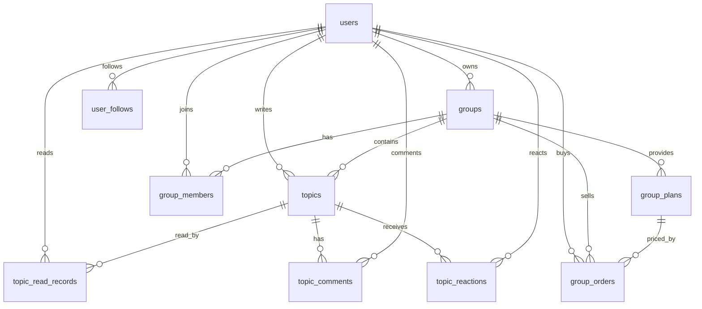

@basemodel.md 请参考基础模型，设计一个社交app，付费群组，阅读帖子，用户注册，圈主管理粉丝的，社交模型，请优化设计，指导trae按照项目规则，架构，openapi协议， CaiRobot MVP 运营管理综合平台

### **建议把社交 App 作为 CaiRobot MVP 的“Social Domain”业务域接入：保留现有 users、groups、topics 基础模型，新增群组会员、付费订阅、粉丝关系、帖子阅读权限、圈主管理、订单支付与审计模型；所有外部能力仍走 `POST /api/hello + MessagePacket + Protobuf + routes.yaml + TarsGo`，OpenAPI 只作为协议映射文档，不作为绕过网关的新接口。**

基于 `basemodel.md` 里的 `users`、`groups`、`topics` 三张基础表，我建议不要推翻重做，而是围绕它们扩展出完整的社交 App 模### **建议把社交 App 设计成 CaiRobot MVP 的一个 Social Domain：基于现有 `users`、`groups`、`topics` 三张基础表扩展，新增“群成员、付费方案、订单支付、关注粉丝、阅读记录、互动行为、圈主管理”模型，所有外部调用仍走 `POST /api/hello` + `MessagePacket` + Protobuf，不新增绕过网关的业务 REST 接口。**

这次设计的核心目标是：在现有 **CaiRobot MVP 运营管理综合平台** 技术架构下，扩展出一个面向移动端/运营后台的社交 App 模块，支持 **用户注册登录、付费群组、帖子阅读、圈主管理粉丝、粉丝运营、内容互动、后台审核与运营管理**。基础模型可以继续沿用 `basemodel.md` 中的 `users`、`groups`、`topics`，但需要补齐会员关系、付费权限、阅读行为和圈主运营能力，否则会出现“有用户、有圈子、有帖子，但无法判断谁能看、谁付费了、圈主能管理谁、用户阅读了什么”的问题。

### **一、产品模型定位**

这个社交 App 可以定义为：

> 一个以“圈子/群组”为核心的内容型社交产品。普通用户可以注册账号、浏览圈子、加入免费群组或购买付费群组权限；圈主可以创建和运营自己的群组，发布帖子，管理粉丝、成员、内容和付费方案；运营后台可以管理用户、群组、帖子、订单、举报、审核和平台配置。

从业务角色上，建议分成四类用户：

| 角色 | 核心能力 | 数据边界 |
|---|---|---|
| 游客 | 浏览公开圈子、查看公开帖子摘要、注册登录 | 不能访问付费内容 |
| 普通用户 | 注册登录、加入群组、阅读帖子、评论互动、关注圈主 | 只能访问自己有权限的内容 |
| 圈主 | 创建/管理群组、发布帖子、管理成员和粉丝、配置付费方案 | 只能管理自己拥有或授权管理的群组 |
| 平台管理员 | 用户管理、群组审核、帖子审核、订单管理、风控配置 | 通过运营后台管理全局数据 |

这个设计要特别注意：**“关注圈主”和“加入群组”不是同一件事**。关注是用户与用户之间的社交关系；加入群组是用户与群组之间的成员关系；购买付费群组是用户与群组权益之间的交易关系。三者必须分表建模，不能混在 `groups.members_count` 或 `users.membership_level` 里。

---

### **二、基于基础模型的优化方向**

`basemodel.md` 里已有三张主表：`users`、`groups`、`topics`。这三张表可以作为 MVP 的核心基础，但需要做边界优化。

#### **1. `users` 用户主表优化**

现有 `users` 表字段比较完整，包含用户名、邮箱、手机号、昵称、头像、状态、性别、生日、登录信息、会员等级、IM 注册状态等。建议保留作为账号身份主表，不要把社交关系、粉丝数量、付费权益直接堆进去。

建议新增或明确以下字段语义：

| 字段 | 建议语义 |
|---|---|
| `id` | 内部主键，char(32)，全系统关联使用 |
| `user_id` / `uid` | 对外展示 ID，建议统一只保留一个主要展示 ID |
| `membership_level` | 平台级会员等级，不等于某个付费群组会员 |
| `im_registered` | 是否已注册 IM 系统，和社交群组成员关系分离 |
| `status` | 用户账号状态，控制登录与访问权限 |

不建议直接在 `users` 中增加 `followers_count`、`following_count`、`group_count` 等频繁变化字段，除非有明确缓存/异步统计机制。MVP 可以后续用 `user_stats` 表或 Redis 聚合。

#### **2. `groups` 圈子/群组主表优化**

现有 `groups` 表已经包含名称、slug、描述、头像、封面、分类、标签、owner、状态、可见性、加入方式、官方/精选、人数上限、规则、欢迎语、类型、成员数、帖子数等字段，非常适合作为“圈子主表”。

建议将 `groups.type` 明确为：

```text
free    免费圈子
paid    付费圈子
mixed   混合圈子，部分公开内容 + 部分付费内容
invite  邀请制圈子
```

建议将 `join_mode` 明确为：

```text
1 = 直接加入
2 = 申请审核
3 = 付费加入
4 = 邀请加入
```

建议将 `visibility` 明确为：

```text
1 = 公开可见
2 = 链接可见
3 = 私密不可搜索
```

`groups` 不应直接保存“某用户是否加入”“某用户是否付费”“某用户是否被禁言”等动态关系，这些应该进入 `group_members` 和相关权限表。

#### **3. `topics` 帖子主表优化**

现有 `topics` 表字段很丰富，支持标题、内容、摘要、作者、群组、分类、标签、匿名、锁定、置顶、精选、评论开关、投票开关、发布时间、过期时间、封面、多媒体、文档、内容类型、状态、可见性等，适合做内容主表。

建议明确几个关键字段：

| 字段 | 建议语义 |
|---|---|
| `type` | 帖子类型，例如普通帖、问答帖、公告帖、付费帖、图文帖 |
| `status` | 草稿、待审核、已发布、已下架、已删除 |
| `visibility` | 公开、群成员可见、付费成员可见、圈主私密 |
| `content_type` | 纯文本、图文、视频、文档、外链 |
| `published_at` | 内容实际发布时间 |
| `last_activity_at` | 评论/点赞/置顶等引起的活跃时间 |

建议新增 `access_level` 或复用 `visibility`，用于判断阅读权限：

```text
PUBLIC = 公开可读
GROUP_MEMBER = 加群可读
PAID_MEMBER = 付费成员可读
OWNER_ONLY = 圈主/管理员可读
```

---

### **三、推荐的核心数据模型**

在已有 `users`、`groups`、`topics` 基础上，建议新增以下社交模型表。



#### **1. 群组成员表：`group_members`**

这张表是社交 App 的核心关系表，用于判断用户是否属于某个群组、在群组内是什么身份、是否被禁言、是否有效。

建议字段：

| 字段 | 类型建议 | 说明 |
|---|---|---|
| `id` | char(32) | 主键 |
| `group_id` | char(32) | 群组 ID |
| `user_id` | char(32) | 用户 ID |
| `role` | varchar(20) | owner/admin/moderator/member |
| `status` | tinyint | active/pending/banned/left/expired |
| `join_source` | varchar(20) | free/paid/invite/admin/import |
| `joined_at` | bigint | 加入时间 |
| `expired_at` | bigint | 付费权益过期时间，免费群可为空 |
| `muted_until` | bigint | 禁言截止时间 |
| `created_at` | bigint | 创建时间 |
| `updated_at` | bigint | 更新时间 |

关键索引建议：

```sql
UNIQUE KEY uk_group_user (group_id, user_id);
KEY idx_user_status (user_id, status);
KEY idx_group_status_role (group_id, status, role);
KEY idx_group_expired (group_id, expired_at);
```

这张表解决“用户是否能进入群组”“圈主能管理哪些粉丝”“付费到期后是否还能看内容”的问题。

#### **2. 付费方案表：`group_plans`**

付费群组不能只在 `groups.type = paid` 上做标记，还需要定义价格、周期和权益。

建议字段：

| 字段 | 类型建议 | 说明 |
|---|---|---|
| `id` | char(32) | 主键 |
| `group_id` | char(32) | 群组 ID |
| `name` | varchar(100) | 方案名称，例如月卡、季卡、年卡 |
| `plan_type` | varchar(20) | monthly/quarterly/yearly/lifetime |
| `price_cent` | bigint | 价格，单位分 |
| `currency` | varchar(10) | CNY |
| `duration_days` | int | 权益天数 |
| `benefits` | json | 权益说明 |
| `status` | tinyint | 上架/下架 |
| `created_at` | bigint | 创建时间 |
| `updated_at` | bigint | 更新时间 |

关键索引建议：

```sql
KEY idx_group_status (group_id, status);
KEY idx_price (price_cent);
```

#### **3. 群组订单表：`group_orders`**

订单表记录用户购买行为，负责连接用户、群组和付费方案。

建议字段：

| 字段 | 类型建议 | 说明 |
|---|---|---|
| `id` | char(32) | 主键 |
| `order_no` | varchar(64) | 对外订单号 |
| `user_id` | char(32) | 购买用户 |
| `group_id` | char(32) | 购买群组 |
| `plan_id` | char(32) | 购买方案 |
| `amount_cent` | bigint | 实付金额 |
| `currency` | varchar(10) | 币种 |
| `status` | tinyint | pending/paid/cancelled/refunded/failed |
| `pay_channel` | varchar(30) | 支付渠道 |
| `paid_at` | bigint | 支付时间 |
| `expired_at` | bigint | 权益过期时间 |
| `created_at` | bigint | 创建时间 |
| `updated_at` | bigint | 更新时间 |

关键索引建议：

```sql
UNIQUE KEY uk_order_no (order_no);
KEY idx_user_status_time (user_id, status, created_at);
KEY idx_group_status_time (group_id, status, created_at);
KEY idx_plan_status (plan_id, status);
```

支付成功后，应该由业务服务在事务内或可靠事件中更新 `group_members`，不能只更新订单不更新成员权益。

#### **4. 用户关注表：`user_follows`**

这张表表达“粉丝关系”，用于圈主管理粉丝、用户关注创作者、个人主页展示粉丝数。

建议字段：

| 字段 | 类型建议 | 说明 |
|---|---|---|
| `id` | char(32) | 主键 |
| `follower_id` | char(32) | 关注者 |
| `following_id` | char(32) | 被关注者，通常是圈主/作者 |
| `status` | tinyint | active/cancelled/blocked |
| `source` | varchar(30) | group/topic/profile/search |
| `created_at` | bigint | 关注时间 |
| `updated_at` | bigint | 更新时间 |

关键索引建议：

```sql
UNIQUE KEY uk_follow (follower_id, following_id);
KEY idx_following_status_time (following_id, status, created_at);
KEY idx_follower_status_time (follower_id, status, created_at);
```

注意：圈主“粉丝”来自 `user_follows`，圈主“群成员”来自 `group_members`，不能混用。

#### **5. 帖子阅读记录表：`topic_read_records`**

阅读帖子是你明确提出的核心功能。建议单独建阅读记录，用于已读状态、阅读历史、内容推荐、圈主数据分析。

建议字段：

| 字段 | 类型建议 | 说明 |
|---|---|---|
| `id` | char(32) | 主键 |
| `topic_id` | char(32) | 帖子 ID |
| `user_id` | char(32) | 阅读用户 |
| `group_id` | char(32) | 冗余群组 ID，便于查询 |
| `read_at` | bigint | 最近阅读时间 |
| `read_count` | bigint | 阅读次数 |
| `duration_sec` | int | 阅读时长 |
| `progress` | int | 阅读进度，0-100 |
| `created_at` | bigint | 首次阅读时间 |
| `updated_at` | bigint | 更新时间 |

关键索引建议：

```sql
UNIQUE KEY uk_user_topic (user_id, topic_id);
KEY idx_topic_read_time (topic_id, read_at);
KEY idx_user_read_time (user_id, read_at);
KEY idx_group_read_time (group_id, read_at);
```

#### **6. 评论表：`topic_comments`**

如果 MVP 要支持帖子互动，评论表建议作为第一期纳入。否则帖子只有阅读，没有社交互动。

建议字段：

| 字段 | 类型建议 | 说明 |
|---|---|---|
| `id` | char(32) | 主键 |
| `topic_id` | char(32) | 帖子 ID |
| `group_id` | char(32) | 群组 ID |
| `user_id` | char(32) | 评论用户 |
| `parent_id` | char(32) | 父评论 ID |
| `content` | text | 评论内容 |
| `status` | tinyint | 正常/审核中/隐藏/删除 |
| `created_at` | bigint | 创建时间 |
| `updated_at` | bigint | 更新时间 |

#### **7. 互动表：`topic_reactions`**

点赞、收藏、表态可以用统一互动表，不建议一开始拆成多张表。

建议字段：

| 字段 | 类型建议 | 说明 |
|---|---|---|
| `id` | char(32) | 主键 |
| `topic_id` | char(32) | 帖子 ID |
| `user_id` | char(32) | 用户 ID |
| `reaction_type` | varchar(20) | like/favorite/share |
| `status` | tinyint | active/cancelled |
| `created_at` | bigint | 创建时间 |
| `updated_at` | bigint | 更新时间 |

关键索引建议：

```sql
UNIQUE KEY uk_user_topic_reaction (user_id, topic_id, reaction_type);
KEY idx_topic_reaction (topic_id, reaction_type, status);
```

#### **8. 圈主管理扩展表：`group_admin_actions`**

圈主管理粉丝时，建议记录操作日志，便于审计。

建议字段：

| 字段 | 类型建议 | 说明 |
|---|---|---|
| `id` | char(32) | 主键 |
| `group_id` | char(32) | 群组 ID |
| `operator_id` | char(32) | 操作人，圈主/管理员 |
| `target_user_id` | char(32) | 被操作用户 |
| `action_type` | varchar(30) | approve/ban/mute/remove/set_admin |
| `reason` | varchar(500) | 原因 |
| `created_at` | bigint | 操作时间 |

这张表对运营管理综合平台非常重要，后续后台可以用它查看圈主是否滥用管理权限。

---

### **四、业务域模块拆分建议**

按照 CaiRobot MVP 当前架构，不建议把所有社交功能都写进一个巨大模块。建议按领域拆分，但第一期可以落在 `go/modules/social` 下，再按 package 分层。

推荐模块边界：

| 模块 | 目录建议 | 责任 |
|---|---|---|
| 用户账号模块 | `go/modules/user` | 注册、登录、用户资料、账号状态 |
| 社交关系模块 | `go/modules/social/follow` | 关注、取关、粉丝列表、关注列表 |
| 群组模块 | `go/modules/social/group` | 创建群组、群组详情、加入群组、成员管理 |
| 内容模块 | `go/modules/social/topic` | 发帖、帖子列表、帖子详情、阅读记录 |
| 付费模块 | `go/modules/social/payment` | 付费方案、订单、支付回调、权益开通 |
| 管理模块 | `go/modules/social/admin` | 圈主管理、后台审核、运营管理 |
| 协议定义 | `proto/social/*.proto` | Protobuf 请求/响应定义 |
| OpenAPI 文档 | `docs/api/social-openapi.yaml` | 网关协议映射说明 |
| 协议注册 | `docs/api/协议编号注册表.md` | maxType/minType 分配 |

如果项目当前已有 `modules/hello` 示例，Trae 应参考其 `handler.go`、`service.go`、`usecase.go` 的分层方式，不要把业务全部堆进一个文件。

---

### **五、协议设计原则**

你要求“按照项目规则、架构、OpenAPI 协议”，这里要统一口径：

**OpenAPI 用于描述外部协议和调试文档，但业务调用仍然应该映射到项目当前单网关协议，即 `POST /api/hello` + `MessagePacket` + Protobuf bytes。**

也就是说，不建议新增这些绕过网关的 REST 接口：

```text
POST /api/users/register
POST /api/groups
GET /api/groups/:id/topics
POST /api/topics/:id/read
```

而是应该设计成逻辑协议，再由 OpenAPI 文档描述它们如何通过 `MessagePacket` 进入。

建议协议大类：

```text
maxType = 300  Social Domain
```

具体编号必须以 `docs/api/协议编号注册表.md` 为准，如果已有编号冲突，Trae 必须重新分配。

建议 minType：

| minType | 协议名称 | 说明 |
|---:|---|---|
| 30001 | UserRegister | 用户注册 |
| 30002 | UserLogin | 用户登录 |
| 30003 | GetUserProfile | 获取用户资料 |
| 30101 | CreateGroup | 创建圈子 |
| 30102 | GetGroupDetail | 群组详情 |
| 30103 | ListGroups | 群组列表 |
| 30104 | JoinGroup | 加入免费群组/申请加入 |
| 30105 | ListGroupMembers | 圈主管理成员列表 |
| 30106 | UpdateGroupMemberStatus | 禁言、移除、恢复成员 |
| 30201 | CreateTopic | 发布帖子 |
| 30202 | GetTopicDetail | 帖子详情 |
| 30203 | ListGroupTopics | 群组帖子列表 |
| 30204 | MarkTopicRead | 标记阅读 |
| 30205 | CreateTopicComment | 评论帖子 |
| 30206 | ReactTopic | 点赞/收藏/取消 |
| 30301 | FollowUser | 关注用户/圈主 |
| 30302 | UnfollowUser | 取关用户/圈主 |
| 30303 | ListFollowers | 粉丝列表 |
| 30304 | ListFollowings | 关注列表 |
| 30401 | CreateGroupPlan | 创建付费方案 |
| 30402 | ListGroupPlans | 查询付费方案 |
| 30403 | CreateGroupOrder | 创建群组订单 |
| 30404 | ConfirmGroupPayment | 支付确认/回调后确认权益 |
| 30501 | OwnerDashboard | 圈主数据看板 |

---

### **六、Protobuf 协议草案**

建议 Trae 新增：

```text
proto/social/user.proto
proto/social/group.proto
proto/social/topic.proto
proto/social/follow.proto
proto/social/payment.proto
proto/social/admin.proto
```

示例协议可以这样设计：

```proto
syntax = "proto3";

package cairobot.social.v1;

option go_package = "github.com/jimiechen/cairobotmvp/proto/generated/go/social/v1;socialv1";

message PageRequest {
  int32 page = 1;
  int32 page_size = 2;
}

message PageResponse {
  int64 total = 1;
  int32 page = 2;
  int32 page_size = 3;
}

message UserRegisterRequest {
  string username = 1;
  string password = 2;
  string email = 3;
  string phone = 4;
  string nickname = 5;
  string invite_code = 6;
}

message UserRegisterResponse {
  string user_id = 1;
  string uid = 2;
  string nickname = 3;
  string token = 4;
}

message GroupDTO {
  string id = 1;
  string name = 2;
  string slug = 3;
  string description = 4;
  string avatar = 5;
  string cover_image = 6;
  string owner_id = 7;
  string type = 8;
  int32 visibility = 9;
  int32 join_mode = 10;
  int64 members_count = 11;
  int64 topics_count = 12;
  int64 created_at = 13;
}

message CreateGroupRequest {
  string name = 1;
  string slug = 2;
  string description = 3;
  string avatar = 4;
  string cover_image = 5;
  string category = 6;
  repeated string tags = 7;
  string type = 8;
  int32 visibility = 9;
  int32 join_mode = 10;
  int64 max_members = 11;
  string rules = 12;
  string welcome_message = 13;
}

message CreateGroupResponse {
  GroupDTO group = 1;
}

message JoinGroupRequest {
  string group_id = 1;
  string plan_id = 2;
  string invite_code = 3;
  string message = 4;
}

message JoinGroupResponse {
  string member_id = 1;
  string status = 2;
  int64 expired_at = 3;
}

message TopicDTO {
  string id = 1;
  string group_id = 2;
  string author_id = 3;
  string title = 4;
  string summary = 5;
  string content = 6;
  int32 type = 7;
  int32 status = 8;
  int32 visibility = 9;
  int64 published_at = 10;
  int64 created_at = 11;
  bool can_read_full_content = 12;
}

message CreateTopicRequest {
  string group_id = 1;
  string title = 2;
  string content = 3;
  string summary = 4;
  repeated string tags = 5;
  int32 type = 6;
  int32 visibility = 7;
  string cover_image = 8;
}

message CreateTopicResponse {
  TopicDTO topic = 1;
}

message GetTopicDetailRequest {
  string topic_id = 1;
}

message GetTopicDetailResponse {
  TopicDTO topic = 1;
}

message MarkTopicReadRequest {
  string topic_id = 1;
  int32 progress = 2;
  int32 duration_sec = 3;
}

message MarkTopicReadResponse {
  bool success = 1;
  int64 read_at = 2;
}
```

关键点是：`GetTopicDetailResponse` 里建议带 `can_read_full_content`。如果用户无权限，可以返回摘要和权限状态，不返回完整内容。

---

### **七、OpenAPI 文档设计方式**

由于项目当前架构是单网关，OpenAPI 不应该描述成一堆真实 REST 业务入口，而应该描述 **网关统一入口 + 逻辑协议映射**。

建议新增：

```text
docs/api/social-openapi.yaml
```

示例结构：

```yaml
openapi: 3.0.3
info:
  title: CaiRobot Social API
  version: 1.0.0
  description: >
    CaiRobot MVP 社交 App 协议文档。所有业务请求统一通过 POST /api/hello 进入，
    由 MessagePacket.maxType 和 MessagePacket.minType 标识具体业务协议，
    payload 使用对应 Protobuf Request 序列化后的 bytes。

paths:
  /api/hello:
    post:
      summary: CaiRobot unified gateway entrance
      operationId: callMessagePacket
      requestBody:
        required: true
        content:
          application/x-protobuf:
            schema:
              type: string
              format: binary
      responses:
        "200":
          description: MessagePacket response
          content:
            application/x-protobuf:
              schema:
                type: string
                format: binary
```

然后在文档中增加逻辑协议说明：

```yaml
x-cairobot-protocols:
  - name: UserRegister
    maxType: 300
    minType: 30001
    requestProto: cairobot.social.v1.UserRegisterRequest
    responseProto: cairobot.social.v1.UserRegisterResponse
  - name: CreateGroup
    maxType: 300
    minType: 30101
    requestProto: cairobot.social.v1.CreateGroupRequest
    responseProto: cairobot.social.v1.CreateGroupResponse
  - name: GetTopicDetail
    maxType: 300
    minType: 30202
    requestProto: cairobot.social.v1.GetTopicDetailRequest
    responseProto: cairobot.social.v1.GetTopicDetailResponse
```

这样既符合 OpenAPI 文档化需求，又不破坏项目当前单网关架构。

---

### **八、核心权限规则**

社交 App 最容易出问题的是权限判断。建议 Trae 必须实现统一权限服务，不允许每个 handler 自己散写判断。

推荐新增：

```text
go/modules/social/permission
```

核心能力：

```go
CanViewGroup(userID, groupID string) bool
CanJoinGroup(userID, groupID string) bool
CanReadTopic(userID, topicID string) bool
CanManageGroup(operatorID, groupID string) bool
CanManageMember(operatorID, groupID, targetUserID string) bool
CanPublishTopic(userID, groupID string) bool
```

权限规则建议：

| 场景 | 判断逻辑 |
|---|---|
| 查看公开群组 | `groups.visibility = public` 且 `groups.status = active` |
| 查看私密群组 | 用户是成员、圈主、管理员或平台管理员 |
| 阅读公开帖子 | 帖子已发布、未删除、公开可见 |
| 阅读成员帖 | 用户是有效群成员 |
| 阅读付费帖 | 用户是有效付费成员，`expired_at` 未过期 |
| 圈主管理成员 | 操作人是 group owner/admin，不能越权管理 owner |
| 发布帖子 | 用户是群成员，且未被禁言，群组允许发帖 |
| 订单开通权益 | 订单已支付，方案有效，群组有效 |

---

### **九、运行链路设计**

用户阅读付费群组帖子时，完整链路应该是：

```text
App 请求帖子详情
        ↓
构造 MessagePacket
maxType=300, minType=30202
payload=GetTopicDetailRequest(topic_id)
        ↓
POST /api/hello
        ↓
Gateway 解析 MessagePacket
        ↓
routes.yaml 匹配 social topic service
        ↓
TarsGo bytes 接口
        ↓
TopicHandler decode Protobuf
        ↓
TopicUsecase.GetTopicDetail
        ↓
PermissionService.CanReadTopic
        ↓
TopicRepository 查询 topics
        ↓
GroupMemberRepository 查询 group_members
        ↓
返回完整内容或无权限摘要
        ↓
encode GetTopicDetailResponse
        ↓
Gateway 封装统一响应
        ↓
App 展示帖子
```

这个链路要求 Trae 不要在前端直接判断“是否付费可读”，前端只能根据后端返回的 `can_read_full_content`、`access_status`、`need_plan_id` 做展示。

---

### **十、推荐第一期 MVP 范围**

为了避免一开始做得过大，建议第一期只做核心闭环：

| 优先级 | 功能 | 是否必须 |
|---|---|---|
| P0 | 用户注册/登录 | 必须 |
| P0 | 创建群组 | 必须 |
| P0 | 群组列表/详情 | 必须 |
| P0 | 加入免费群组 | 必须 |
| P0 | 创建付费方案 | 必须 |
| P0 | 创建订单并开通权益 | 必须 |
| P0 | 发布帖子 | 必须 |
| P0 | 帖子列表/详情 | 必须 |
| P0 | 付费帖子阅读权限判断 | 必须 |
| P0 | 圈主查看成员/粉丝 | 必须 |
| P1 | 评论、点赞、收藏 | 建议 |
| P1 | 阅读记录 | 建议 |
| P1 | 禁言/移除成员 | 建议 |
| P2 | 推荐流、搜索、消息通知 | 后续 |
| P2 | 分销、优惠券、创作者收益结算 | 后续 |

---

### **十一、给 Trae 的开发指导 Prompt**

下面这段可以直接发给 Trae 作为开发任务指令。

```text
你现在接手的是 CaiRobot MVP 运营管理综合平台项目，需要在现有协议和技术架构下，基于 basemodel.md 中已有的 users、groups、topics 三张基础表，设计并实现一个社交 App MVP 模块。

一、项目架构约束

必须严格遵循当前 CODE-WIKI 中的架构规则：

1. 外部业务请求统一通过 POST /api/hello 进入。
2. 请求通过 MessagePacket.maxType / minType 标识协议身份。
3. 请求和响应业务字段必须使用 Protobuf 定义。
4. maxType/minType 到内部服务的映射必须配置到 routes.yaml。
5. 内部服务遵循 TarsCloud/TarsGo 服务治理与 bytes 接口约定。
6. Go 代码必须按 handler / service / usecase / repository 分层。
7. TypeScript 前端不得手写临时 JSON 协议，必须使用生成的 Protobuf 类型或统一 proto-client。
8. OpenAPI 只作为统一网关协议文档和调试描述，不得新增绕过 POST /api/hello 的业务 REST 接口。
9. 所有新增协议必须更新 docs/api/协议编号注册表.md。
10. 所有新增模块、运行方式、协议说明必须更新 docs/wiki/CODE-WIKI.md 或对应 docs/api 文档。

二、业务目标

设计并实现社交 App MVP，支持：

1. 用户注册与登录。
2. 用户资料查询。
3. 圈子/群组创建。
4. 免费群组加入。
5. 付费群组方案配置。
6. 付费群组订单创建与权益开通。
7. 帖子发布。
8. 帖子列表与详情。
9. 付费帖子/群成员帖子阅读权限判断。
10. 帖子阅读记录。
11. 用户关注圈主。
12. 圈主查看粉丝与群成员。
13. 圈主管理成员，包括禁言、移除、恢复。
14. 后台可扩展审核与运营管理能力。

三、基础模型

参考 basemodel.md 中已有表：

1. users：用户主表。
2. groups：圈子/群组主表。
3. topics：帖子主表。

在此基础上新增以下表：

1. group_members：群组成员关系表。
2. group_plans：付费群组方案表。
3. group_orders：付费群组订单表。
4. user_follows：用户关注/粉丝关系表。
5. topic_read_records：帖子阅读记录表。
6. topic_comments：帖子评论表。
7. topic_reactions：帖子点赞/收藏/分享互动表。
8. group_admin_actions：圈主管理操作日志表。

四、数据模型要求

1. users 只作为账号身份主表，不要堆粉丝关系和群组权益。
2. groups 只作为圈子主表，不要保存用户是否加入、是否付费等动态关系。
3. topics 只作为帖子主表，阅读权限由 topics.visibility + group_members + group_orders/group_plans 判断。
4. 关注关系用 user_follows 表表达。
5. 群成员关系用 group_members 表表达。
6. 付费权益通过 group_orders 支付成功后写入或更新 group_members.expired_at。
7. 阅读行为写入 topic_read_records。
8. 圈主管理行为必须写入 group_admin_actions，便于审计。

五、协议编号建议

请先检查 docs/api/协议编号注册表.md，确认是否已有 Social Domain 编号。如果没有冲突，可以使用：

maxType = 300

minType 建议：

30001 UserRegister
30002 UserLogin
30003 GetUserProfile

30101 CreateGroup
30102 GetGroupDetail
30103 ListGroups
30104 JoinGroup
30105 ListGroupMembers
30106 UpdateGroupMemberStatus

30201 CreateTopic
30202 GetTopicDetail
30203 ListGroupTopics
30204 MarkTopicRead
30205 CreateTopicComment
30206 ReactTopic

30301 FollowUser
30302 UnfollowUser
30303 ListFollowers
30304 ListFollowings

30401 CreateGroupPlan
30402 ListGroupPlans
30403 CreateGroupOrder
30404 ConfirmGroupPayment

30501 OwnerDashboard

如果编号冲突，必须重新分配，并更新协议编号注册表。

六、Protobuf 文件要求

新增或更新以下文件：

proto/social/user.proto
proto/social/group.proto
proto/social/topic.proto
proto/social/follow.proto
proto/social/payment.proto
proto/social/admin.proto

每个协议必须定义 Request 和 Response，不允许使用 map[string]interface{} 替代强类型字段。

七、OpenAPI 文档要求

新增：

docs/api/social-openapi.yaml

OpenAPI 文档必须描述统一网关入口：

POST /api/hello

并通过 x-cairobot-protocols 扩展字段描述 Social Domain 逻辑协议映射，包括：

name
maxType
minType
requestProto
responseProto

不得在 OpenAPI 中定义实际绕过网关的业务 REST 路径，例如 /api/groups、/api/topics/:id 等。

八、Go 模块实现要求

建议新增：

go/modules/social/

目录结构建议：

go/modules/social/
  handler/
  service/
  usecase/
  repository/
  permission/
  model/
  adapter/
  tests/

实现要求：

1. handler 只负责 Protobuf decode/encode、参数校验、调用 usecase/service。
2. usecase 负责业务流程编排。
3. service 负责领域服务能力，如权限、订单、群组、帖子。
4. repository 负责数据库读写。
5. permission 包统一处理权限，不允许在各 handler 中散写权限判断。
6. 所有写操作必须考虑事务。
7. 创建订单和开通群组权益必须保证一致性。
8. 帖子详情必须调用 CanReadTopic 判断阅读权限。
9. 圈主管理成员必须调用 CanManageMember 判断权限。
10. 成员数、帖子数等计数字段必须有一致的更新策略，可以先事务内同步更新，后续再改异步统计。

九、权限服务要求

实现以下能力：

CanViewGroup(userID, groupID string) bool
CanJoinGroup(userID, groupID string) bool
CanReadTopic(userID, topicID string) bool
CanManageGroup(operatorID, groupID string) bool
CanManageMember(operatorID, groupID, targetUserID string) bool
CanPublishTopic(userID, groupID string) bool

十、测试要求

至少补充：

1. 用户注册单元测试。
2. 创建群组单元测试。
3. 加入群组单元测试。
4. 创建付费方案单元测试。
5. 创建订单并开通权益测试。
6. 发布帖子测试。
7. 付费帖子阅读权限测试。
8. 圈主管理成员权限测试。
9. maxType/minType 网关路由集成测试。
10. Protobuf encode/decode 测试。

必须保证 make test 或项目当前测试命令通过。

十一、文档更新要求

必须更新：

docs/wiki/CODE-WIKI.md
docs/api/协议编号注册表.md
docs/api/social-openapi.yaml

如涉及架构决策，新增：

docs/adr/ADR-social-domain-model.md

如涉及产品需求，新增：

docs/prd/PRD-social-app-mvp.md

十二、禁止事项

1. 禁止新增绕过 POST /api/hello 的业务 HTTP 接口。
2. 禁止使用临时 JSON 协议替代 Protobuf。
3. 禁止在 Gateway 层写具体社交业务逻辑。
4. 禁止前端直接访问内部 Go 服务。
5. 禁止将粉丝关系、群成员关系、付费权益混在一张表中。
6. 禁止只写代码不更新协议文档。
7. 禁止只实现 happy path，不做权限和异常测试。
8. 禁止圈主管理任意用户，必须限定在自己管理的群组内。
9. 禁止无权限用户读取付费帖子完整内容。
10. 禁止支付成功后只更新订单，不更新群组成员权益。

十三、交付结果

完成后请输出：

1. 架构理解说明。
2. 新增/修改文件清单。
3. 数据库迁移文件清单。
4. Protobuf 协议清单。
5. maxType/minType 注册表。
6. routes.yaml 更新内容。
7. Go 模块实现说明。
8. OpenAPI 文档说明。
9. 测试用例与测试结果。
10. 风险点与后续优化建议。
```

---

### **十二、验收清单**

Trae 完成后，你可以按下面清单验收。

| 验收项 | 判断标准 |
|---|---|
| 架构合规 | 是否仍然通过 `POST /api/hello` 进入 |
| 协议合规 | 是否新增 Protobuf Request/Response |
| 编号合规 | 是否更新 `docs/api/协议编号注册表.md` |
| 路由合规 | 是否更新 `routes.yaml` |
| OpenAPI 合规 | 是否描述统一网关，而不是绕过网关的 REST |
| 数据模型合规 | 是否分清用户、粉丝、群成员、付费权益 |
| 权限合规 | 是否有统一 permission 服务 |
| 付费合规 | 支付成功后是否正确开通/续期权益 |
| 阅读合规 | 无权限用户是否不能读取付费内容全文 |
| 圈主管理合规 | 圈主是否只能管理自己群组内成员 |
| 测试合规 | 是否覆盖注册、群组、帖子、付费、权限、网关路由 |
| 文档合规 | 是否更新 CODE-WIKI、API 文档、协议注册表 |

这套方案的重点不是单纯“加几张表”，而是把社交 App 放进 CaiRobot MVP 现有工程体系里：**协议先行、单网关入口、Protobuf 强类型、TarsGo 服务边界、权限统一、文档同步、测试闭环**。这样 Trae 后续开发出来的内容才不会偏离当前项目规则。

*内容由 AI 生成仅供参考*