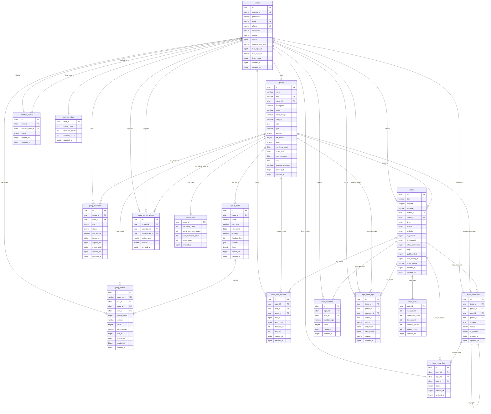

gorm生成sql建表语句，生成完整的sql建表语句 @PRD-social-app-mvp.md ，生成er图，mermaid格式

### **建议采用 tinyint 存储协议枚举，svc 层使用 protobuf 枚举常量，### **以下是基于 `PRD-social-app-mvp.md` 生成的完整 MySQL 建表 SQL 与 Mermaid ER 图，可作为 GORM Migration/DDL 基线使用。**

我按 PRD 中的数据模型整理为 MySQL 8.x / InnoDB / `utf8mb4` 版本。时间字段统一使用 `bigint` 时间戳；1 级事实表保留强一致事务设计；2 级统计表作为可重建快照表。需要注意：PRD 中 `group_members.role` 使用字符串枚举，`groups.visibility`、`groups.join_mode`、`topics.status`、`topics.visibility` 等使用 `tinyint` 枚举；如果代码侧已经决定全面使用 Protobuf 数字枚举，建议后续将 `role` 也统一改成 `tinyint`，避免 schema 与 svc 层枚举风格不一致。

### **完整 SQL 建表语句**

```sql
-- ============================================================
-- Social App MVP Schema
-- Source: PRD-social-app-mvp.md
-- Engine: MySQL 8.x / InnoDB
-- Charset: utf8mb4
-- Time: bigint unix timestamp
-- ============================================================

SET NAMES utf8mb4;
SET FOREIGN_KEY_CHECKS = 0;

-- ============================================================
-- 1. users - 用户身份主表（1级数据）
-- ============================================================

CREATE TABLE IF NOT EXISTS `users` (
  `id` char(32) NOT NULL COMMENT '内部主键，全系统关联',
  `uid` bigint DEFAULT NULL COMMENT '用户数字ID，便于展示或外部引用',
  `username` varchar(50) NOT NULL COMMENT '登录用户名',
  `password` varchar(255) NOT NULL COMMENT '加密密码',
  `email` varchar(100) DEFAULT NULL COMMENT '邮箱',
  `phone` varchar(20) DEFAULT NULL COMMENT '手机号',
  `nickname` varchar(50) DEFAULT NULL COMMENT '昵称',
  `avatar` varchar(255) DEFAULT NULL COMMENT '头像URL',
  `status` tinyint NOT NULL DEFAULT '1' COMMENT '状态：1=active 2=inactive 3=banned 4=deleted',
  `membership_level` varchar(32) NOT NULL DEFAULT 'normal' COMMENT '平台会员等级，非群组付费会员',
  `last_login_at` bigint DEFAULT NULL COMMENT '最后登录时间',
  `last_login_ip` varchar(64) DEFAULT NULL COMMENT '最后登录IP',
  `login_count` bigint NOT NULL DEFAULT '0' COMMENT '登录次数',
  `created_at` bigint NOT NULL COMMENT '创建时间',
  `updated_at` bigint NOT NULL COMMENT '更新时间',
  PRIMARY KEY (`id`),
  UNIQUE KEY `uk_users_uid` (`uid`),
  UNIQUE KEY `uk_users_username` (`username`),
  UNIQUE KEY `uk_users_email` (`email`),
  UNIQUE KEY `uk_users_phone` (`phone`),
  KEY `idx_users_status` (`status`),
  KEY `idx_users_created_at` (`created_at`)
) ENGINE=InnoDB DEFAULT CHARSET=utf8mb4 COLLATE=utf8mb4_unicode_ci COMMENT='用户身份主表（1级数据）';

-- ============================================================
-- 2. groups - 群组/圈子主表（1级数据 + 少量2级快照字段）
-- ============================================================

CREATE TABLE IF NOT EXISTS `groups` (
  `id` char(32) NOT NULL COMMENT '群组ID',
  `name` varchar(100) NOT NULL COMMENT '群组名称',
  `slug` varchar(100) NOT NULL COMMENT 'URL标识',
  `description` text DEFAULT NULL COMMENT '群组描述',
  `avatar` varchar(255) DEFAULT NULL COMMENT '群组头像',
  `cover_image` varchar(500) DEFAULT NULL COMMENT '封面图',
  `category` varchar(64) DEFAULT NULL COMMENT '分类',
  `tags` json DEFAULT NULL COMMENT '标签JSON数组',
  `owner_id` char(32) NOT NULL COMMENT '圈主用户ID',
  `type` varchar(20) NOT NULL DEFAULT 'free' COMMENT '群组类型：free/paid/mixed/invite',
  `visibility` tinyint NOT NULL DEFAULT '1' COMMENT '可见性：1=公开 2=链接可见 3=私密',
  `join_mode` tinyint NOT NULL DEFAULT '1' COMMENT '加入方式：1=直接 2=审核 3=付费 4=邀请',
  `status` tinyint NOT NULL DEFAULT '1' COMMENT '状态：1=active 2=inactive 3=closed 4=deleted',
  `members_count` bigint NOT NULL DEFAULT '0' COMMENT '成员数冗余快照（2级）',
  `topics_count` bigint NOT NULL DEFAULT '0' COMMENT '帖子数冗余快照（2级）',
  `max_members` bigint NOT NULL DEFAULT '0' COMMENT '人数上限，0表示不限',
  `rules` text DEFAULT NULL COMMENT '群组规则',
  `welcome_message` text DEFAULT NULL COMMENT '欢迎语',
  `created_at` bigint NOT NULL COMMENT '创建时间',
  `updated_at` bigint NOT NULL COMMENT '更新时间',
  PRIMARY KEY (`id`),
  UNIQUE KEY `uk_groups_slug` (`slug`),
  KEY `idx_groups_owner` (`owner_id`),
  KEY `idx_groups_status_visibility` (`status`, `visibility`),
  KEY `idx_groups_category_status` (`category`, `status`),
  KEY `idx_groups_created_at` (`created_at`),
  CONSTRAINT `fk_groups_owner` FOREIGN KEY (`owner_id`) REFERENCES `users` (`id`)
) ENGINE=InnoDB DEFAULT CHARSET=utf8mb4 COLLATE=utf8mb4_unicode_ci COMMENT='群组/圈子主表（1级数据）';

-- ============================================================
-- 3. topics - 帖子主表（1级数据）
-- ============================================================

CREATE TABLE IF NOT EXISTS `topics` (
  `id` char(32) NOT NULL COMMENT '帖子ID',
  `group_id` char(32) NOT NULL COMMENT '所属群组ID',
  `author_id` char(32) NOT NULL COMMENT '作者用户ID',
  `title` varchar(200) NOT NULL COMMENT '标题',
  `content` longtext NOT NULL COMMENT '正文内容',
  `summary` varchar(500) DEFAULT NULL COMMENT '摘要，无权限时返回',
  `type` tinyint NOT NULL DEFAULT '1' COMMENT '帖子类型：1=normal 2=article 3=question 4=notice',
  `status` tinyint NOT NULL DEFAULT '1' COMMENT '状态：1=draft 2=pending 3=published 4=rejected 5=banned 6=deleted',
  `visibility` tinyint NOT NULL DEFAULT '1' COMMENT '可见性：1=PUBLIC 2=GROUP_MEMBER 3=PAID_MEMBER 4=OWNER_ONLY',
  `is_pinned` tinyint NOT NULL DEFAULT '0' COMMENT '是否置顶：0=否 1=是',
  `is_featured` tinyint NOT NULL DEFAULT '0' COMMENT '是否精选：0=否 1=是',
  `allow_comments` tinyint NOT NULL DEFAULT '1' COMMENT '是否允许评论：0=否 1=是',
  `published_at` bigint DEFAULT NULL COMMENT '发布时间',
  `last_activity_at` bigint DEFAULT NULL COMMENT '最后活跃时间（2级派生）',
  `cover_image` varchar(500) DEFAULT NULL COMMENT '封面图',
  `tags` json DEFAULT NULL COMMENT '标签JSON数组',
  `created_at` bigint NOT NULL COMMENT '创建时间',
  `updated_at` bigint NOT NULL COMMENT '更新时间',
  PRIMARY KEY (`id`),
  KEY `idx_topics_group_status_publish` (`group_id`, `status`, `published_at`),
  KEY `idx_topics_author_status` (`author_id`, `status`),
  KEY `idx_topics_visibility_status` (`visibility`, `status`),
  KEY `idx_topics_pinned` (`group_id`, `is_pinned`, `published_at`),
  KEY `idx_topics_featured` (`is_featured`, `status`, `published_at`),
  CONSTRAINT `fk_topics_group` FOREIGN KEY (`group_id`) REFERENCES `groups` (`id`),
  CONSTRAINT `fk_topics_author` FOREIGN KEY (`author_id`) REFERENCES `users` (`id`)
) ENGINE=InnoDB DEFAULT CHARSET=utf8mb4 COLLATE=utf8mb4_unicode_ci COMMENT='帖子主表（1级数据）';

-- ============================================================
-- 4. group_members - 群组成员关系表（1级数据）
-- ============================================================

CREATE TABLE IF NOT EXISTS `group_members` (
  `id` char(32) NOT NULL COMMENT '主键UUID',
  `group_id` char(32) NOT NULL COMMENT '群组ID',
  `user_id` char(32) NOT NULL COMMENT '用户ID',
  `role` varchar(20) NOT NULL DEFAULT 'member' COMMENT '角色：owner/admin/moderator/member',
  `status` tinyint NOT NULL DEFAULT '1' COMMENT '状态：1=active 2=pending 3=banned 4=left 5=expired',
  `join_source` varchar(20) DEFAULT NULL COMMENT '加入来源：free/paid/invite/admin/import/follow',
  `joined_at` bigint DEFAULT NULL COMMENT '加入时间',
  `expired_at` bigint DEFAULT NULL COMMENT '付费权益过期时间，免费群为空',
  `muted_until` bigint DEFAULT NULL COMMENT '禁言截止时间戳',
  `created_at` bigint NOT NULL COMMENT '创建时间',
  `updated_at` bigint NOT NULL COMMENT '更新时间',
  PRIMARY KEY (`id`),
  UNIQUE KEY `uk_group_members_group_user` (`group_id`, `user_id`),
  KEY `idx_group_members_user_status` (`user_id`, `status`),
  KEY `idx_group_members_group_status_role` (`group_id`, `status`, `role`),
  KEY `idx_group_members_group_expired` (`group_id`, `expired_at`),
  KEY `idx_group_members_muted_until` (`muted_until`),
  CONSTRAINT `fk_group_members_group` FOREIGN KEY (`group_id`) REFERENCES `groups` (`id`),
  CONSTRAINT `fk_group_members_user` FOREIGN KEY (`user_id`) REFERENCES `users` (`id`)
) ENGINE=InnoDB DEFAULT CHARSET=utf8mb4 COLLATE=utf8mb4_unicode_ci COMMENT='群组成员关系表（1级数据）';

-- ============================================================
-- 5. group_plans - 付费群组方案表（1级数据）
-- ============================================================

CREATE TABLE IF NOT EXISTS `group_plans` (
  `id` char(32) NOT NULL COMMENT '方案ID',
  `group_id` char(32) NOT NULL COMMENT '所属群组ID',
  `name` varchar(100) NOT NULL COMMENT '方案名称：月卡/季卡/年卡',
  `plan_type` varchar(20) NOT NULL COMMENT '方案类型：monthly/quarterly/yearly/lifetime',
  `price_cent` bigint NOT NULL DEFAULT '0' COMMENT '价格，单位：分',
  `currency` varchar(10) NOT NULL DEFAULT 'CNY' COMMENT '币种',
  `duration_days` int NOT NULL DEFAULT '30' COMMENT '权益天数',
  `benefits` json DEFAULT NULL COMMENT '权益说明JSON',
  `status` tinyint NOT NULL DEFAULT '1' COMMENT '状态：1=上架 2=下架',
  `created_at` bigint NOT NULL COMMENT '创建时间',
  `updated_at` bigint NOT NULL COMMENT '更新时间',
  PRIMARY KEY (`id`),
  KEY `idx_group_plans_group_status` (`group_id`, `status`),
  KEY `idx_group_plans_type_status` (`plan_type`, `status`),
  CONSTRAINT `fk_group_plans_group` FOREIGN KEY (`group_id`) REFERENCES `groups` (`id`)
) ENGINE=InnoDB DEFAULT CHARSET=utf8mb4 COLLATE=utf8mb4_unicode_ci COMMENT='付费群组方案表（1级数据）';

-- ============================================================
-- 6. group_orders - 群组付费订单表（1级数据）
-- ============================================================

CREATE TABLE IF NOT EXISTS `group_orders` (
  `id` char(32) NOT NULL COMMENT '订单ID',
  `order_no` varchar(64) NOT NULL COMMENT '对外订单号',
  `user_id` char(32) NOT NULL COMMENT '购买用户ID',
  `group_id` char(32) NOT NULL COMMENT '购买群组ID',
  `plan_id` char(32) DEFAULT NULL COMMENT '购买方案ID',
  `amount_cent` bigint NOT NULL DEFAULT '0' COMMENT '实付金额，单位：分',
  `currency` varchar(10) NOT NULL DEFAULT 'CNY' COMMENT '币种',
  `status` tinyint NOT NULL DEFAULT '1' COMMENT '订单状态：1=pending 2=paid 3=cancelled 4=refunded 5=failed',
  `pay_channel` varchar(30) DEFAULT NULL COMMENT '支付渠道',
  `paid_at` bigint DEFAULT NULL COMMENT '支付时间',
  `expired_at` bigint DEFAULT NULL COMMENT '权益过期时间',
  `created_at` bigint NOT NULL COMMENT '创建时间',
  `updated_at` bigint NOT NULL COMMENT '更新时间',
  PRIMARY KEY (`id`),
  UNIQUE KEY `uk_group_orders_order_no` (`order_no`),
  KEY `idx_group_orders_user_status_time` (`user_id`, `status`, `created_at`),
  KEY `idx_group_orders_group_status_time` (`group_id`, `status`, `created_at`),
  KEY `idx_group_orders_plan` (`plan_id`),
  CONSTRAINT `fk_group_orders_user` FOREIGN KEY (`user_id`) REFERENCES `users` (`id`),
  CONSTRAINT `fk_group_orders_group` FOREIGN KEY (`group_id`) REFERENCES `groups` (`id`),
  CONSTRAINT `fk_group_orders_plan` FOREIGN KEY (`plan_id`) REFERENCES `group_plans` (`id`)
) ENGINE=InnoDB DEFAULT CHARSET=utf8mb4 COLLATE=utf8mb4_unicode_ci COMMENT='群组付费订单表（1级数据）';

-- ============================================================
-- 7. topic_read_records - 帖子阅读记录表（2级行为数据）
-- ============================================================

CREATE TABLE IF NOT EXISTS `topic_read_records` (
  `id` char(32) NOT NULL COMMENT '阅读记录ID',
  `topic_id` char(32) NOT NULL COMMENT '帖子ID',
  `user_id` char(32) NOT NULL COMMENT '阅读用户ID',
  `group_id` char(32) DEFAULT NULL COMMENT '冗余群组ID，便于按群组查询',
  `read_at` bigint DEFAULT NULL COMMENT '最近阅读时间',
  `read_count` bigint NOT NULL DEFAULT '0' COMMENT '阅读次数',
  `duration_sec` int NOT NULL DEFAULT '0' COMMENT '累计阅读时长，单位：秒',
  `progress` int NOT NULL DEFAULT '0' COMMENT '阅读进度，0-100',
  `created_at` bigint NOT NULL COMMENT '首次阅读时间',
  `updated_at` bigint NOT NULL COMMENT '更新时间',
  PRIMARY KEY (`id`),
  UNIQUE KEY `uk_topic_read_records_user_topic` (`user_id`, `topic_id`),
  KEY `idx_topic_read_records_topic_time` (`topic_id`, `read_at`),
  KEY `idx_topic_read_records_user_time` (`user_id`, `read_at`),
  KEY `idx_topic_read_records_group_time` (`group_id`, `read_at`),
  CONSTRAINT `fk_topic_read_records_topic` FOREIGN KEY (`topic_id`) REFERENCES `topics` (`id`),
  CONSTRAINT `fk_topic_read_records_user` FOREIGN KEY (`user_id`) REFERENCES `users` (`id`),
  CONSTRAINT `fk_topic_read_records_group` FOREIGN KEY (`group_id`) REFERENCES `groups` (`id`)
) ENGINE=InnoDB DEFAULT CHARSET=utf8mb4 COLLATE=utf8mb4_unicode_ci COMMENT='帖子阅读记录表（2级行为数据）';

-- ============================================================
-- 8. topic_comments - 帖子评论表（1级数据）
-- ============================================================

CREATE TABLE IF NOT EXISTS `topic_comments` (
  `id` char(32) NOT NULL COMMENT '评论ID',
  `topic_id` char(32) NOT NULL COMMENT '帖子ID',
  `group_id` char(32) NOT NULL COMMENT '群组ID',
  `user_id` char(32) NOT NULL COMMENT '评论用户ID',
  `parent_id` char(32) DEFAULT NULL COMMENT '父评论ID，支持楼中楼',
  `content` text NOT NULL COMMENT '评论内容',
  `status` tinyint NOT NULL DEFAULT '1' COMMENT '状态：1=normal 2=pending 3=hidden 4=deleted',
  `created_at` bigint NOT NULL COMMENT '创建时间',
  `updated_at` bigint NOT NULL COMMENT '更新时间',
  PRIMARY KEY (`id`),
  KEY `idx_topic_comments_topic_status_time` (`topic_id`, `status`, `created_at`),
  KEY `idx_topic_comments_user_time` (`user_id`, `created_at`),
  KEY `idx_topic_comments_group_time` (`group_id`, `created_at`),
  KEY `idx_topic_comments_parent` (`parent_id`),
  CONSTRAINT `fk_topic_comments_topic` FOREIGN KEY (`topic_id`) REFERENCES `topics` (`id`),
  CONSTRAINT `fk_topic_comments_group` FOREIGN KEY (`group_id`) REFERENCES `groups` (`id`),
  CONSTRAINT `fk_topic_comments_user` FOREIGN KEY (`user_id`) REFERENCES `users` (`id`),
  CONSTRAINT `fk_topic_comments_parent` FOREIGN KEY (`parent_id`) REFERENCES `topic_comments` (`id`)
) ENGINE=InnoDB DEFAULT CHARSET=utf8mb4 COLLATE=utf8mb4_unicode_ci COMMENT='帖子评论表（1级数据）';

-- ============================================================
-- 9. topic_reactions - 帖子互动表（1级数据）
-- ============================================================

CREATE TABLE IF NOT EXISTS `topic_reactions` (
  `id` char(32) NOT NULL COMMENT '互动ID',
  `topic_id` char(32) NOT NULL COMMENT '帖子ID',
  `user_id` char(32) NOT NULL COMMENT '用户ID',
  `reaction_type` varchar(20) NOT NULL COMMENT '互动类型：like/favorite/share',
  `status` tinyint NOT NULL DEFAULT '1' COMMENT '状态：1=active 2=cancelled',
  `created_at` bigint NOT NULL COMMENT '创建时间',
  `updated_at` bigint NOT NULL COMMENT '更新时间',
  PRIMARY KEY (`id`),
  UNIQUE KEY `uk_topic_reactions_user_topic_type` (`user_id`, `topic_id`, `reaction_type`),
  KEY `idx_topic_reactions_topic_type_status` (`topic_id`, `reaction_type`, `status`),
  KEY `idx_topic_reactions_user_type_status` (`user_id`, `reaction_type`, `status`),
  CONSTRAINT `fk_topic_reactions_topic### **以下是基于 `PRD-social-app-mvp.md` 生成的完整 MySQL 建表 SQL 与 Mermaid ER 图，适合作为 GORM 模型落库结构的对齐目标。**

我按 PRD 中的社交域数据模型整理了完整表结构，包括 `users`、`groups`、`topics` 三张基础主表，以及 `group_members`、`group_plans`、`group_orders`、`topic_read_records`、`topic_comments`、`topic_reactions`、`group_admin_actions`、三张统计快照表。枚举类字段在 SQL 层统一使用 `tinyint` 或受控 `varchar`，svc 层实现时应使用 Protobuf 枚举常量，不允许硬编码数字或字符串。

### **一、完整 SQL 建表语句**

```sql
-- ============================================================
-- Social App MVP Schema
-- Based on PRD-social-app-mvp.md
-- Engine: InnoDB
-- Charset: utf8mb4
-- Collation: utf8mb4_unicode_ci
-- ============================================================

SET NAMES utf8mb4;
SET FOREIGN_KEY_CHECKS = 0;

-- ============================================================
-- 1. users — 用户身份主表（1级数据）
-- ============================================================

DROP TABLE IF EXISTS `users`;

CREATE TABLE `users` (
  `id` char(32) NOT NULL COMMENT '内部主键，全系统关联',
  `username` varchar(50) NOT NULL COMMENT '登录用户名',
  `password` varchar(255) NOT NULL COMMENT '加密密码',
  `email` varchar(100) DEFAULT NULL COMMENT '邮箱',
  `phone` varchar(20) DEFAULT NULL COMMENT '手机号',
  `nickname` varchar(50) NOT NULL DEFAULT '' COMMENT '昵称',
  `avatar` varchar(255) NOT NULL DEFAULT '' COMMENT '头像 URL',
  `status` tinyint(4) NOT NULL DEFAULT '1' COMMENT '用户状态：1=active 2=inactive 3=banned 4=deleted',
  `membership_level` varchar(32) NOT NULL DEFAULT 'normal' COMMENT '平台会员等级，非群组付费会员',
  `last_login_at` bigint(20) DEFAULT NULL COMMENT '最近登录时间',
  `last_login_ip` varchar(64) DEFAULT NULL COMMENT '最近登录 IP',
  `login_count` bigint(20) NOT NULL DEFAULT '0' COMMENT '登录次数',
  `created_at` bigint(20) NOT NULL COMMENT '创建时间',
  `updated_at` bigint(20) NOT NULL COMMENT '更新时间',
  PRIMARY KEY (`id`),
  UNIQUE KEY `uk_username` (`username`),
  UNIQUE KEY `uk_email` (`email`),
  UNIQUE KEY `uk_phone` (`phone`),
  KEY `idx_status` (`status`),
  KEY `idx_created_at` (`created_at`)
) ENGINE=InnoDB DEFAULT CHARSET=utf8mb4 COLLATE=utf8mb4_unicode_ci COMMENT='用户身份主表（1级数据）';


-- ============================================================
-- 2. groups — 群组/圈子主表（1级数据 + 部分2级快照字段）
-- ============================================================

DROP TABLE IF EXISTS `groups`;

CREATE TABLE `groups` (
  `id` char(32) NOT NULL COMMENT '群组主键',
  `name` varchar(100) NOT NULL COMMENT '群组名称',
  `slug` varchar(100) NOT NULL COMMENT 'URL 标识',
  `owner_id` char(32) NOT NULL COMMENT '圈主用户 ID',
  `description` varchar(1000) NOT NULL DEFAULT '' COMMENT '群组描述',
  `avatar` varchar(255) NOT NULL DEFAULT '' COMMENT '群组头像',
  `cover_image` varchar(500) NOT NULL DEFAULT '' COMMENT '群组封面图',
  `category` varchar(64) NOT NULL DEFAULT '' COMMENT '群组分类',
  `tags` json DEFAULT NULL COMMENT '标签列表 JSON',
  `type` varchar(20) NOT NULL DEFAULT 'free' COMMENT '群组类型：free/paid/mixed/invite',
  `visibility` tinyint(4) NOT NULL DEFAULT '1' COMMENT '可见性：1=公开 2=链接可见 3=私密',
  `join_mode` tinyint(4) NOT NULL DEFAULT '1' COMMENT '加入方式：1=直接 2=审核 3=付费 4=邀请',
  `status` tinyint(4) NOT NULL DEFAULT '1' COMMENT '群组状态：1=active 2=inactive 3=pending 4=rejected 5=deleted',
  `members_count` bigint(20) NOT NULL DEFAULT '0' COMMENT '成员数冗余快照（2级数据）',
  `topics_count` bigint(20) NOT NULL DEFAULT '0' COMMENT '帖子数冗余快照（2级数据）',
  `max_members` bigint(20) NOT NULL DEFAULT '0' COMMENT '人数上限，0表示不限制',
  `rules` text COMMENT '群组规则',
  `welcome_message` varchar(1000) NOT NULL DEFAULT '' COMMENT '欢迎语',
  `created_at` bigint(20) NOT NULL COMMENT '创建时间',
  `updated_at` bigint(20) NOT NULL COMMENT '更新时间',
  PRIMARY KEY (`id`),
  UNIQUE KEY `uk_slug` (`slug`),
  KEY `idx_owner_status` (`owner_id`, `status`),
  KEY `idx_type_status` (`type`, `status`),
  KEY `idx_visibility_status` (`visibility`, `status`),
  KEY `idx_category_status` (`category`, `status`),
  KEY `idx_created_at` (`created_at`),
  CONSTRAINT `fk_groups_owner` FOREIGN KEY (`owner_id`) REFERENCES `users` (`id`)
) ENGINE=InnoDB DEFAULT CHARSET=utf8mb4 COLLATE=utf8mb4_unicode_ci COMMENT='群组/圈子主表（1级数据）';


-- ============================================================
-- 3. topics — 帖子主表（1级数据）
-- ============================================================

DROP TABLE IF EXISTS `topics`;

CREATE TABLE `topics` (
  `id` char(32) NOT NULL COMMENT '帖子主键',
  `title` varchar(200) NOT NULL COMMENT '标题',
  `content` longtext NOT NULL COMMENT '正文内容',
  `summary` varchar(500) NOT NULL DEFAULT '' COMMENT '摘要，无权限时返回',
  `author_id` char(32) NOT NULL COMMENT '作者 ID',
  `group_id` char(32) NOT NULL COMMENT '所属群组 ID',
  `type` tinyint(4) NOT NULL DEFAULT '1' COMMENT '帖子类型：1=normal 2=article 3=notice 4=qa',
  `status` tinyint(4) NOT NULL DEFAULT '1' COMMENT '帖子状态：1=draft 2=pending 3=published 4=rejected 5=banned 6=deleted',
  `visibility` tinyint(4) NOT NULL DEFAULT '1' COMMENT '可见性：1=PUBLIC 2=GROUP_MEMBER 3=PAID_MEMBER 4=OWNER_ONLY',
  `is_pinned` tinyint(1) NOT NULL DEFAULT '0' COMMENT '是否置顶',
  `is_featured` tinyint(1) NOT NULL DEFAULT '0' COMMENT '是否精选',
  `allow_comments` tinyint(1) NOT NULL DEFAULT '1' COMMENT '是否允许评论',
  `tags` json DEFAULT NULL COMMENT '帖子标签 JSON',
  `published_at` bigint(20) DEFAULT NULL COMMENT '发布时间',
  `last_activity_at` bigint(20) DEFAULT NULL COMMENT '最后活跃时间（2级派生）',
  `cover_image` varchar(500) NOT NULL DEFAULT '' COMMENT '封面图',
  `created_at` bigint(20) NOT NULL COMMENT '创建时间',
  `updated_at` bigint(20) NOT NULL COMMENT '更新时间',
  PRIMARY KEY (`id`),
  KEY `idx_group_status_published` (`group_id`, `status`, `published_at`),
  KEY `idx_author_status_created` (`author_id`, `status`, `created_at`),
  KEY `idx_visibility_status` (`visibility`, `status`),
  KEY `idx_group_pinned` (`group_id`, `is_pinned`, `published_at`),
  KEY `idx_group_featured` (`group_id`, `is_featured`, `published_at`),
  KEY `idx_last_activity` (`last_activity_at`),
  CONSTRAINT `fk_topics_author` FOREIGN KEY (`author_id`) REFERENCES `users` (`id`),
  CONSTRAINT `fk_topics_group` FOREIGN KEY (`group_id`) REFERENCES `groups` (`id`)
) ENGINE=InnoDB DEFAULT CHARSET=utf8mb4 COLLATE=utf8mb4_unicode_ci COMMENT='帖子主表（1级数据）';


-- ============================================================
-- 4. group_members — 群组成员关系表（1级数据）
-- ============================================================

DROP TABLE IF EXISTS `group_members`;

CREATE TABLE `group_members` (
  `id` char(32) NOT NULL COMMENT '主键 UUID',
  `group_id` char(32) NOT NULL COMMENT '群组 ID',
  `user_id` char(32) NOT NULL COMMENT '用户 ID',
  `role` tinyint(4) NOT NULL DEFAULT '3' COMMENT '成员角色：1=owner 2=admin 3=member 4=moderator',
  `status` tinyint(4) NOT NULL DEFAULT '1' COMMENT '成员状态：1=active 2=pending 3=banned 4=left 5=expired',
  `join_source` varchar(20) NOT NULL DEFAULT 'free' COMMENT '加入来源：free/paid/invite/admin/import/follow',
  `joined_at` bigint(20) DEFAULT NULL COMMENT '加入时间',
  `expired_at` bigint(20) DEFAULT NULL COMMENT '付费权益过期时间，免费群为空',
  `muted_until` bigint(20) DEFAULT NULL COMMENT '禁言截止时间戳',
  `created_at` bigint(20) NOT NULL COMMENT '创建时间',
  `updated_at` bigint(20) NOT NULL COMMENT '更新时间',
  PRIMARY KEY (`id`),
  UNIQUE KEY `uk_group_user` (`group_id`, `user_id`),
  KEY `idx_user_status` (`user_id`, `status`),
  KEY `idx_group_status_role` (`group_id`, `status`, `role`),
  KEY `idx_group_expired` (`group_id`, `expired_at`),
  KEY `idx_user_joined_at` (`user_id`, `joined_at`),
  CONSTRAINT `fk_group_members_group` FOREIGN KEY (`group_id`) REFERENCES `groups` (`id`),
  CONSTRAINT `fk_group_members_user` FOREIGN KEY (`user_id`) REFERENCES `users` (`id`)
) ENGINE=InnoDB DEFAULT CHARSET=utf8mb4 COLLATE=utf8mb4_unicode_ci COMMENT='群组成员关系表（1级数据）';


-- ============================================================
-- 5. group_plans — 付费群组方案表（1级数据）
-- ============================================================

DROP TABLE IF EXISTS `group_plans`;

CREATE TABLE `group_plans` (
  `id` char(32) NOT NULL COMMENT '方案主键',
  `group_id` char(32) NOT NULL COMMENT '所属群组',
  `name` varchar(100) NOT NULL COMMENT '方案名称：月卡/季卡/年卡',
  `plan_type` varchar(20) NOT NULL COMMENT '方案类型：monthly/quarterly/yearly/lifetime',
  `price_cent` bigint(20) NOT NULL DEFAULT '0' COMMENT '价格，单位：分',
  `currency` varchar(10) NOT NULL DEFAULT 'CNY' COMMENT '币种',
  `duration_days` int(11) NOT NULL DEFAULT '30' COMMENT '权益天数',
  `benefits` json DEFAULT NULL COMMENT '权益说明 JSON',
  `status` tinyint(4) NOT NULL DEFAULT '1' COMMENT '方案状态：1=上架 2=下架',
  `created_at` bigint(20) NOT NULL COMMENT '创建时间',
  `updated_at` bigint(20) NOT NULL COMMENT '更新时间',
  PRIMARY KEY (`id`),
  KEY `idx_group_status` (`group_id`, `status`),
  KEY `idx_plan_type_status` (`plan_type`, `status`),
  CONSTRAINT `fk_group_plans_group` FOREIGN KEY (`group_id`) REFERENCES `groups` (`id`)
) ENGINE=InnoDB DEFAULT CHARSET=utf8mb4 COLLATE=utf8mb4_unicode_ci COMMENT='付费群组方案表（1级数据）';


-- ============================================================
-- 6. group_orders — 群组付费订单表（1级数据）
-- ============================================================

DROP TABLE IF EXISTS `group_orders`;

CREATE TABLE `group_orders` (
  `id` char(32) NOT NULL COMMENT '订单主键',
  `order_no` varchar(64) NOT NULL COMMENT '对外订单号',
  `user_id` char(32) NOT NULL COMMENT '购买用户',
  `group_id` char(32) NOT NULL COMMENT '购买群组',
  `plan_id` char(32) DEFAULT NULL COMMENT '购买方案',
  `amount_cent` bigint(20) NOT NULL DEFAULT '0' COMMENT '实付金额，单位：分',
  `currency` varchar(10) NOT NULL DEFAULT 'CNY' COMMENT '币种',
  `status` tinyint(4) NOT NULL DEFAULT '1' COMMENT '订单状态：1=pending 2=paid 3=cancelled 4=refunded 5=failed',
  `pay_channel` varchar(30) DEFAULT NULL COMMENT '支付渠道',
  `paid_at` bigint(20) DEFAULT NULL COMMENT '支付时间',
  `expired_at` bigint(20) DEFAULT NULL COMMENT '权益过期时间',
  `created_at` bigint(20) NOT NULL COMMENT '创建时间',
  `updated_at` bigint(20) NOT NULL COMMENT '更新时间',
  PRIMARY KEY (`id`),
  UNIQUE KEY `uk_order_no` (`order_no`),
  KEY `idx_user_status_time` (`user_id`, `status`, `created_at`),
  KEY `idx_group_status_time` (`group_id`, `status`, `created_at`),
  KEY `idx_plan_status` (`plan_id`, `status`),
  CONSTRAINT `fk_group_orders_user` FOREIGN KEY (`user_id`) REFERENCES `users` (`id`),
  CONSTRAINT `fk_group_orders_group` FOREIGN KEY (`group_id`) REFERENCES `groups` (`id`),
  CONSTRAINT `fk_group_orders_plan` FOREIGN KEY (`plan_id`) REFERENCES `group_plans` (`id`)
) ENGINE=InnoDB DEFAULT CHARSET=utf8mb4 COLLATE=utf8mb4_unicode_ci COMMENT='群组付费订单表（1级数据）';


-- ============================================================
-- 7. topic_read_records — 帖子阅读记录表（2级行为数据）
-- ============================================================

DROP TABLE IF EXISTS `topic_read_records`;

CREATE TABLE `topic_read_records` (
  `id` char(32) NOT NULL COMMENT '阅读记录主键',
  `topic_id` char(32) NOT NULL COMMENT '帖子 ID',
  `user_id` char(32) NOT NULL COMMENT '阅读用户',
  `group_id` char(32) DEFAULT NULL COMMENT '冗余群组 ID，便于按群组查询',
  `read_at` bigint(20) DEFAULT NULL COMMENT '最近阅读时间',
  `read_count` bigint(20) NOT NULL DEFAULT '0' COMMENT '阅读次数',
  `duration_sec` int(11) NOT NULL DEFAULT '0' COMMENT '累计阅读时长，单位：秒',
  `progress` int(11) NOT NULL DEFAULT '0' COMMENT '阅读进度，0-100',
  `created_at` bigint(20) NOT NULL COMMENT '首次阅读时间',
  `updated_at` bigint(20) NOT NULL COMMENT '更新时间',
  PRIMARY KEY (`id`),
  UNIQUE KEY `uk_user_topic` (`user_id`, `topic_id`),
  KEY `idx_topic_read_time` (`topic_id`, `read_at`),
  KEY `idx_user_read_time` (`user_id`, `read_at`),
  KEY `idx_group_read_time` (`group_id`, `read_at`),
  CONSTRAINT `fk_topic_read_records_topic` FOREIGN KEY (`topic_id`) REFERENCES `topics` (`id`),
  CONSTRAINT `fk_topic_read_records_user` FOREIGN KEY (`user_id`) REFERENCES `users` (`id`),
  CONSTRAINT `fk_topic_read_records_group` FOREIGN KEY (`group_id`) REFERENCES `groups` (`id`)
) ENGINE=InnoDB DEFAULT CHARSET=utf8mb4 COLLATE=utf8mb4_unicode_ci COMMENT='帖子阅读记录表（2级行为数据）';


-- ============================================================
-- 8. topic_comments — 帖子评论表（1级数据）
-- ============================================================

DROP TABLE IF EXISTS `topic_comments`;

CREATE TABLE `topic_comments` (
  `id` char(32) NOT NULL COMMENT '评论主键',
  `topic_id` char(32) NOT NULL COMMENT '帖子 ID',
  `group_id` char(32) NOT NULL COMMENT '群组 ID',
  `user_id` char(32) NOT NULL COMMENT '评论用户',
  `parent_id` char(32) DEFAULT NULL COMMENT '父评论 ID，支持楼中楼',
  `content` text NOT NULL COMMENT '评论内容',
  `status` tinyint(4) NOT NULL DEFAULT '1' COMMENT '评论状态：1=正常 2=审核中 3=隐藏 4=删除',
  `is_pinned` tinyint(1) NOT NULL DEFAULT '0' COMMENT '是否置顶',
  `created_at` bigint(20) NOT NULL COMMENT '创建时间',
  `updated_at` bigint(20) NOT NULL COMMENT '更新时间',
  PRIMARY KEY (`id`),
  KEY `idx_topic_status` (`topic_id`, `status`, `created_at`),
  KEY `idx_user_comments` (`user_id`, `created_at`),
  KEY `idx_group_status_time` (`group_id`, `status`, `created_at`),
  KEY `idx_parent_id` (`parent_id`),
  CONSTRAINT `fk_topic_comments_topic` FOREIGN KEY (`topic_id`) REFERENCES `topics` (`id`),
  CONSTRAINT `fk_topic_comments_group` FOREIGN KEY (`group_id`) REFERENCES `groups` (`id`),
  CONSTRAINT `fk_topic_comments_user` FOREIGN KEY (`user_id`) REFERENCES `users` (`id`),
  CONSTRAINT `fk_topic_comments_parent` FOREIGN KEY (`parent_id`) REFERENCES `topic_comments` (`id`)
) ENGINE=InnoDB DEFAULT CHARSET=utf8mb4 COLLATE=utf8mb4_unicode_ci COMMENT='帖子评论表（1级数据）';


-- ============================================================
-- 9. topic_reactions — 帖子互动表（1级数据）
-- ============================================================

DROP TABLE IF EXISTS `topic_reactions`;

CREATE TABLE `topic_reactions` (
  `id` char(32) NOT NULL COMMENT '互动记录主键',
  `topic_id` char(32) NOT NULL COMMENT '帖子 ID',
  `user_id` char(32) NOT NULL COMMENT '用户 ID',
  `reaction_type` varchar(20) NOT NULL COMMENT '互动类型：like/favorite/share',
  `status` tinyint(4) NOT NULL DEFAULT '1' COMMENT '互动状态：1=active 2=cancelled',
  `created_at` bigint(20) NOT NULL COMMENT '创建时间',
  `updated_at` bigint(20) NOT NULL COMMENT '更新时间',
  PRIMARY KEY (`id`),
  UNIQUE KEY `uk_user_topic_reaction` (`user_id`, `topic_id`, `reaction_type`),
  KEY `idx_topic_reaction` (`topic_id`, `reaction_type`, `status`),
  KEY `idx_user_reaction_time` (`user_id`, `reaction_type`, `created_at`),
  CONSTRAINT `fk_topic_reactions_topic` FOREIGN KEY (`topic_id`) REFERENCES `topics` (`id`),
  CONSTRAINT `fk_topic_reactions_user` FOREIGN KEY (`user_id`) REFERENCES `users` (`id`)
) ENGINE=InnoDB DEFAULT CHARSET=utf8mb4 COLLATE=utf8mb4_unicode_ci COMMENT='帖子互动表（1级数据）';


-- ============================================================
-- 10. topic_reply_likes — 评论/回复点赞表（1级数据）
-- 当前 PRD 的主题协议包含 LikeReply，因此补充该表，避免协议无落库对象。
-- ============================================================

DROP TABLE IF EXISTS `topic_reply_likes`;

CREATE TABLE `topic_reply_likes` (
  `id` char(32) NOT NULL COMMENT '回复点赞主键',
  `reply_id` char(32) NOT NULL COMMENT '评论/回复 ID',
  `topic_id` char(32) NOT NULL COMMENT '帖子 ID',
  `user_id` char(32) NOT NULL COMMENT '点赞用户 ID',
  `status` tinyint(4) NOT NULL DEFAULT '1' COMMENT '状态：1=active 2=cancelled',
  `created_at` bigint(20) NOT NULL COMMENT '创建时间',
  `updated_at` bigint(20) NOT NULL COMMENT '更新时间',
  PRIMARY KEY (`id`),
  UNIQUE KEY `uk_user_reply` (`user_id`, `reply_id`),
  KEY `idx_reply_status` (`reply_id`, `status`),
  KEY `idx_topic_status` (`topic_id`, `status`),
  CONSTRAINT `fk_topic_reply_likes_reply` FOREIGN KEY (`reply_id`) REFERENCES `topic_comments` (`id`),
  CONSTRAINT `fk_topic_reply_likes_topic` FOREIGN KEY (`topic_id`) REFERENCES `topics` (`id`),
  CONSTRAINT `fk_topic_reply_likes_user` FOREIGN KEY (`user_id`) REFERENCES `users` (`id`)
) ENGINE=InnoDB DEFAULT CHARSET=utf8mb4 COLLATE=utf8mb4_unicode_ci COMMENT='评论/回复点赞表（1级数据）';


-- ============================================================
-- 11. group_admin_actions — 圈主管理操作日志表（1级审计数据）
-- ============================================================

DROP TABLE IF EXISTS `group_admin_actions`;

CREATE TABLE `group_admin_actions` (
  `id` char(32) NOT NULL COMMENT '操作日志主键',
  `group_id` char(32) NOT NULL COMMENT '群组 ID',
  `operator_id` char(32) NOT NULL COMMENT '操作人 ID',
  `target_user_id` char(32) NOT NULL COMMENT '被操作用户 ID',
  `action_type` varchar(30) NOT NULL COMMENT '操作类型：approve/ban/mute/remove/set_admin/recover/unban/unmute',
  `reason` varchar(500) DEFAULT NULL COMMENT '操作原因',
  `created_at` bigint(20) NOT NULL COMMENT '操作时间',
  PRIMARY KEY (`id`),
  KEY `idx_group_operator` (`group_id`, `operator_id`, `created_at`),
  KEY `idx_target` (`target_user_id`, `created_at`),
  KEY `idx_action_type` (`action_type`, `created_at`),
  CONSTRAINT `fk_group_admin_actions_group` FOREIGN KEY (`group_id`) REFERENCES `groups` (`id`),
  CONSTRAINT `fk_group_admin_actions_operator` FOREIGN KEY (`operator_id`) REFERENCES `users` (`id`),
  CONSTRAINT `fk_group_admin_actions_target` FOREIGN KEY (`target_user_id`) REFERENCES `users` (`id`)
) ENGINE=InnoDB DEFAULT CHARSET=utf8mb4 COLLATE=utf8mb4_unicode_ci COMMENT='圈主管理操作日志表（1级审计数据）';


-- ============================================================
-- 12. topic_audit_logs — 帖子审核日志表（1级审计数据）
-- PRD 在 FR-Topic-040 中提到 topic_audit_logs 或 group_admin_actions。
-- 为避免帖子审核审计和群成员管理审计混杂，这里单独建表。
-- ============================================================

DROP TABLE IF EXISTS `topic_audit_logs`;

CREATE TABLE `topic_audit_logs` (
  `id` char(32) NOT NULL COMMENT '审核日志主键',
  `topic_id` char(32) NOT NULL COMMENT '帖子 ID',
  `group_id` char(32) NOT NULL COMMENT '群组 ID',
  `operator_id` char(32) NOT NULL COMMENT '审核操作人 ID',
  `author_id` char(32) NOT NULL COMMENT '帖子作者 ID',
  `action` varchar(30) NOT NULL COMMENT '审核动作：approve/reject/ban/delete',
  `old_status` tinyint(4) NOT NULL COMMENT '审核前状态',
  `new_status` tinyint(4) NOT NULL COMMENT '审核后状态',
  `reason` varchar(500) DEFAULT NULL COMMENT '审核原因',
  `created_at` bigint(20) NOT NULL COMMENT '审核时间',
  PRIMARY KEY (`id`),
  KEY `idx_topic_time` (`topic_id`, `created_at`),
  KEY `idx_group_time` (`group_id`, `created_at`),
  KEY `idx_operator_time` (`operator_id`, `created_at`),
  KEY `idx_author_time` (`author_id`, `created_at`),
  CONSTRAINT `fk_topic_audit_logs_topic` FOREIGN KEY (`topic_id`) REFERENCES `topics` (`id`),
  CONSTRAINT `fk_topic_audit_logs_group` FOREIGN KEY (`group_id`) REFERENCES `groups` (`id`),
  CONSTRAINT `fk_topic_audit_logs_operator` FOREIGN KEY (`operator_id`) REFERENCES `users` (`id`),
  CONSTRAINT `fk_topic_audit_logs_author` FOREIGN KEY (`author_id`) REFERENCES `users` (`id`)
) ENGINE=InnoDB DEFAULT CHARSET=utf8mb4 COLLATE=utf8mb4_unicode_ci COMMENT='帖子审核日志表（1级审计数据）';


-- ============================================================
-- 13. member_blocks — 用户拉黑关系表（1级数据）
-- 当前 member 协议组包含 BlockUser / UnblockUser / GetBlockList，
-- PRD 业务协议已有拉黑能力，因此需要补充落库表。
-- ============================================================

DROP TABLE IF EXISTS `member_blocks`;

CREATE TABLE `member_blocks` (
  `id` char(32) NOT NULL COMMENT '拉黑记录主键',
  `user_id` char(32) NOT NULL COMMENT '发起拉黑的用户 ID',
  `blocked_user_id` char(32) NOT NULL COMMENT '被拉黑用户 ID',
  `status` tinyint(4) NOT NULL DEFAULT '1' COMMENT '状态：1=active 2=cancelled',
  `created_at` bigint(20) NOT NULL COMMENT '创建时间',
  `updated_at` bigint(20) NOT NULL COMMENT '更新时间',
  PRIMARY KEY (`id`),
  UNIQUE KEY `uk_user_blocked` (`user_id`, `blocked_user_id`),
  KEY `idx_blocked_user` (`blocked_user_id`, `status`),
  KEY `idx_user_status` (`user_id`, `status`),
  CONSTRAINT `fk_member_blocks_user` FOREIGN KEY (`user_id`) REFERENCES `users` (`id`),
  CONSTRAINT `fk_member_blocks_blocked_user` FOREIGN KEY (`blocked_user_id`) REFERENCES `users` (`id`)
) ENGINE=InnoDB DEFAULT CHARSET=utf8mb4 COLLATE=utf8mb4_unicode_ci COMMENT='用户拉黑关系表（1级数据）';


-- ============================================================
-- 14. member_stats — 成员统计快照表（2级，可重建）
-- ============================================================

DROP TABLE IF EXISTS `member_stats`;

CREATE TABLE `member_stats` (
  `user_id` char(32) NOT NULL COMMENT '用户 ID',
  `topics_count` int(11) NOT NULL DEFAULT '0' COMMENT '发帖数',
  `followers_count` int(11) NOT NULL DEFAULT '0' COMMENT '粉丝数，可由 group_members 重建',
  `following_count` int(11) NOT NULL DEFAULT '0' COMMENT '关注数，可由 group_members 重建',
  `updated_at` bigint(20) NOT NULL COMMENT '更新时间',
  PRIMARY KEY (`user_id`),
  CONSTRAINT `fk_member_stats_user` FOREIGN KEY (`user_id`) REFERENCES `users` (`id`)
) ENGINE=InnoDB DEFAULT CHARSET=utf8mb4 COLLATE=utf8mb4_unicode_ci COMMENT='成员统计快照表（2级，可重建）';


-- ============================================================
-- 15. group_stats — 群组统计快照表（2级，可重建）
-- ============================================================

DROP TABLE IF EXISTS `group_stats`;

CREATE TABLE `group_stats` (
  `group_id` char(32) NOT NULL COMMENT '群组 ID',
  `members_count` int(11) NOT NULL DEFAULT '0' COMMENT '成员数',
  `active_members_count` int(11) NOT NULL DEFAULT '0' COMMENT '活跃成员数',
  `paid_members_count` int(11) NOT NULL DEFAULT '0' COMMENT '付费成员数',
  `topics_count` int(11) NOT NULL DEFAULT '0' COMMENT '帖子数',
  `updated_at` bigint(20) NOT NULL COMMENT '更新时间',
  PRIMARY KEY (`group_id`),
  CONSTRAINT `fk_group_stats_group` FOREIGN KEY (`group_id`) REFERENCES `groups` (`id`)
) ENGINE=InnoDB DEFAULT CHARSET=utf8mb4 COLLATE=utf8mb4_unicode_ci COMMENT='群组统计快照表（2级，可重建）';


-- ============================================================
-- 16. topic_stats — 主题统计快照表（2级，可重建）
-- ============================================================

DROP TABLE IF EXISTS `topic_stats`;

CREATE TABLE `topic_stats` (
  `topic_id` char(32) NOT NULL COMMENT '帖子 ID',
  `read_count` int(11) NOT NULL DEFAULT '0' COMMENT '阅读数',
  `comments_count` int(11) NOT NULL DEFAULT '0' COMMENT '评论数',
  `likes_count` int(11) NOT NULL DEFAULT '0' COMMENT '点赞数',
  `favorites_count` int(11) NOT NULL DEFAULT '0' COMMENT '收藏数',
  `shares_count` int(11) NOT NULL DEFAULT '0' COMMENT '分享数',
  `updated_at` bigint(20) NOT NULL COMMENT '更新时间',
  PRIMARY KEY (`topic_id`),
  CONSTRAINT `fk_topic_stats_topic` FOREIGN KEY (`topic_id`) REFERENCES `topics` (`id`)
) ENGINE=InnoDB DEFAULT CHARSET=utf8mb4 COLLATE=utf8mb4_unicode_ci COMMENT='主题统计快照表（2级，可重建）';


SET FOREIGN_KEY_CHECKS = 1;
```

### **二、GORM 实现时的枚举与常量约束**

上面的 SQL 中，`status`、`role`、`visibility`、`join_mode`、`type` 等字段在数据库里表现为 `tinyint` 或受控 `varchar`。但在 svc 层和 GORM model 层，不应直接写裸数字或魔法字符串。

例如，以下写法不推荐：

```go
member.Role = 1
member.Status = 1
topic.Visibility = 3
order.Status = 2
group.Type = "paid"
```

推荐在 svc 层使用 Protobuf 枚举常量或包级常量：

```go
member.Role = int8(pb.GroupMemberRole_GROUP_MEMBER_ROLE_OWNER)
member.Status = int8(pb.GroupMemberStatus_GROUP_MEMBER_STATUS_ACTIVE)
topic.Visibility = int8(pb.TopicVisibility_TOPIC_VISIBILITY_PAID_MEMBER)
order.Status = int8(pb.GroupOrderStatus_GROUP_ORDER_STATUS_PAID)
```

对于数据库中仍然使用字符串表达的字段，例如 `groups.type`、`group_plans.plan_type`、`topic_reactions.reaction_type`、`group_admin_actions.action_type`，建议抽取为包级常量：

```go
const (
    GroupTypeFree   = "free"
    GroupTypePaid   = "paid"
    GroupTypeMixed  = "mixed"
    GroupTypeInvite = "invite"

    PlanTypeMonthly   = "monthly"
    PlanTypeQuarterly = "quarterly"
    PlanTypeYearly    = "yearly"
    PlanTypeLifetime  = "lifetime"

    ReactionTypeLike     = "like"
    ReactionTypeFavorite = "favorite"
    ReactionTypeShare    = "share"
)
```

### **三、Mermaid ER 图**



### **四、GORM 建模注意点**

这份 SQL 可以直接作为 GORM model 的落库目标，但实现 `repository_gorm.go` 时建议注意几个点。

第一，`char(32)` 主键建议统一由业务层生成，不依赖数据库自增。PRD 明确要求生成 `char(32) UUID`，所以 GORM model 中主键字段建议使用：

```go
ID string `gorm:"column:id;type:char(32);primaryKey"`
```

第二，时间字段当前按 PRD 使用 `bigint` 时间戳，不使用 `datetime`。GORM model 中建议使用 `int64`，避免 `time.Time` 自动映射造成 schema 偏差：

```go
CreatedAt int64 `gorm:"column:created_at;not null"`
UpdatedAt int64 `gorm:"column:updated_at;not null"`
```

第三，JSON 字段如 `tags`、`benefits` 可以使用 `datatypes.JSON`：

```go
Tags datatypes.JSON `gorm:"column:tags;type:json"`
```

第四，数据库外键可以保留在正式 DDL 中，但 GORM `AutoMigrate` 阶段建议谨慎启用外键自动创建。原因是 repository 单测使用 SQLite in-memory 时，外键、JSON、索引行为和 MySQL 有差异。可以在 GORM 配置中关闭自动外键迁移，然后用独立 SQL migration 管理正式环境 schema。

```go
gorm.Config{
    DisableForeignKeyConstraintWhenMigrating: true,
}
```

第五，`member_blocks`、`topic_reply_likes`、`topic_audit_logs` 是我根据 PRD 协议能力和流程补齐的表。PRD 的数据模型章节没有完整展开这三张表，但协议中已经存在拉黑、回复点赞、帖子审核能力；如果不建表，后续 `SvcBlock`、`LikeReply`、`AuditTopic` 会缺少明确落库对象。

*内容由 AI 生成仅供参考*