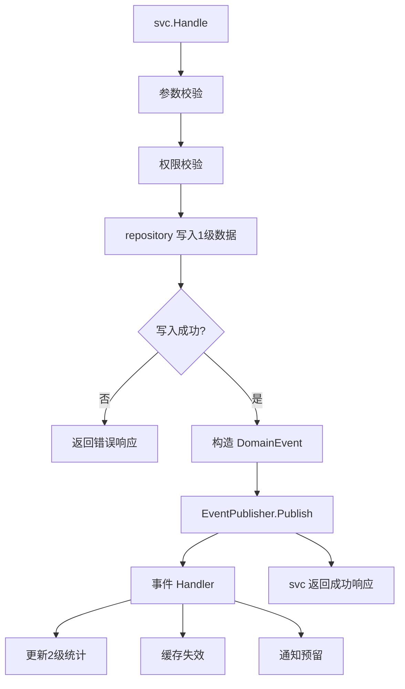

@PRD-social-app-mvp.md 指导trae完成领域事件，请输出详细设计方案文档

### **领域事件建议采用“进程内事件总线 + Outbox 预留”的 MVP-P0 方案：先保证领域事件接口、事件模型、发布点、消费者边界全部落地，后续再平滑升级到 Redis PubSub / MQ / Outbox 事务消息。**

下面这份设计方案用于指导 Trae 在 `go/modules/social` 内完成领域事件能力建设，目标是满足 `PRD-social-app-mvp.md` 中“1级数据变更后发布领域事件，驱动 2级数据更新、缓存失效、通知预留”的要求，同时避免在 MVP-P0 阶段引入过重基础设施。

### **Social 领域事件详细设计方案**

#### **一、设计背景**

根据 `PRD-social-app-mvp.md`，社交域的数据被划分为两类：1级强一致事实数据与2级最终一致派生数据。1级数据包括 `users`、`groups`、`topics`、`group_members`、`group_plans`、`group_orders`、`topic_comments`、`topic_reactions`、`group_admin_actions` 等核心业务事实；2级数据包括 `member_stats`、`group_stats`、`topic_stats`、热门帖子、群组帖子列表、圈主看板等可重建数据。

PRD 明确要求：1级数据变更必须发布领域事件，2级数据由事件驱动异步更新。也就是说，svc 层在完成主事务写入后，不应直接散落更新统计、清缓存、通知等副作用逻辑，而应统一通过领域事件表达业务事实，再由消费者执行后续动作。

本阶段的领域事件实现重点不是引入完整 MQ，而是先建立稳定的领域事件契约和代码边界，使后续切换 Redis PubSub、消息队列或 Outbox 表时不需要大规模重写 svc 逻辑。

---

### **二、设计目标**

本方案的核心目标是让社交域具备统一、可测试、可扩展的事件发布能力。

第一### **基于 `PRD-social-app-mvp.md`，领域事件应按“1级数据写入成功后发布、驱动2级统计与缓存失效”的原则实现；MVP-P0 建议先做模块内事件总线 + 可测试 Publisher 接口，不引入复杂消息中间件。**

下面是一份可直接交给 Trae 执行的详细设计方案文档。目标是指导其在 `go/modules/social` 中完成领域事件基础设施、事件定义、发布点接入、消费者处理和测试覆盖。

# **Social 领域事件详细设计方案**

## **1. 设计目标**

社交域领域事件用于承接 PRD 中定义的“1级事实数据变更 → 发布事件 → 驱动2级数据更新、缓存失效、后续通知”的机制。当前 Phase 1 MVP-P0 已完成 svc、repository_gorm、permission helpers，下一步需要补齐事件机制，使 member/group/topic 三个子域在核心写操作成功后能够稳定发布标准化事件。

本阶段不追求完整分布式可靠消息系统，不引入 Kafka、RabbitMQ 等外部依赖。MVP-P0 的目标是建立统一事件抽象、统一事件名称、统一发布入口、统一测试方式，为后续 Redis PubSub、Outbox、异步任务、通知系统接入留下扩展点。

领域事件需要满足以下约束：事件只能在 1级数据写入成功后发布；事件名称、事件类型、payload 字段必须使用常量或强类型结构，禁止魔法字符串散落；svc 层只负责发布领域事实，不直接处理统计重算、缓存失效、通知等副作用；测试中允许使用 fake publisher 捕获事件并断言。

## **2. 实现范围**

本轮领域事件实现范围限定在 PRD 已明确列出的 MVP-P0/P1 事件，不扩展推荐、IM、外部推送、支付渠道回调等复杂能力。

需要实现的基础设施包括：

```text
go/modules/social/event
├── constants.go        // 事件类型、实体类型、动作常量
├── event.go            // DomainEvent 结构定义
├── publisher.go        // Publisher 接口、NoopPublisher、CompositePublisher
├── memory_bus.go       // 内存事件总线，支持注册 handler
├── payload.go          // 各事件 payload 结构
├── fake_publisher_test.go 或 testutil.go
└── handler.go          // Handler 接口、HandlerFunc 适配器
```

需要在以下业务写操作中接入事件发布：

```text
member:
- UserRegister 成功后发布 MemberRegistered

group:
- CreateGroup 成功后发布 GroupCreated
- JoinGroup 成功后发布 GroupJoined
- LeaveGroup 成功后发布 GroupLeft
- BanMember 成功后发布 GroupMemberBanned
- RemoveMember 成功后发布 GroupMemberRemoved
- CreateGroupPlan 成功后发布 GroupPlanCreated
- RenewMember / ConfirmGroupPayment 类权益变更成功后发布 GroupOrderPaid 或 GroupMemberActivated

topic:
- CreateTopic 成功后发布 TopicCreated
- DeleteTopic 成功后发布 TopicDeleted
- AddTopicReply / CreateComment 成功后发布 TopicCommentCreated
- LikeTopic / FavoriteTopic 成功后发布 TopicReacted
- AuditTopic 后续实现时发布 TopicAudited
```

当前若某些 svc 尚未实现，例如 `AuditTopic`、完整订单支付确认能力，可以先定义事件常量和 payload，不强行接入不存在的 svc。已存在 svc 必须接入。

## **3. 非目标**

本阶段不做以下内容：

```text
1. 不实现跨进程可靠消息投递
2. 不实现 Redis PubSub 真实适配器，最多保留接口扩展点
3. 不实现事务 Outbox 表
4. 不实现站内通知表写入
5. 不实现 WebSocket/IM 推送
6. 不实现定时重建统计任务
7. 不改变现有 repository_gorm 的主事务边界，除非已有 transaction helper
```

如果当前 repository 层暂未提供显式事务封装，则事件发布点放在 repository 写操作成功返回之后。后续如果补充事务管理，再将事件发布升级为“事务提交成功后发布”。

## **4. 核心架构**

领域事件的整体链路如下：



svc 层只允许依赖 `event.Publisher` 接口，不允许直接依赖具体事件总线实现。这样可以在单测中注入 fake publisher，在生产中注入 memory bus 或后续 Redis publisher。

## **5. 事件发布语义**

领域事件采用“业务成功优先，事件失败可观测”的策略。具体规则如下：

第一，1级数据写入失败时，不发布事件，直接返回业务错误。

第二，1级数据写入成功后，事件发布失败原则上不回滚业务结果。原因是当前 MVP-P0 没有 Outbox 事务保证，如果事件发布失败后回滚业务写入，反而可能制造更复杂的一致性问题。

第三，事件发布失败必须记录日志，并在响应中保持业务成功。后续如果接入 outbox，可改为写出站事件表，异步重试。

第四，高权限操作的事件发布必须发生在审计日志写入成功之后。顺序必须遵循 PRD 中的高权限操作流水线：

```text
权限校验 → 审计日志 → 1级数据更新 → 领域事件 → 缓存失效 → 通知
```

当前如审计日志表或通知系统未实现，事件发布仍然需要先落地，为后续补齐副作用提供钩子。

## **6. 事件基础结构设计**

### **6.1 DomainEvent**

建议定义统一的 `DomainEvent` 结构：

```go
package event

type DomainEvent struct {
    ID            string                 `json:"id"`
    Type          string                 `json:"type"`
    AggregateType string                 `json:"aggregate_type"`
    AggregateID   string                 `json:"aggregate_id"`
    ActorID       string                 `json:"actor_id,omitempty"`
    TraceID       string                 `json:"trace_id,omitempty"`
    OccurredAt    int64                  `json:"occurred_at"`
    Payload       map[string]interface{} `json:"payload,omitempty"`
}
```

字段含义如下：

| 字段 | 含义 |
|---|---|
| `ID` | 事件 ID，使用 char(32) UUID 或现有 ID 生成器 |
| `Type` | 事件类型，例如 `MemberRegistered` |
| `AggregateType` | 聚合类型，例如 `member`、`group`、`topic` |
| `AggregateID` | 聚合根 ID，例如 user_id、group_id、topic_id |
| `ActorID` | 触发事件的用户 ID |
| `TraceID` | 请求链路 ID，从 context 中读取，当前没有则允许为空 |
| `OccurredAt` | 事件发生时间，Unix 秒或毫秒，需与项目现有时间单位一致 |
| `Payload` | 事件业务载荷，必须只放必要字段，不放密码、token 等敏感信息 |

如果项目中已经有统一 ID 生成器和时间工具，必须复用项目已有工具；如果没有，MVP-P0 可先使用内部简易实现，但需要隔离在 helper 中，避免散落。

### **6.2 Publisher 接口**

```go
package event

import "context"

type Publisher interface {
    Publish(ctx context.Context, evt DomainEvent) error
}
```

默认实现包括：

```go
type NoopPublisher struct{}

func (p NoopPublisher) Publish(ctx context.Context, evt DomainEvent) error {
    return nil
}
```

NoopPublisher 用于尚未注入真实 publisher 的场景，避免因事件系统未配置导致业务不可用。

### **6.3 Handler 接口**

```go
package event

import "context"

type Handler interface {
    Handle(ctx context.Context, evt DomainEvent) error
}

type HandlerFunc func(ctx context.Context, evt DomainEvent) error

func (f HandlerFunc) Handle(ctx context.Context, evt DomainEvent) error {
    return f(ctx, evt)
}
```

### **6.4 MemoryBus**

MVP-P0 先实现内存事件总线，支持同步或异步模式。建议默认同步执行 handler，测试更稳定；如果开启异步，需要额外处理 goroutine panic、日志和等待机制，当前阶段不建议默认异步。

```go
type MemoryBus struct {
    handlers map[string][]Handler
}

func NewMemoryBus() *MemoryBus {
    return &MemoryBus{
        handlers: make(map[string][]Handler),
    }
}

func (b *MemoryBus) Subscribe(eventType string, handler Handler) {
    b.handlers[eventType] = append(b.handlers[eventType], handler)
}

func (b *MemoryBus) Publish(ctx context.Context, evt DomainEvent) error {
    handlers := b.handlers[evt.Type]
    for _, h := range handlers {
        if err := h.Handle(ctx, evt); err != nil {
            return err
        }
    }
    return nil
}
```

注意：如果 production 中使用同步 bus，handler 不能执行重 IO 或慢任务。MVP-P0 的 handler 可以先只记录日志或调用统计 repository 的轻量更新。后续再迁移到 Redis PubSub 或 Outbox worker。

## **7. 事件类型常量**

所有事件类型必须在 `event/constants.go` 中统一定义，svc 层禁止直接写 `"GroupCreated"` 这类魔法字符串。

```go
package event

const (
    EventMemberRegistered = "MemberRegistered"

    EventGroupCreated       = "GroupCreated"
    EventGroupJoined        = "GroupJoined"
    EventGroupLeft          = "GroupLeft"
    EventGroupMemberRemoved = "GroupMemberRemoved"
    EventGroupMemberBanned  = "GroupMemberBanned"
    EventGroupMemberMuted   = "GroupMemberMuted"
    EventGroupMemberRecovered = "GroupMemberRecovered"
    EventGroupPlanCreated   = "GroupPlanCreated"
    EventGroupOrderPaid     = "GroupOrderPaid"
    EventGroupMemberActivated = "GroupMemberActivated"

    EventTopicCreated        = "TopicCreated"
    EventTopicDeleted        = "TopicDeleted"
    EventTopicCommentCreated = "TopicCommentCreated"
    EventTopicReacted        = "TopicReacted"
    EventTopicAudited        = "TopicAudited"
)

const (
    AggregateMember = "member"
    AggregateGroup  = "group"
    AggregateTopic  = "topic"
    AggregateOrder  = "group_order"
    AggregateComment = "topic_comment"
)
```

如果未来事件需要对外发布，事件名称可以保持 PascalCase；如果仅内部使用，也可以用 snake_case。但一旦确定，不允许混用。

## **8. Payload 设计**

### **8.1 设计原则**

Payload 只携带事件消费者必要字段，不携带完整 model。原因是完整 model 容易泄露敏感字段，也会造成事件格式随数据库结构变化而频繁变动。

禁止放入以下字段：

```text
password
token
refresh_token
salt
用户隐私敏感扩展字段
大段正文 content
```

帖子事件中可以放 `summary`、`title`、`visibility` 等必要信息，但不建议放完整 `content`。

### **8.2 事件 payload 清单**

#### **MemberRegistered**

触发点：用户注册成功，`users` 记录创建完成后。

```go
type MemberRegisteredPayload struct {
    UserID          string `json:"user_id"`
    Username        string `json:"username,omitempty"`
    Nickname        string `json:"nickname,omitempty"`
    MembershipLevel string `json:"membership_level,omitempty"`
}
```

用途：

```text
1. 初始化 member_stats
2. 后续发送欢迎通知
3. 后续风控/增长分析
```

#### **GroupCreated**

触发点：群组创建成功，并且 owner member 关系写入成功后。

```go
type GroupCreatedPayload struct {
    GroupID    string `json:"group_id"`
    OwnerID    string `json:"owner_id"`
    Type       string `json:"type"`
    Visibility int8   `json:"visibility"`
    JoinMode   int8   `json:"join_mode"`
}
```

用途：

```text
1. 初始化 group_stats
2. 刷新推荐群组候选池
3. 后续通知圈主创建成功
```

注意：PRD 要求创建群组后自动将创建者加入 `group_members`，因此 `GroupCreated` 应在 group 和 owner member 均写入成功后发布。

#### **GroupJoined**

触发点：用户加入群组成功，`group_members` active/pending 记录创建或恢复后。

```go
type GroupJoinedPayload struct {
    GroupID    string `json:"group_id"`
    UserID     string `json:"user_id"`
    MemberID   string `json:"member_id"`
    Status     int8   `json:"status"`
    JoinSource string `json:"join_source,omitempty"`
    ExpiredAt  int64  `json:"expired_at,omitempty"`
}
```

用途：

```text
1. 更新 group_stats.members_count
2. 失效 group:members:{groupId}:*
3. 失效 group:member:{groupId}:{userId}
```

#### **GroupLeft**

触发点：用户退出群组成功，`group_members.status` 变为 left 后。

```go
type GroupLeftPayload struct {
    GroupID  string `json:"group_id"`
    UserID   string `json:"user_id"`
    MemberID string `json:"member_id,omitempty"`
}
```

用途：

```text
1. 更新 group_stats.members_count
2. 失效成员关系缓存
```

#### **GroupMemberBanned / GroupMemberRemoved / GroupMemberMuted / GroupMemberRecovered**

触发点：圈主或管理员完成成员管理操作后。

```go
type GroupMemberChangedPayload struct {
    GroupID      string `json:"group_id"`
    OperatorID   string `json:"operator_id"`
    TargetUserID string `json:"target_user_id"`
    Action       string `json:"action"`
    NewStatus    int8   `json:"new_status,omitempty"`
    MutedUntil   int64  `json:"muted_until,omitempty"`
    Reason       string `json:"reason,omitempty"`
}
```

用途：

```text
1. 失效 group:member:{groupId}:{targetUserId}
2. 失效 group:members:{groupId}:*
3. 更新 group_stats
4. 后续通知被操作用户
```

Action 字段必须使用常量，不允许直接写 `"ban"`、`"remove"`。

#### **GroupPlanCreated**

触发点：付费方案创建成功后。

```go
type GroupPlanCreatedPayload struct {
    GroupID      string `json:"group_id"`
    PlanID       string `json:"plan_id"`
    PlanType     string `json:"plan_type"`
    PriceCent    int64  `json:"price_cent"`
    DurationDays int32  `json:"duration_days"`
}
```

用途：

```text
1. 失效 group:plans:{groupId}
2. 后续更新群组付费能力展示
```

#### **GroupOrderPaid**

触发点：订单状态变为 paid，并且 `group_members` 权益写入或续期成功后。

```go
type GroupOrderPaidPayload struct {
    OrderID   string `json:"order_id"`
    OrderNo   string `json:"order_no"`
    GroupID   string `json:"group_id"`
    UserID    string `json:"user_id"`
    PlanID    string `json:"plan_id,omitempty"`
    AmountCent int64 `json:"amount_cent"`
    PaidAt    int64  `json:"paid_at"`
    ExpiredAt int64  `json:"expired_at"`
}
```

用途：

```text
1. 更新 group_stats.paid_members_count
2. 失效 group:member:{groupId}:{userId}
3. 后续通知用户权益已开通
```

#### **TopicCreated**

触发点：帖子创建成功后。

```go
type TopicCreatedPayload struct {
    TopicID    string `json:"topic_id"`
    GroupID    string `json:"group_id"`
    AuthorID   string `json:"author_id"`
    Status     int8   `json:"status"`
    Visibility int8   `json:"visibility"`
    PublishedAt int64 `json:"published_at,omitempty"`
}
```

用途：

```text
1. 更新 group_stats.topics_count
2. 更新 member_stats.topics_count
3. 失效 group:topics:{groupId}:*
```

#### **TopicDeleted**

触发点：帖子删除或软删除成功后。

```go
type TopicDeletedPayload struct {
    TopicID  string `json:"topic_id"`
    GroupID  string `json:"group_id"`
    AuthorID string `json:"author_id"`
}
```

用途：

```text
1. 更新 group_stats.topics_count
2. 更新 member_stats.topics_count
3. 失效 topic:detail:{topicId}
4. 失效 group:topics:{groupId}:*
5. 后续清理 topic:hot:{groupId}
```

#### **TopicCommentCreated**

触发点：评论/回复创建成功后。

```go
type TopicCommentCreatedPayload struct {
    CommentID string `json:"comment_id"`
    TopicID   string `json:"topic_id"`
    GroupID   string `json:"group_id"`
    UserID    string `json:"user_id"`
    ParentID  string `json:"parent_id,omitempty"`
    Status    int8   `json:"status"`
}
```

用途：

```text
1. 更新 topic_stats.comments_count
2. 失效 topic:detail:{topicId} 或评论列表缓存
```

#### **TopicReacted**

触发点：点赞、收藏、分享等互动状态变更成功后。

```go
type TopicReactedPayload struct {
    TopicID      string `json:"topic_id"`
    UserID       string `json:"user_id"`
    ReactionType string `json:"reaction_type"`
    Status       int8   `json:"status"`
}
```

用途：

```text
1. 更新 topic_stats.likes_count/favorites_count/shares_count
2. 失效 topic:stats:{topicId}
```

#### **TopicAudited**

触发点：帖子审核动作完成后。

```go
type TopicAuditedPayload struct {
    TopicID    string `json:"topic_id"`
    GroupID    string `json:"group_id"`
    OperatorID string `json:"operator_id"`
    AuthorID   string `json:"author_id"`
    Action     string `json:"action"`
    OldStatus  int8   `json:"old_status"`
    NewStatus  int8   `json:"new_status"`
    Reason     string `json:"reason,omitempty"`
}
```

用途：

```text
1. 失效 topic:detail:{topicId}
2. 可能更新 group_stats.topics_count
3. 后续通知帖子作者
```

## **9. 事件构造规范**

建议在 `event` 包中提供 helper，避免每个 svc 手写 `DomainEvent` 的通用字段。

```go
type NewEventOptions struct {
    Type          string
    AggregateType string
    AggregateID   string
    ActorID       string
    Payload       map[string]interface{}
}

func NewDomainEvent(ctx context.Context, opt NewEventOptions) DomainEvent {
    return DomainEvent{
        ID:            newEventID(),
        Type:          opt.Type,
        AggregateType: opt.AggregateType,
        AggregateID:   opt.AggregateID,
        ActorID:       opt.ActorID,
        TraceID:       TraceIDFromContext(ctx),
        OccurredAt:    nowUnix(),
        Payload:       opt.Payload,
    }
}
```

如果项目已有 `context` 工具函数，应复用现有的 `TraceIDFromContext`。如果没有，先返回空字符串，不能阻塞业务。

Payload 建议通过结构体转 map，或直接使用明确字段构造。为了减少反射复杂度，MVP-P0 可使用 `map[string]interface{}` 手工构造，但 key 必须定义常量或由 payload 结构统一转换，避免 key 拼写散落。

## **10. svc 接入方式**

### **10.1 构造函数注入**

每个 svc struct 增加 publisher 字段：

```go
type SvcCreate struct {
    repo      Repository
    publisher event.Publisher
}
```

构造时如果 publisher 为空，则使用 `event.NoopPublisher{}`：

```go
func NewSvcCreate(repo Repository, publisher event.Publisher) *SvcCreate {
    if publisher == nil {
        publisher = event.NoopPublisher{}
    }
    return &SvcCreate{
        repo: repo,
        publisher: publisher,
    }
}
```

如果当前项目没有单独 svc constructor，而是在 handler 中直接构造 svc，则需要在 handler struct 中持有 publisher，并传给每个 svc。

### **10.2 handler/servant/module 注入链路**

推荐注入链路如下：

```text
module.NewModule(deps)
  ├── memberRepo
  ├── groupRepo
  ├── topicRepo
  ├── eventPublisher
  ├── member.NewHandler(memberRepo, eventPublisher)
  ├── group.NewHandler(groupRepo, eventPublisher)
  └── topic.NewHandler(topicRepo, eventPublisher)
```

如果当前 `NewModule` 已经接收三个 repository，则可以新增第四个可选依赖，或者在 `module.go` 内部默认创建 `event.NewMemoryBus()`。为了减少改动，建议在 module 层统一创建：

```go
publisher := event.NewMemoryBus()
```

但测试中应允许直接注入 fake publisher。

### **10.3 发布失败处理**

svc 中发布事件的处理方式：

```go
if err := s.publisher.Publish(ctx, evt); err != nil {
    // MVP-P0: 记录日志，不回滚业务
    // TODO(event): 接入 outbox 后支持失败重试
}
```

如果当前项目已有 logger，必须使用项目 logger；如果没有，MVP-P0 可以暂时忽略返回错误，但测试应覆盖 publisher 正常路径。更推荐保留 TODO 注释，避免静默吞错成为长期行为。

## **11. 各 svc 发布点设计**

### **11.1 UserRegister**

发布时机：用户创建成功、member_stats 初始化如已有则成功之后。不能在密码校验或唯一性校验阶段发布。

事件：

```go
event.EventMemberRegistered
```

Aggregate：

```text
AggregateType = member
AggregateID = user.ID
ActorID = user.ID
```

Payload：

```text
user_id
username
nickname
membership_level
```

### **11.2 CreateGroup**

发布时机：`groups` 创建成功，并且 `group_members` owner 记录创建成功后。

事件：

```go
event.EventGroupCreated
```

Aggregate：

```text
AggregateType = group
AggregateID = group.ID
ActorID = ownerID
```

Payload：

```text
group_id
owner_id
type
visibility
join_mode
```

注意：如果 `CreateGroup` 内部创建 owner member 失败，则整个创建应返回失败，不发布 `GroupCreated`。否则权限链路会出现“群存在但 owner 关系不存在”的不一致。

### **11.3 JoinGroup**

发布时机：`group_members` 创建或恢复成功后。

事件：

```go
event.EventGroupJoined
```

Payload 中 `status` 必须使用 model 中最终写入的状态值。svc 层设置该值时应来自 protobuf 枚举常量或统一常量，不允许裸写 `1`。

### **11.4 LeaveGroup**

发布时机：成员状态更新为 left 后。

事件：

```go
event.EventGroupLeft
```

如果重复退出按幂等成功处理，是否重复发事件需要明确规则。建议：

```text
如果本次调用没有造成状态变化，不重复发布 GroupLeft。
如果从 active/pending/banned 变为 left，则发布 GroupLeft。
```

这样可以避免统计重复扣减。

### **11.5 BanMember / RemoveMember / MuteMember / UnmuteMember**

发布时机：权限校验通过、审计日志写入成功、成员状态或禁言字段更新成功后。

事件对应关系：

| 操作 | 事件 |
|---|---|
| ban | `GroupMemberBanned` |
| remove | `GroupMemberRemoved` |
| mute | `GroupMemberMuted` |
| recover/unban/unmute | `GroupMemberRecovered` 或对应 Unbanned/Unmuted 事件 |

如果当前事件常量没有 `GroupMemberUnbanned`、`GroupMemberUnmuted`，可以先统一使用 `GroupMemberRecovered`，payload 中用 action 区分。

### **11.6 CreateGroupPlan**

发布时机：`group_plans` 创建成功后。

事件：

```go
event.EventGroupPlanCreated
```

用于后续失效 `group:plans:{groupId}` 缓存。

### **11.7 RenewMember / ConfirmGroupPayment**

PRD 中完整支付确认流程包括订单变 paid 和成员权益 upsert。当前如果只有 `RenewMember` svc，则可在续费成功后发布：

```go
event.EventGroupOrderPaid
```

或更精确地发布：

```go
event.EventGroupMemberActivated
```

本阶段建议规则：

```text
如果存在 order/order_no 上下文：发布 GroupOrderPaid。
如果只是直接续期成员权益：发布 GroupMemberActivated。
```

### **11.8 CreateTopic**

发布时机：`topics` 创建成功后。

事件：

```go
event.EventTopicCreated
```

Payload：

```text
topic_id
group_id
author_id
status
visibility
published_at
```

如果帖子状态是 draft 或 pending，消费者更新统计时要注意：只有 published 状态才应该计入可见帖子数。事件本身仍应发布，因为创建草稿也是 1级事实变化。

### **11.9 DeleteTopic**

发布时机：帖子软删除状态写入成功后。

事件：

```go
event.EventTopicDeleted
```

重复删除的幂等策略同 `LeaveGroup`：如果状态已经是 deleted，建议不重复发布删除事件，避免统计重复扣减。

### **11.10 AddTopicReply / CreateComment**

发布时机：评论写入成功后。

事件：

```go
event.EventTopicCommentCreated
```

如果评论状态是 pending，是否计入 comments_count 由消费者决定。事件仍然发布。

### **11.11 LikeTopic / FavoriteTopic**

发布时机：互动关系 upsert 或状态变更成功后。

事件：

```go
event.EventTopicReacted
```

Payload 中需要包含：

```text
reaction_type = like/favorite/share
status = active/cancelled
```

`reaction_type` 必须使用常量，例如：

```go
const (
    ReactionTypeLike     = "like"
    ReactionTypeFavorite = "favorite"
    ReactionTypeShare    = "share"
)
```

不允许 svc 中直接写字符串。

## **12. 事件消费者设计**

MVP-P0 至少实现可插拔消费者，不强制所有统计真实更新都完成。如果 repository 已有 stats upsert/update 方法，则优先接入真实更新；如果没有，可先实现 handler skeleton + 单测验证被调用。

### **12.1 StatsEventHandler**

建议新增：

```text
go/modules/social/eventhandler
或
go/modules/social/stats
```

为了避免 event 包依赖 member/group/topic repository 造成循环依赖，消费者不要放在 `event` 包内部。可以放在：

```text
go/modules/social/eventhandler/stats_handler.go
```

它依赖三个 repository：

```go
type StatsHandler struct {
    memberRepo member.Repository
    groupRepo  group.Repository
    topicRepo  topic.Repository
}
```

处理事件：

| 事件 | 处理动作 |
|---|---|
| `MemberRegistered` | 初始化 `member_stats` |
| `GroupCreated` | 初始化 `group_stats` |
| `GroupJoined` | 增加或刷新 group members_count |
| `GroupLeft` | 减少或刷新 group members_count |
| `GroupOrderPaid` | 刷新 paid_members_count |
| `TopicCreated` | 刷新 group topics_count、member topics_count |
| `TopicDeleted` | 刷新 group topics_count、member topics_count |
| `TopicCommentCreated` | 刷新 topic comments_count |
| `TopicReacted` | 刷新 topic likes/favorites/shares count |

对于统计更新方式，推荐优先使用“从 1级数据重算”而不是简单自增自减，尤其是幂等场景。PRD 明确 2级数据必须可从 1级数据重建，因此 handler 可以调用 repository 的 Count 方法或 RefreshStats 方法。

如果当前 repository 已有 `UpsertGroupStats`、`UpdateTopicStats` 等方法，可以先复用。若缺 Count 方法，不要为了事件系统大规模改 repository，MVP-P0 可先只在 handler 中保留 TODO，并通过 fake handler 验证事件发布链路。

### **12.2 CacheInvalidationHandler**

缓存失效本阶段可以先定义接口，不强制 Redis 实现：

```go
type CacheInvalidator interface {
    Delete(ctx context.Context, keys ...string) error
    DeletePattern(ctx context.Context, pattern string) error
}
```

Noop 实现：

```go
type NoopCacheInvalidator struct{}

func (n NoopCacheInvalidator) Delete(ctx context.Context, keys ...string) error {
    return nil
}

func (n NoopCacheInvalidator) DeletePattern(ctx context.Context, pattern string) error {
    return nil
}
```

事件到缓存 key 的映射如下：

| 事件 | 缓存失效 |
|---|---|
| `MemberRegistered` | 无或 `member:profile:{userId}` |
| `GroupCreated` | `group:detail:{groupId}`、`group:recommend:*` |
| `GroupJoined` | `group:member:{groupId}:{userId}`、`group:members:{groupId}:*`、`group:stats:{groupId}` |
| `GroupLeft` | `group:member:{groupId}:{userId}`、`group:members:{groupId}:*`、`group:stats:{groupId}` |
| `GroupMemberBanned` | `group:member:{groupId}:{targetUserId}`、`group:members:{groupId}:*` |
| `GroupMemberRemoved` | `group:member:{groupId}:{targetUserId}`、`group:members:{groupId}:*`、`group:stats:{groupId}` |
| `GroupPlanCreated` | `group:plans:{groupId}` |
| `GroupOrderPaid` | `group:member:{groupId}:{userId}`、`group:stats:{groupId}` |
| `TopicCreated` | `group:topics:{groupId}:*`、`group:stats:{groupId}` |
| `TopicDeleted` | `topic:detail:{topicId}`、`group:topics:{groupId}:*`、`topic:hot:{groupId}` |
| `TopicCommentCreated` | `topic:stats:{topicId}` |
| `TopicReacted` | `topic:stats:{topicId}` |

缓存 key 模板必须定义常量或函数，禁止手写拼接散落：

```go
func GroupMemberKey(groupID, userID string) string {
    return fmt.Sprintf("group:member:%s:%s", groupID, userID)
}
```

## **13. 事务一致性策略**

MVP-P0 暂采用“写库成功后发布事件”的简化模式：

```text
repository 写入成功 → Publish 事件 → 返回响应
```

这存在一种已知风险：写库成功后，事件发布失败，2级统计或缓存失效可能没有执行。当前阶段接受该风险，但必须保留扩展点。

后续推荐升级为 Outbox 模式：

```text
BEGIN
  写业务表
  写 event_outbox
COMMIT

worker 扫描 event_outbox
  发布事件
  标记 published
```

本阶段可以不建 `event_outbox` 表，但代码结构上不要把事件发布逻辑写死在具体 Redis 或内存实现里。

## **14. 编码规范**

领域事件实现必须遵守以下编码规范。

第一，事件类型必须使用 `event.EventXxx` 常量，不允许直接写字符串。

错误：

```go
publisher.Publish(ctx, event.DomainEvent{Type: "GroupCreated"})
```

正确：

```go
publisher.Publish(ctx, event.DomainEvent{Type: event.EventGroupCreated})
```

第二，业务状态值必须使用 protobuf 枚举常量或包级常量，不允许硬编码数字。

错误：

```go
Payload: map[string]interface{}{
    "status": 1,
}
```

正确：

```go
Payload: map[string]interface{}{
    "status": int8(pb.GroupMemberStatus_GROUP_MEMBER_STATUS_ACTIVE),
}
```

第三，缓存 key、action、reaction type、join source 等字符串必须使用常量或函数封装。

错误：

```go
"reaction_type": "like"
```

正确：

```go
"reaction_type": topic.ReactionTypeLike
```

第四，事件 payload 禁止包含敏感字段。

第五，事件发布失败不能 panic，不能导致业务成功路径崩溃。

第六，测试必须覆盖事件是否发布、事件类型是否正确、aggregate 是否正确、payload 核心字段是否正确。

## **15. 测试设计**

### **15.1 FakePublisher**

建议提供测试工具：

```go
type FakePublisher struct {
    Events []event.DomainEvent
    Err    error
}

func (p *FakePublisher) Publish(ctx context.Context, evt event.DomainEvent) error {
    p.Events = append(p.Events, evt)
    return p.Err
}
```

测试中注入 fake publisher，断言：

```go
require.Len(t, publisher.Events, 1)
assert.Equal(t, event.EventGroupCreated, publisher.Events[0].Type)
assert.Equal(t, event.AggregateGroup, publisher.Events[0].AggregateType)
assert.Equal(t, groupID, publisher.Events[0].AggregateID)
```

### **15.2 单元测试覆盖范围**

需要新增或补充以下测试：

| 包 | 测试点 |
|---|---|
| `event` | NoopPublisher、MemoryBus Subscribe/Publish、handler 错误返回 |
| `member` | Register 成功发布 `MemberRegistered`，失败不发布 |
| `group` | CreateGroup 发布 `GroupCreated`，JoinGroup 发布 `GroupJoined`，LeaveGroup 发布 `GroupLeft` |
| `group` | Ban/Remove/Mute 类操作发布对应 GroupMember 事件 |
| `topic` | CreateTopic 发布 `TopicCreated`，DeleteTopic 发布 `TopicDeleted` |
| `topic` | AddReply 发布 `TopicCommentCreated`，Like/Favorite 发布 `TopicReacted` |
| `eventhandler` | StatsHandler/CacheInvalidationHandler 能根据事件调用对应依赖 |

### **15.3 幂等测试**

对已有幂等操作必须明确事件发布行为：

```text
重复 JoinGroup：
- 如果第一次创建 active 成员，发布 GroupJoined
- 如果第二次发现已 active 且不改变状态，不发布 GroupJoined

重复 LeaveGroup：
- 如果第一次从 active 改为 left，发布 GroupLeft
- 如果第二次已 left，不发布 GroupLeft

重复 LikeTopic：
- 如果状态从无记录/取消变 active，发布 TopicReacted
- 如果已 active 且重复点赞不改变状态，不发布或发布 status=active 需统一
```

建议 MVP-P0 采用“只有状态变化才发布事件”的规则，避免统计重复计算。

## **16. Trae 执行任务拆分**

### **Step E1：新增 event 基础包**

创建：

```text
go/modules/social/event/constants.go
go/modules/social/event/event.go
go/modules/social/event/publisher.go
go/modules/social/event/memory_bus.go
go/modules/social/event/payload.go
go/modules/social/event/event_test.go
```

完成：

```text
1. DomainEvent 结构
2. Publisher 接口
3. NoopPublisher
4. MemoryBus
5. Handler / HandlerFunc
6. 事件常量
7. payload 结构
8. event 包单测
```

验收：

```text
go test ./go/modules/social/event
```

### **Step E2：接入 member 事件发布**

修改注册 svc：

```text
member/svc_register.go
member/handler.go
member/servant.go 如有必要
```

完成：

```text
UserRegister 成功后发布 MemberRegistered
注册失败不发布事件
```

验收：

```text
go test ./go/modules/social/member
```

### **Step E3：接入 group 事件发布**

修改：

```text
group/svc_create.go
group/svc_join.go
group/svc_leave.go
group/svc_ban.go
group/svc_unban.go
group/svc_mute.go
group/svc_unmute.go
group/svc_remove.go
group/svc_create_plan.go 或对应 plan svc
```

完成：

```text
CreateGroup → GroupCreated
JoinGroup → GroupJoined
LeaveGroup → GroupLeft
BanMember → GroupMemberBanned
RemoveMember → GroupMemberRemoved
MuteMember → GroupMemberMuted
Recover/Unban/Unmute → GroupMemberRecovered 或对应事件
CreateGroupPlan → GroupPlanCreated
RenewMember/ConfirmPayment → GroupOrderPaid 或 GroupMemberActivated
```

验收：

```text
go test ./go/modules/social/group
```

### **Step E4：接入 topic 事件发布**

修改：

```text
topic/svc_create.go
topic/svc_delete.go
topic/svc_add_reply.go
topic/svc_like.go
topic/svc_favorite.go
topic/svc_pin.go 如涉及高权限动作
```

完成：

```text
CreateTopic → TopicCreated
DeleteTopic → TopicDeleted
AddTopicReply → TopicCommentCreated
LikeTopic/FavoriteTopic → TopicReacted
AuditTopic 后续实现时 → TopicAudited
```

验收：

```text
go test ./go/modules/social/topic
```

### **Step E5：新增 eventhandler skeleton**

创建：

```text
go/modules/social/eventhandler/stats_handler.go
go/modules/social/eventhandler/cache_handler.go
go/modules/social/eventhandler/eventhandler_test.go
```

完成：

```text
1. StatsHandler 基础结构
2. CacheInvalidationHandler 基础结构
3. NoopCacheInvalidator
4. 事件类型 switch
5. 目前没有 repository 方法时允许 TODO，但必须有测试覆盖事件分发
```

验收：

```text
go test ./go/modules/social/eventhandler
```

### **Step E6：module 层 wiring**

修改：

```text
go/modules/social/module.go
```

完成：

```text
1. 创建 event.NewMemoryBus()
2. 注册 stats/cache handler
3. 将 publisher 注入 member/group/topic handler 或 svc
4. 未配置时使用 NoopPublisher
```

验收：

```text
go test ./go/modules/social/...
```

## **17. 完成标准**

领域事件任务完成后，应满足以下条件：

```text
1. event 包存在统一 DomainEvent / Publisher / MemoryBus
2. 所有事件类型使用常量定义
3. member/group/topic 核心写 svc 已接入事件发布
4. 业务失败路径不发布事件
5. 业务成功路径发布正确事件
6. 发布失败不回滚业务，但可观测
7. 单测覆盖事件发布行为
8. go test ./go/modules/social/... 全绿
9. svc 层无新增事件魔法字符串
10. payload 中不包含 password/token 等敏感字段
```

## **18. 给 Trae 的执行提示词**

可以直接将以下指令交给 Trae：

```text
请基于 docs 中的 PRD-social-app-mvp.md，在 go/modules/social 中实现领域事件机制。

实现要求：
1. 新增 go/modules/social/event 包，包含 DomainEvent、Publisher、NoopPublisher、MemoryBus、Handler、事件常量、payload 定义。
2. 事件类型必须使用常量，禁止在 svc 中硬编码事件字符串。
3. svc 层发布事件时，业务枚举值必须使用 protobuf 枚举常量或已有包级常量，不允许硬编码 1/2/3。
4. 在 member/group/topic 三个子域的核心写操作成功后发布领域事件：
   - UserRegister → MemberRegistered
   - CreateGroup → GroupCreated
   - JoinGroup → GroupJoined
   - LeaveGroup → GroupLeft
   - Ban/Remove/Mute/Recover member → 对应 GroupMember* 事件
   - CreateGroupPlan → GroupPlanCreated
   - RenewMember/ConfirmPayment → GroupOrderPaid 或 GroupMemberActivated
   - CreateTopic → TopicCreated
   - DeleteTopic → TopicDeleted
   - AddTopicReply → TopicCommentCreated
   - LikeTopic/FavoriteTopic → TopicReacted
5. 只有 1级数据写入成功后才能发布事件；业务失败路径不得发布事件。
6. 事件发布失败不回滚业务，但需要保留日志或 TODO，后续接入 outbox。
7. 新增 fake publisher 测试工具，补充单元测试断言事件类型、aggregate、actor、payload。
8. 新增 eventhandler skeleton，用于后续统计更新和缓存失效；当前如 repository 缺方法，可先保留 TODO，但事件分发测试必须通过。
9. 更新 module.go，将 event publisher 注入 member/group/topic。
10. 最终执行 go test ./go/modules/social/...，确保全部测试通过。
```

本设计可以作为 Phase 1 Step 9 前的事件基础设施补齐任务，也可以命名为：

```text
Step 8.6: Domain Event Infrastructure & Publishing Hooks
```

建议执行顺序是：先完成 `event` 包和 fake publisher，再逐个接入 member/group/topic，最后接 module wiring。这样每一步都可以独立测试，避免一次性改动过大。

*内容由 AI 生成仅供参考*