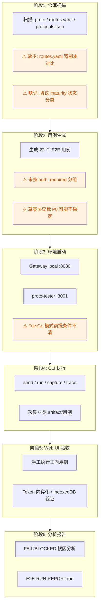

# 评审方案并输出评审意见

> **Workspace:** /Volumes/MacintoshHD/Users/jemoo/git/traeMVP/cairobotmvp

---

**User**

`/Volumes/MacintoshHD/Users/jemoo/git/traeMVP/cairobotmvp/docs/tabbit/inbox/2026/06/TabAI会话_1780625171905.md` 评审方案，输出评审意见

**Assistant**

我来对这份 E2E 验收方案进行评审。先收集项目实际代码和配置证据。

所有路径的初步检查已完成。现在读取存在文件的关键内容：

以下是对所有 13 个路径的完整验证报告。

---

## 文件/目录存在性验证结果

### 1. `go/gateway/proto-gateway/` -- **存在**

**路径**: `/Volumes/MacintoshHD/Users/jemoo/git/traeMVP/cairobotmvp/go/gateway/proto-gateway/`

**目录结构**:
```
proto-gateway/
  cmd/
    server/main.go
    testclient/main.go
  configs/
    gateway/
      gateway.local.conf
      routes.yaml
  internal/
    adapter/          (message_packet.go, message_packet_test.go)
    config/           (routes.go, routes_test.go)
    router/           (route_table.go, route_table_test.go)
    server/           (http_server.go, http_server_test.go, e2e_*.go)
  tarsclient/         (invoker.go, invoker_test.go, module_handler_test.go)
  README.md, go.mod, go.sum
```

**摘要**: Gateway 网关服务源码，包含 HTTP 服务端、路由表、Tars 客户端调用层，以及 E2E 测试（`e2e_config_i18n_test.go`, `e2e_modules_test.go`）。

---

### 2. `routes.yaml` -- **存在（2 个副本）**

| 路径 | 说明 |
|---|---|
| `/Volumes/MacintoshHD/Users/jemoo/git/traeMVP/cairobotmvp/configs/gateway/routes.yaml` | **主配置文件（完整版）** |
| `/Volumes/MacintoshHD/Users/jemoo/git/traeMVP/cairobotmvp/go/gateway/proto-gateway/configs/gateway/routes.yaml` | Gateway 内嵌配置（仅含 2 条路由） |

**主 routes.yaml 路由表结构**（共 **8 条路由**, 分为 3 段):

| # | command_name | max:min | Tars Server | 方法 | auth_required |
|---|---|---|---|---|---|
| 1 | ServiceHealthCheck | 2100:2097 | SystemServer | HealthCheck | false |
| 2 | HelloWorld | 2100:2101 | SystemServer | HelloWorld | false |
| 3 | GetAppConfigs | 6000:6001 | ConfigServer | GetAppConfigs | true |
| 4 | AppConfigVersion | 6000:6009 | ConfigServer | AppConfigVersion | true |
| 5 | GetAppLanguage | 6000:6003 | I18nServer | GetAppLanguage | false |
| 6 | GetLangPack | 6000:6005 | I18nServer | GetLangPack | true |
| 7 | GetLangDifference | 6000:6007 | I18nServer | GetLangDifference | true |

> 注意：Gateway 内嵌副本仅包含前 2 条路由（2100 段），且 HelloWorld 的 request_proto 包名有差异（`health` vs `hello`），这可能是历史遗留或有意为之的差异化配置。

---

### 3. 所有 `.proto` 文件 -- **存在（共 6 个）**

全部位于 `/Volumes/MacintoshHD/Users/jemoo/git/traeMVP/cairobotmvp/proto/base/` 下：

| 文件名 | Package | 定义的 Message / Enum |
|---|---|---|
| **message.proto** | `com.mineplanet.pojo` | `Platform`(枚举), `MessagePacket` |
| **result.proto** | `com.mineplanet.pojo.pb` | `Result`, `PageInfo`, `ErrorDetail`, `ValidationResult` |
| **health.proto** | `com.mineplanet.pojo.health` | `ServiceHealthCheckRequest`, `ComponentStatus`, `ServiceHealthCheckResponse` |
| **hello.proto** | `com.mineplanet.pojo.hello` | `HelloWorldRequest`, `HelloWorldResponse` |
| **i18n.proto** | `com.mineplanet.pojo` | `AppFetchLanguageReq/Rsp`, `I18nLanguageMeta`, `AppFetchLangPackReq/Rsp`, `AppFetchLangDifferenceReq/Rsp`, `LangStringEntry`, `LangParam` |
| **app_config.proto** | `com.mineplanet.pojo` | `AppConfigsReq/Rsp`, `DynamicConfigModule`, `FieldDescriptor`, `AppBaseConfigs`, `AppWapUrlConfigs`, `AppRegexConfigs`, `AppPayConfigs`, `PayMethod`, `AppOssConfigs`, `AppLanguageConfigs`, `LanguageMeta`, `AppMuteConfigs`, `MuteDuration`, `AppGroupConfigs`, `AppConfigVersionReq/Rsp` |

**协议编号分配汇总**:
- **2100 段**（系统基础能力）: 2097~2102 (Health + Hello)
- **6000 段**（全局配置 + i18n）: 6001~6010 (Config x4 + I18n x6)

---

### 4. `protocols.json` -- **存在**

**路径**: `/Volumes/MacintoshHD/Users/jemoo/git/traeMVP/cairobotmvp/typescript/proto-tester/src/data/protocols.json`

**生成时间**: `2026-06-03T08:38:17.545Z`，版本 `"1"`

**内容结构**:
- **`protocols` 数组**: 共 **14 条协议条目**（7 对 Request/Response）
  - 已启用: `ServiceHealthCheckRequest/Response` (2097/2098) -- status=已启用
  - 草案: `HelloWorldRequest/Response` (2101/2102), 全部 Config/I18n 协议 (6001~6010) -- status=草案
- **`messageSchemas` 对象**: 包含 **30 个 Message 的完整 Schema 定义**（字段列表、类型、编号、嵌套类型、枚举值）

---

### 5. `typescript/proto-tester/` -- **存在**

**路径**: `/Volumes/MacintoshHD/Users/jemoo/git/traeMVP/cairobotmvp/typescript/proto-tester/`

**完整目录结构**:
```
typescript/proto-tester/
  src/
    cli/commands/     (capture.ts, run.ts, send.ts, trace.ts)  -- 4 个 CLI 子命令
    components/       (ProtoFormRenderer, EnumSelect, JsonEditor, TokenInjector, UserSwitcher, ExtendParamsPanel)
    lib/              (apiClient, messagePacket, protoFormBuilder, protoMetadata, errors)
    store/            (history, historyCleanup, protocols, session)
    routes/           (history.tsx, trace.tsx)
    data/             (protocols.json, test_users.json, endpoints.default.json)
    utils/            (traceId.ts)
    App.tsx, main.tsx
  scripts/gen-protocols.mjs          # 协议元数据生成脚本
  tests/                             # 单元测试(9 文件) + 组件测试 + 场景测试 + 套件测试
  public/config/endpoints.json
  Dockerfile.dev, docker-compose.dev.yml
  README.md, package.json, vite.config.ts, tsconfig*.json
```

---

### 6. `typescript/proto-tester/README.md` -- **存在**

**关键信息**:
- **定位**: CaiRobot MVP 研发/QA 团队内部协议测试工具，用于 Protobuf 协议联调场景下的 MessagePacket 构造、发送、响应解析和链路追踪
- **技术栈**: React 18 + antd 5 + zustand + CodeMirror 6 + vite 5 + vitest + commander(CLI)
- **默认端口**: `127.0.0.1:3001`，代理至 Gateway `localhost:8080`
- **安全规范**: Token 内存化（不持久化）、CSP 硬编码、禁止公网部署、prod 环境拦截
- **CLI 子命令**: `send`(单次发送)、`run`(运行用例集)、`capture`(浏览器自动化)、`trace`(traceId 查询)

---

### 7. `typescript/proto-tester/package.json` -- **存在**

**关键元数据**:
```json
{
  "name": "proto-tester",
  "version": "2.0.0",
  "private": true,
  "type": "module",
  "bin": { "proto-tester": "./dist/cli/index.js" }
}
```
- **核心依赖**: google-protobuf 3.21.2, antd ^5.x, axios, commander ^12, zustand ^4.5.5, idb ^8
- **可选依赖**: playwright ^1.49.0（浏览器自动化 capture 命令用）
- **Scripts**: dev/build/test/lint/cli/cli:build

---

### 8. `go/modules/hello/` -- **存在**

**路径**: `/Volumes/MacintoshHD/Users/jemoo/git/traeMVP/cairobotmvp/go/modules/hello/`

**文件清单**:
| 文件 | 说明 |
|---|---|
| handler.go | TarsGo Handler 入口 |
| service.go | 业务服务实现 |
| usecase.go | 用例逻辑层 |
| service_test.go, usecase_test.go | 测试文件 |
| README.md, go.mod, go.sum |

**摘要**: Hello 模块，标准的 Go TarsGo 模块结构（handler -> service -> usecase 三层分离），带完整测试覆盖。

---

### 9. `go/modules/health/` -- **存在**

**路径**: `/Volumes/MacintoshHD/Users/jemoo/git/traeMVP/cairobotmvp/go/modules/health/`

**文件清单**:
| 文件 | 说明 |
|---|---|
| checker.go, checker_test.go | 健康检查器（多组件健康检测） |
| handler.go | TarsGo Handler 入口 |
| service.go | 业务服务实现 |
| usecase.go | 用例逻辑层 |
| service_test.go, usecase_test.go | 测试文件 |
| README.md, go.mod, go.sum |

**摘要**: Health 模块，比 Hello 多了独立的 `checker.go`（组件级健康检查逻辑），同样遵循三层架构+TDD。

---

### 10. `go/services/config/` -- **存在**

**路径**: `/Volumes/MacintoshHD/Users/jemoo/git/traeMVP/cairobotmvp/go/services/config/`

**目录结构**（完整的 DDD 分层架构）:
```
config/
  admin/        (service.go, schema_service.go, value_service.go, audit.go, event.go) -- 管理后台 API
  cache/        (interface.go, redis_cache.go, mock_cache.go) -- 缓存层
  domain/       (module_key, schema, value, version + 各自测试) -- 领域模型
  repository/   (interface, mem_*, mysql_*, sqlite_* + 测试) -- 多存储后端
  sdk/          (client, get, module, watch, pubsub, remote*, cache_lru, errors, types + 测试) -- 客户端 SDK
  service/      (interface, fetch, compose, parse, validate, schema_service + 测试) -- 应用服务
  testutil/     (mock_cache, mock_pubsub, mock_redis, mock_repository) -- 测试工具
  go.mod, go.sum
```

**摘要**: 配置服务的完整 DDD 实现，支持 MySQL/SQLite 双存储后端、Redis 缓存、内存缓存、完整的 SDK 层（含 PubSub 变更通知和 Watch 机制）、管理后台 CRUD。

---

### 11. `go/services/i18n/` -- **存在**

**路径**: `/Volumes/MacintoshHD/Users/jemoo/git/traeMVP/cairobotmvp/go/services/i18n/`

**目录结构**（与 config 对称的 DDD 架构）:
```
i18n/
  admin/        (service.go, string_service.go, pack_service.go, import_export.go, event.go) -- 管理 API
  cache/        (interface, redis_cache, mock_cache) -- 缓存层
  domain/       (lang_pack, lang_string, operation, template, version + 测试) -- 领域模型
  repository/   (interface, mysql_*, sqlite_*, sqlite_helpers, mock_repo + 测试) -- 存储层
  sdk/          (client, batch, render, translate, watch, pubsub, remote*, cache_lru + 测试) -- SDK
  service/      (interface, language, pack, compat_filter, diff, template_validator + 测试) -- 应用服务
  go.mod, go.sum
```

**摘要**: 国际化服务，支持语言包全量/增量拉取、参数化模板渲染（plain/named/icu）、兼容性过滤、Diff 计算、导入导出。SDK 层提供批量翻译和模板渲染能力。

---

### 12. TarsGo 相关目录 -- **全部存在**

#### `go/tars/system/` -- **存在**
**路径**: `/Volumes/MacintoshHD/Users/jemoo/git/traeMVP/cairobotmvp/go/tars/system/`
```
system/
  adapter/       (system_adapter.go, deprecated/local_handler.go) -- 适配器（含已弃用的本地处理器）
  cmd/main.go    -- TarsGo 主入口
  internal/service/ (system_service.go, system_service_test.go) -- 系统服务实现
  README.md, go.mod, go.sum
```

#### `go/tars/config/` -- **存在**
**路径**: `/Volumes/MacintoshHD/Users/jemoo/git/traeMVP/cairobotmvp/go/tars/config/`
```
config/
  cmd/main.go    -- TarsGo 主入口
  e2e_test.go    -- E2E 集成测试
  go.mod, go.sum
```
> 较简洁，E2E 测试直接在模块根目录。

#### `go/tars/i18n/` -- **存在**
**路径**: `/Volumes/MacintoshHD/Users/jemoo/git/traeMVP/cairobotmvp/go/tars/i18n/`
```
i18n/
  cmd/main.go    -- TarsGo 主入口
  e2e_test.go    -- E2E 集成测试
  go.mod, go.sum
```
> 与 config 结构一致。

**三个 TarsGo 服务的共同特点**:
- 各自有独立的 `go.mod`（Go Workspace 多模块模式）
- system 最完善（有 adapter 层 + internal service）；config 和 i18n 目前较精简（仅 main + e2e_test）
- 都通过 Gateway 的 `routes.yaml` 路由到对应 Tars Servant

---

### 13. `docs/e2e-acceptance/` -- **不存在**

该目录在项目中不存在。当前项目的文档验收相关内容可能位于其他位置（如 `docs/reports/testing/` 或 `docs/wiki/`），但 `docs/e2e-acceptance/` 这个具体路径尚未创建。

---

## 总结表

| # | 路径 | 存在状态 | 关键内容摘要 |
|---|---|---|---|
| 1 | `go/gateway/proto-gateway/` | **存在** | Gateway 网关源码：HTTP 服务 + 路由表 + TarsClient + E2E 测试 |
| 2 | `routes.yaml` | **存在（2 份）** | 主配置 8 条路由（2100 段 2 条 + 6000 段 6 条）；Gateway 内嵌仅 2 条 |
| 3 | 所有 `.proto` 文件 | **存在（6 个）** | message/result/health/hello/i18n/app_config，共定义 ~30 个 Message |
| 4 | `protocols.json` | **存在** | 14 条协议条目 + 30 个 MessageSchema，生成于 2026-06-03 |
| 5 | `typescript/proto-tester/` | **存在** | 协议测试 Web 工具 + CLI（send/run/capture/trace） |
| 6 | `typescript/proto-tester/README.md` | **存在** | 内网开发工具文档，含安全规范、CLI 用法、5 个测试账号 |
| 7 | `typescript/proto-tester/package.json` | **存在** | v2.0.0，React+antd+vite+commander 技术栈 |
| 8 | `go/modules/hello/` | **存在** | Hello 模块：handler/service/usecase 三层 + TDD |
| 9 | `go/modules/health/` | **存在** | Health 模块：比 Hello 多 checker 组件级健康检查 |
| 10 | `go/services/config/` | **存在** | Config 服务：完整 DDD 六层架构（admin/cache/domain/repository/sdk/service） |
| 11 | `go/services/i18n/` | **存在** | I18n 服务：对称 DDD 架构，支持模板/增量/diff/翻译 |
| 12 | `go/tars/{system,config,i18n}/` | **全部存在** | 3 个 TarsGo 服务入口；system 最完整，config/i18n 仅 main+e2e |
| 13 | `docs/e2e-acceptance/` | **不存在** | 该目录尚未创建 |

现在让我进一步验证方案中的一些关键细节。

现在我已经完成了对方案文档和项目实际代码的全面对照审查。以下是评审意见。

---

# E2E 验收方案评审报告

## 一、结论：建议修改

方案整体框架合理，验收闭环思路清晰（用例矩阵 → 执行 → 报文采集 → traceId 关联 → 归档），但在**关键事实偏差、风险遗漏、可执行性**方面存在必须修改项。

---

## 二、符合要求的部分

| 维度 | 评价 |
|---|---|
| 验收闭环设计 | 用例矩阵 → proto-tester 执行 → 原始报文采集 → traceId 日志关联 → 结果归档，链路完整 |
| 产物定义 | 9 类交付物（PLAN/CASE-MATRIX/RUN-REPORT + artifacts）结构清晰，具备审计能力 |
| 分阶段执行 | 6 个阶段（发现→用例→环境→CLI→WebUI→分析）拆分合理，依赖关系明确 |
| 安全边界意识 | Token 脱敏、CSP 本地绑定、`--env prod` 拦截、禁止公网部署等约束正确 |
| P0/P1/P2 分级 | 通过标准与失败处理规则清晰，P0 失败即不通过验收的硬性标准恰当 |
| traceId 贯穿验证 | 8 层日志关联检查清单详细，是本方案最有价值的部分 |

---

## 三、必须修改项

### 问题 1：routes.yaml 双副本不一致 — 方案未提及此关键风险

**严重程度：P0（阻断性）**

项目中存在 **2 份 routes.yaml**，内容不一致：

| 文件 | 路由数量 | 差异 |
|---|---|---|
| [configs/gateway/routes.yaml](file:///Volumes/MacintoshHD/Users/jemoo/git/traeMVP/cairobotmvp/configs/gateway/routes.yaml) | **8 条** | 完整版，含 Health/Hello/Config/I18n 全部路由 |
| [go/gateway/proto-gateway/configs/gateway/routes.yaml](file:///Volumes/MacintoshHD/Users/jemoo/git/traeMVP/cairobotmvp/go/gateway/proto-gateway/configs/gateway/routes.yaml) | **仅 2 条** | 仅 Health(2097) + Hello(2101)，且 HelloWorld 的 `request_proto` 包名错误 |

Gateway 内嵌副本第 32-33 行：
```yaml
request_proto: com.mineplanet.pojo.health.HelloWorldRequest  # 错误：应为 hello 包
response_proto: com.mineplanet.pojo.health.HelloWorldResponse # 错误：应为 hello 包
```

主配置文件第 33-36 行：
```yaml
request_proto: com.mineplanet.pojo.hello.HelloWorldRequest    # 正确
response_proto: com.mineplanet.pojo.hello.HelloWorldResponse  # 正确
```

**影响**：如果 Gateway 启动时加载的是内嵌副本（local 模式常见行为），则 Config/I18n 的 6 条 6000 段路由全部不可达，E2E-003/004/009~011/017 等大量用例将直接 BLOCKED 或 FAIL。方案中**完全未提及这一风险**，也未要求 Trae 在阶段 1（仓库扫描）中对比两份路由表。

**建议**：在阶段 1 的扫描任务中增加"routes.yaml 一致性检查"，明确 Gateway 实际加载哪份配置，并先修复内嵌副本的包名错误和路由缺失问题后再进入测试执行阶段。

---

### 问题 2：auth_required 字段未纳入用例设计 — Token 测试覆盖不足

**严重程度：P1**

主 [routes.yaml](file:///Volumes/MacintoshHD/Users/jemoo/git/traeMVP/cairobotmvp/configs/gateway/routes.yaml) 中 8 条路由有 **4 条 `auth_required: true`**：

| 路由 | max:min | auth_required |
|---|---|---|
| GetAppConfigs | 6000:6001 | **true** |
| AppConfigVersion | 6000:6009 | **true** |
| GetLangPack | 6000:6005 | **true** |
| GetLangDifference | 6000:6007 | **true** |

但方案的用例矩阵（第三节）中：
- E2E-003（Config）、E2E-004（I18n）被标记为 P0 正向调用，**未说明需要携带有效 Bearer Token**
- E2E-009/010/011（Token 相关）是独立的 Token 测试用例，但未与具体业务用例联动
- 如果 Trae 先跑 E2E-003 不带 token，预期结果应该是 401/403 而非 200，但用例模板中的 `expected.httpStatus: 200` 会产生误导

**建议**：在 E2E-003/004 的用例模板中增加 `prerequisites: requires valid Bearer Token` 前置条件，或在阶段 2 生成用例矩阵时按 `auth_required` 字段自动分组——无 auth 的用例可直接跑，有 auth 的用例必须串联 Token 注入步骤。

---

### 问题 3：协议状态（草案 vs 已启用）未纳入用例优先级

**严重程度：P1**

[protocols.json](file:///Volumes/MacintoshHD/Users/jemoo/git/traeMVP/cairobotmvp/typescript/proto-tester/src/data/protocols.json) 中 14 条协议的状态分布：

| 状态 | 数量 | 协议 |
|---|---|---|
| 已启用 | 2 条 | ServiceHealthCheck Request+Response (2097/2098) |
| 草案 | 12 条 | HelloWorld + 全部 Config/I18n 协议 |

方案将 E2E-001(Hello)、E2E-003(Config)、E2E-004(I18n) 全部标为 **P0**，但这些协议当前均为"草案"状态。"草案"可能意味着：proto 定义尚未冻结、服务端 Handler 尚未完成对接、或字段可能变更。直接对草案协议做 P0 验收，可能导致用例频繁失效。

**建议**：在阶段 1 的 E2E-DISCOVERY.md 输出中增加"协议 maturity 列"，按已启用/草案区分用例优先级。草案协议的 P0 用例应附加说明："若服务端尚未实现对应 Handler，降级为 BLOCKED 并记录原因"。

---

### 问题 4：E2E-017 TarsGoInvoker 模式前提条件缺失

**严重程度：P1**

E2E-017 要求验证 TarsGo 模式调用，但根据实际代码：

- [go/tars/config/](file:///Volumes/MacintoshHD/Users/jemoo/git/traeMVP/cairobotmvp/go/tars/config/) 和 [go/tars/i18n/](file:///Volumes/MacintoshHD/Users/jemoo/git/traeMVP/cairobotmvp/go/tars/i18n/) 目录下**仅有 `cmd/main.go` + `e2e_test.go`**，没有完整的 TarsGo 服务实现
- [go/tars/system/](file:///Volumes/MacintoshHD/Users/jemoo/git/traeMVP/cairobotmvp/go/tars/system/) 相对完善（有 adapter + internal service）
- LocalInvoker / TarsGoInvoker 的切换方式未在方案中说明如何操作

**建议**：为 E2E-017 增加 `blockedWhen` 条件列表，包括"TarsGo 进程是否可启动"、"TarsRegistry 是否可用"、"TarsGo config/i18n 服务是否有完整 Handler 实现"。如果 TarsGo 模式在 MVP 当前阶段不可用，应明确标记为 BLOCKED 并给出替代验证策略（如使用已有的 e2e_test.go 作为证据）。

---

### 问题 5：用例数量偏多（22 个），单次验收周期可能过长

**严重程度：P2**

方案定义了 E2E-001 到 E2E-022 共 **22 个用例**，其中：
- P0：约 7 个（Hello/Health/Config/I18n/traceId/Token）
- P1：约 10 个（异常路由/字段错误/batch/invalidate 等）
- P2：约 5 个（UI 历史/覆盖率/env 拦截等）

考虑到每个用例都需要采集 6 类 artifact（request.raw.json / response.raw.json / trace.log / gateway.log / service.log / assertion.json），加上 Web UI 手工验收步骤，完整执行一轮的工作量较大。

**建议**：将 22 个用例拆分为 **MVP 必选集（~10 个）** 和 **完整回归集（22 个）**。MVP 阶段只跑必选集，完整回归留到 CI pipeline 或下一轮验收。

---

## 四、建议修改项

### 建议 1：增加 Gateway HTTP 入口路由验证

方案反复提到 `POST /api/hello` 作为入口，但未要求 Trae 在阶段 1 确认 Gateway 的实际 HTTP 路由注册代码。建议在阶段 1 扫描任务中增加一项："确认 Gateway HTTP Server 注册了哪些 URL path，以及 `/api/hello` 与 routes.yaml 的映射关系"。

### 建议 2：E2E-018 invalidate 事件用例缺少触发方式

[E2E-018](file:///Volumes/MacintoshHD/Users/jemoo/git/traeMVP/cairobotmvp/docs/tabbit/inbox/2026/06/TabAI会话_1780625171905.md#L296-L326) 要求验证 Config/I18n invalidate 事件兼容性，但用例模板中只有 `structuredPayload` 和 `legacyPayload` 的数据定义，**缺少如何触发该事件的操作步骤**（是通过 Redis PubSub？还是通过 Admin API？还是直接调 SDK？）。方案第十二节也提到"不要求 redisx.Client 扩展 Publish"，那到底通过什么通道触发？

### 建议 3：产物目录路径不符合项目文档规范

方案定义交付到 `docs/e2e-acceptance/`，但项目的 [docs 规则](file:///Volumes/MacintoshHD/Users/jemoo/git/traeMVP/cairobotmvp/.trae/rules/docs.md) 规定测试报告应放在 `docs/reports/testing/`。建议将产物目录调整为 `docs/reports/testing/e2e-acceptance/` 或在方案中说明例外原因。

### 建议 4：CLI 命令参数为占位符，应标注"需以实际为准"

第五节的 CLI 命令示例（第 370-405 行）使用了 `--gateway`、`--token`、`--case`、`--output`、`--trace-id`、`--suite` 等参数名，但方案自己也说了"实际参数必须以仓库 CLI 为准"。建议在这些命令前加注释标注："以下参数名基于 README 推测，Trae 执行阶段 1 后应替换为 CLI --help 的真实输出"。

---

## 五、测试缺口

| 缺失场景 | 说明 | 建议 |
|---|---|---|
| 并发请求 | 无并发/压测用例 | 至少补充 1 个并发 traceId 不串用的验证 |
| 超时场景 | routes.yaml 定义了 timeout_ms（3000/5000ms），但无超时用例 | 补充下游服务慢响应时 Gateway 的超时处理验证 |
| MessagePacket dataEncoding | 方案提到 dataEncoding 可能为 base64/protobuf/json，但无跨编码验证 | 明确项目实际使用的编码方式，针对性验证 |
| 大 payload | 无大报文/边界值测试 | 补充 payload 接近上限时的行为验证 |
| Gateway local ↔ TarsGo 行为一致性 | E2E-016/017 分别测了两种模式，但缺少同一输入在两种模式下输出一致的对比用例 | 增加"双模式一致性"校验维度 |

---

## 六、方案整体架构可视化



---

## 七、总结

| 维度 | 评分 | 说明 |
|---|---|---|
| 闭环完整性 | **良好** | 从用例到报文到 traceId 到归档，链路完整 |
| 事实准确性 | **需改进** | routes.yaml 双副本差异、协议草案状态、auth_required 分布均未反映 |
| 可执行性 | **中等** | CLI 参数待确认、TarsGo 前提不清、invalidate 触发方式缺失 |
| 安全意识 | **良好** | Token/CSP/env 拦截/公网禁用的约束到位 |
| 符合项目规范 | **需改进** | 产物目录位置与 docs 规则不一致 |

**核心建议优先级**：
1. **先修**：阶段 1 增加 routes.yaml 一致性检查（P0 阻断风险）
2. **先修**：用例模板按 `auth_required` 和协议 maturity 分组（P1）
3. **补完**：E2E-017 增加 blockedWhen 条件（P1）
4. **优化**：拆分 MVP 必选集 / 完整回归集（P2）
5. **调整**：产物目录对齐 docs 规范（P2）

---

