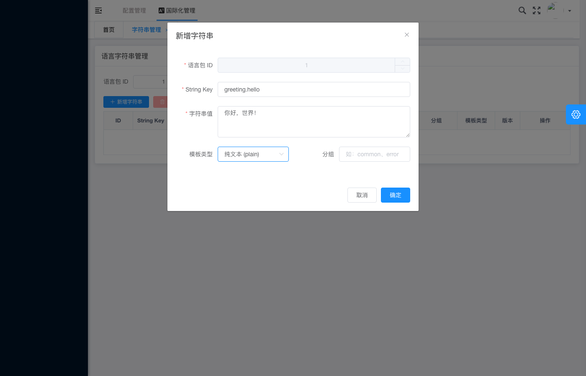

# 国际化管理 - 创建字符串填写完成

## 基本信息

| 项目 | 内容 |
|---|---|
| 测试用例编号 | IA-01 |
| 截图时间 | 2026-05-28T08:31:24 |
| 页面类型 | 新增字符串弹窗 |
| 模块 | 国际化管理（i18n） |

## 页面描述

截图展示了**国际化管理的「新增字符串」弹窗**在表单填写完成后的状态。用户已完整填写所有必填字段，准备提交创建请求。

## 关键元素

### 弹窗信息
- **弹窗标题**：新增字符串
- **关闭按钮**：右上角 × 图标

### 表单字段

| 字段名 | 字段值 | 是否必填 | 状态 |
|---|---|:---:|:---:|
| 语言包 ID | `1` | ✅ 是 | 已填写 |
| String Key | `greeting.hello` | ✅ 是 | 已填写 |
| 字符串值 | `你好，世界！` | ✅ 是 | 已填写 |
| 模板类型 | `纯文本 (plain)` | 否 | 已选择（下拉框） |
| 分组 | `common_erro...` | 否 | 已填写（部分可见） |

### 操作按钮
- **取消**：灰色按钮，位于左下角
- **确定**：蓝色主按钮，位于右下角，处于可点击状态

## 背景页面信息

弹窗背后的主页面为**语言字符串管理**页面：
- 页面标题：语言字符串管理
- 当前 Tab：字符串管理
- 顶部导航：配置管理 > 国际化管理
- 左侧包含语言包 ID 输入框和查询/重置按钮
- 包含「+ 新增字符串」和「批量删除」操作按钮

## 预期行为

1. **表单校验通过**：所有必填字段均已填写，前端校验应无错误提示
2. **提交成功**：点击「确定」按钮后，应调用后端 API 创建字符串记录
3. **关闭弹窗**：创建成功后弹窗自动关闭，返回列表页
4. **列表刷新**：列表页应显示新创建的字符串记录，并展示成功提示消息
5. **数据一致性**：新建记录的各字段值应与表单填写内容一致

## 测试验证要点

- [ ] 语言包 ID 字段支持数字输入
- [ ] String Key 支持点分格式（如 `greeting.hello`）
- [ ] 字符串值支持中文输入
- [ ] 模板类型下拉框默认选中 `plain`
- [ ] 确定按钮在必填项填写完成后可点击
- [ ] 取消按钮可正常关闭弹窗且不提交数据

## 关联截图

