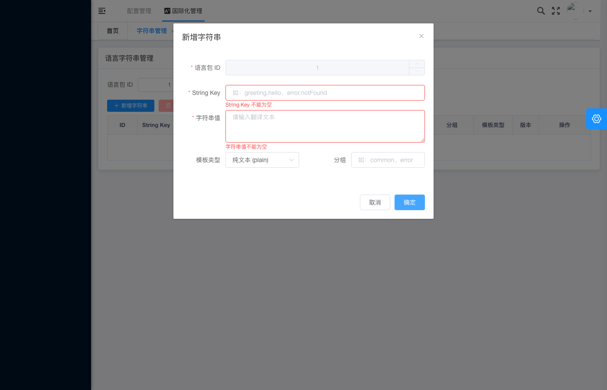

# 国际化管理 - 缺少必填字段校验提示

## 基本信息

| 项目 | 内容 |
|---|---|
| 测试用例编号 | IA-02 |
| 截图时间 | 2026-05-28T08:31:34 |
| 页面类型 | 新增字符串弹窗 - 校验失败状态 |
| 模块 | 国际化管理（i18n） |

## 页面描述

截图展示了**新增字符串表单在前端校验失败时的错误提示状态**。当用户尝试提交缺少必填信息的表单时，系统对未填写的必填字段显示了红色的校验错误提示。

## 关键元素

### 弹窗信息
- **弹窗标题**：新增字符串
- **弹窗状态**：校验错误态（阻止提交）

### 校验错误详情

| 字段名 | 错误状态 | 错误提示文案 |
|---|:---:|---|
| 语言包 ID | 正常（已填 `1`） | 无 |
| String Key | ❌ 红色边框 + 红色文字 | **String Key 不能为空** |
| 字符串值 | ❌ 红色边框 + 红色文字 | **字符串值不能为空** |
| 模板类型 | 正常（已选 `纯文本 (plain)`） | 无 |
| 分组 | 正常 | 无 |

### 字段具体表现

#### String Key 字段
- **输入框边框**：红色高亮边框
- **占位符/提示文字**：如: greeting.hello, error.notFound
- **错误提示**：位于输入框正下方，红色字体「String Key 不能为空」
- **星号标识**：字段标签前有红色 * 号表示必填

#### 字符串值字段
- **输入框边框**：红色高亮边框
- **占位符文字**：请输入翻译文本
- **错误提示**：位于输入框正下方，红色字体「字符串值不能为空」
- **星号标识**：字段标签前有红色 * 号表示必填
- **控件类型**：多行文本域（textarea）

### 操作按钮
- **取消**：灰色按钮，可关闭弹窗
- **确定**：蓝色按钮，但在校验失败时点击应触发校验而非提交

## 预期行为

1. **即时校验**：当用户点击「确定」按钮时，系统应对所有必填字段进行非空校验
2. **错误定位**：校验未通过的字段应以红色边框高亮，并在字段下方显示明确的错误提示文案
3. **阻止提交**：存在校验错误时，不应发送 API 请求到后端
4. **错误清除机制**：
   - 用户修正字段值并满足校验规则后，对应字段的红色边框和错误提示应立即消失
   - 点击取消关闭弹窗后再次打开，错误状态应重置
5. **聚焦引导**：建议自动将焦点定位到第一个校验失败的字段

## 测试验证要点

- [ ] 必填字段标签前显示红色星号 *
- [ ] 未填写的必填字段显示红色边框
- [ ] 错误提示文案清晰明确（"xxx 不能为空"）
- [ ] 错误提示位置紧邻对应字段下方
- [ ] 校验失败时不触发 API 请求
- [ ] 非必填字段（模板类型、分组）无错误提示
- [ ] 已填写的必填字段（语言包ID=1）无错误提示
- [ ] 修正输入后错误提示实时消失

## 校验规则总结

| 字段 | 必填 | 校验规则 | 错误提示 |
|---|:---:|---|---|
| 语言包 ID | ✅ | 非空 + 数字格式 | （截图中已通过） |
| String Key | ✅ | 非空 + 格式校验（点分命名） | String Key 不能为空 |
| 字符串值 | ✅ | 非空 | 字符串值不能为空 |
| 模板类型 | ❌ | 枚举值（plain/named） | 无 |
| 分组 | ❌ | 文本 | 无 |

## 关联截图

