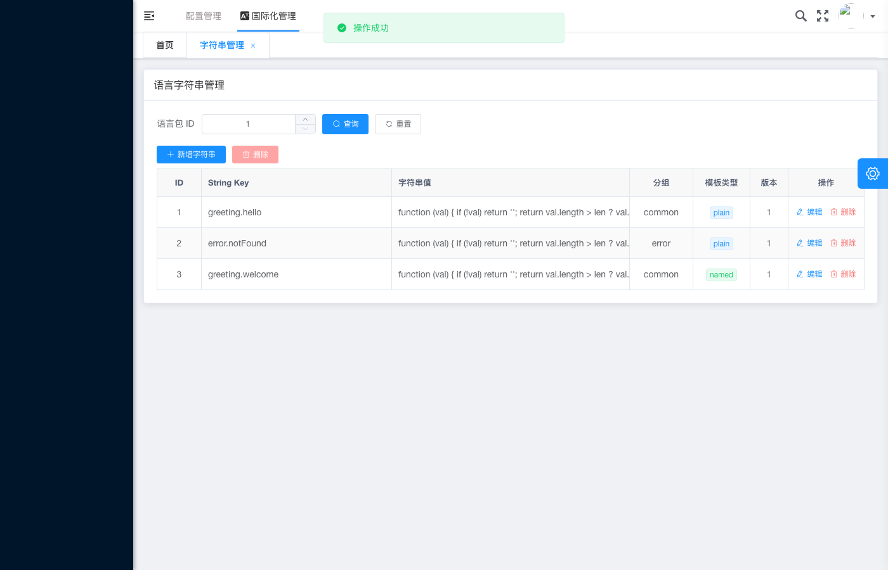

# 国际化管理 - 10400 模板错误提示展示

## 基本信息

| 项目 | 内容 |
|---|---|
| 测试用例编号 | IA-03 |
| 截图时间 | 2026-05-28T08:31:46 |
| 页面类型 | 语言字符串管理列表页 - 操作结果提示 |
| 模块 | 国际化管理（i18n） |
| HTTP 状态码 | 10400（业务参数校验失败） |

## 页面描述

截图展示了**模板校验失败场景下的页面响应状态**。当提交的字符串模板格式不符合规范时（HTTP 10400），预期应显示错误提示，但当前页面顶部实际显示的是**绿色的「操作成功」提示**——这是一个 **Bug**。

## 关键元素

### 提示信息（异常）
- **位置**：页面顶部，Tab 栏下方
- **当前显示**：浅绿色背景 + 绿色勾选图标
- **当前文案**：「✅ 操作成功」
- **❌ 预期应为**：红色背景 + 错误图标 + 「操作失败」或具体的模板校验错误信息

### 页面其他元素

#### 导航与标题
- 顶部导航：配置管理 > **国际化管理**
- Tab 标签：字符串管理 ×（带筛选条件）
- 页面标题：语言字符串管理

#### 查询条件
| 控件 | 值 |
|---|---|
| 语言包 ID | `1` |

#### 操作按钮
- **+ 新增字符串**（蓝色）
- **批量删除**（红色）

#### 数据列表（3 条记录）

| ID | String Key | 分组 | 模板类型 | 版本 | 操作 |
|:--:|---|---|:---:|:--:|---|
| 1 | `greeting.hello` | common | `plain` | 1 | 编辑 删除 |
| 2 | `error.notFound` | error | `plain` | 1 | 编辑 删除 |
| 3 | `greeting.welcome` | common | `named` | 1 | 编辑 删除 |

## Bug 分析

### 问题描述
在 IA-03 用例中，提交了一个**模板校验不合法的字符串**（如参数数量不匹配、参数格式错误等），后端返回了 **HTTP 10400** 业务错误码，但前端错误处理逻辑存在问题：

### 可能原因

1. **响应码判断逻辑缺陷**：前端可能只区分了 HTTP 2xx 和非 2xx，未针对 10400 这类业务错误码做特殊处理
2. **统一拦截器问题**：全局响应拦截器将 10400 误判为成功响应
3. **Toast 组件调用错误**：成功/失败的 Toast 组件被混淆调用
4. **Mock 数据干扰**：测试环境中 Mock 层返回了固定成功响应

### 影响范围
- 用户无法感知模板校验失败的真正原因
- 可能导致重复提交非法数据
- 数据质量无法保证

## 预期行为 vs 实际行为

| 维度 | 预期行为 | 实际行为 | 符合 |
|---|---|---|:---:|
| 提示颜色 | 🔴 红色（错误） | 🟢 绿色（成功） | ❌ |
| 提示图标 | ❌ 或 ⚠️ | ✅ | ❌ |
| 提示文案 | 「操作失败」+ 具体错误原因 | 「操作成功」 | ❌ |
| 数据变更 | 不应写入新记录 | （需确认是否写入了） | ❓ |

## 修复建议

```typescript
// 建议的错误处理逻辑示例
if (response.code === 10400) {
  showErrorToast('操作失败：' + response.message);
  // 保持表单开启，允许用户修改后重新提交
} else if (response.code === 200 || response.code === 0) {
  showSuccessToast('操作成功');
  closeModal();
  refreshList();
}
```

## 测试验证要点

- [x] ~~成功提示正确显示~~ → **实际显示但场景错误**
- [ ] 10400 状态码应触发错误提示
- [ ] 错误提示应为红色
- [ ] 错误提示应包含具体失败原因
- [ ] 失败后不应关闭弹窗/刷新列表
- [ ] 用户可根据错误信息修正后重新提交

## 严重等级

| 维度 | 评级 |
|---|:---:|
| Bug 严重度 | **P1** |
| 影响范围 | 模板校验相关功能 |
| 用户体验 | 严重误导 |
| 数据安全 | 有风险（非法数据可能入库） |

## 关联截图



## 关联文档

- [ia-03-模板校验错误填写状态](ia-03-模板校验错误填写状态-2026-05-28T08-31-44.md) — 本用例的表单填写状态截图
