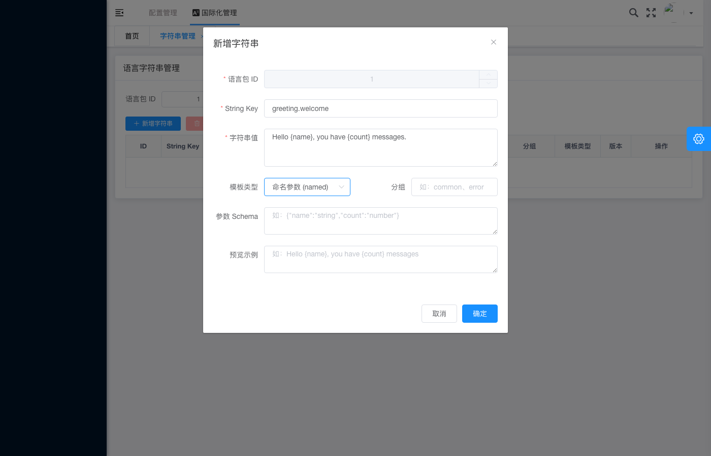

# 国际化管理 - 模板校验错误填写状态

## 基本信息

| 项目 | 内容 |
|---|---|
| 测试用例编号 | IA-03 |
| 截图时间 | 2026-05-28T08-31:44 |
| 页面类型 | 新增字符串弹窗 - 命名参数模板填写 |
| 模块 | 国际化管理（i18n） |
| 模板类型 | named（命名参数） |

## 页面描述

截图展示了**新增字符串弹窗在选择「命名参数 (named)」模板类型时的完整表单状态**。相比纯文本模板，命名参数模板额外展示了参数 Schema 定义和预览示例区域。这是用于测试模板校验功能的填写状态快照。

## 关键元素

### 弹窗信息
- **弹窗标题**：新增字符串
- **弹窗状态**：填写中（所有字段已填写完毕）

### 基础表单字段

| 字段名 | 字段值 | 说明 |
|---|---|---|
| 语言包 ID | `1` | 目标语言包标识 |
| String Key | `greeting.welcome` | 点分格式的字符串唯一标识 |
| 字符串值 | `Hello {name}, you have {count} messages.` | 含命名参数占位符的模板文本 |
| 模板类型 | `命名参数 (named)` | 下拉选择，当前选中 named 类型 |
| 分组 | `common_erro...` | 字符串分组（部分可见） |

### 命名参数模板专属字段

#### 参数 Schema
- **字段标签**：参数 Schema
- **字段值**：`{"name":"string","count":"number"}`
- **说明**：定义了模板中两个参数的类型约束：
  - `name`：string 类型（字符串）
  - `count`：number 类型（数字）

#### 预览示例
- **字段标签**：预览示例
- **字段值**：`Hello {name}, you have {count} messages.`
- **说明**：展示模板的原始格式预览，用于确认参数占位符书写正确

### 操作按钮
- **取消**：灰色按钮
- **确定**：蓝色主按钮（可点击状态）

## 模板类型对比

| 特性 | plain（纯文本） | named（命名参数） |
|---|---|---|
| 参数支持 | 不支持 | 支持 `{param}` 占位符 |
| 参数 Schema 字段 | 不显示 | ✅ 显示 |
| 预览示例字段 | 不显示 | ✅ 显示 |
| 适用场景 | 固定文本 | 动态插值文本 |
| 校验复杂度 | 低（仅非空） | 高（参数匹配 + 类型检查） |

## 预期行为

### 正常提交流程
1. 用户选择模板类型为 `named`
2. 在字符串值中使用 `{paramName}` 格式书写参数占位符
3. 系统自动解析字符串值中的参数，填充参数 Schema 字段
4. 用户确认或手动调整参数 Schema 中的类型定义
5. 预览示例区域同步显示模板原文
6. 点击「确定」提交，后端进行模板合法性校验

### 模板校验规则（预期）
- 参数占位符格式必须为 `{参数名}`
- 字符串值中的每个 `{param}` 都必须在 Schema 中有对应定义
- Schema 中定义的参数类型必须合法（string / number / boolean 等）
- 参数名遵循命名规范（字母开头，允许字母数字下划线）

### 校验失败场景（关联 IA-03-10400）
本截图对应的提交操作触发了 **HTTP 10400** 模板校验失败，可能的失败原因包括：
- 参数 Schema 与字符串值中的实际参数不匹配
- 参数类型定义不合法
- 占位符格式错误（如缺少闭合大括号）

## 测试验证要点

- [ ] 模板类型切换到 `named` 后，参数 Schema 和预览示例字段动态显示
- [ ] 字符串值支持输入含 `{param}` 占位符的文本
- [ ] 参数 Schema 以 JSON 格式展示参数名和类型的映射关系
- [ ] 预览示例与字符串值内容保持一致
- [ ] 所有必填字段填写完成后确定按钮可点击
- [ ] 提交时后端执行模板格式校验
- [ ] 校验失败返回 10400 状态码及具体错误信息

## 技术细节

### 参数 Schema JSON 结构
```json
{
  "name": "string",
  "count": "number"
}
```

### 模板字符串示例
```
Hello {name}, you have {count} messages.
```

### 预期渲染结果（传入参数后）
```
Hello 张三, you have 5 messages.
```

## 关联文档

- [ia-03-10400模板错误提示展示](ia-03-10400模板错误提示展示-2026-05-28T08-31-46.md) — 本表单提交后的结果页面（发现 Bug：错误显示为成功提示）

## 关联截图


