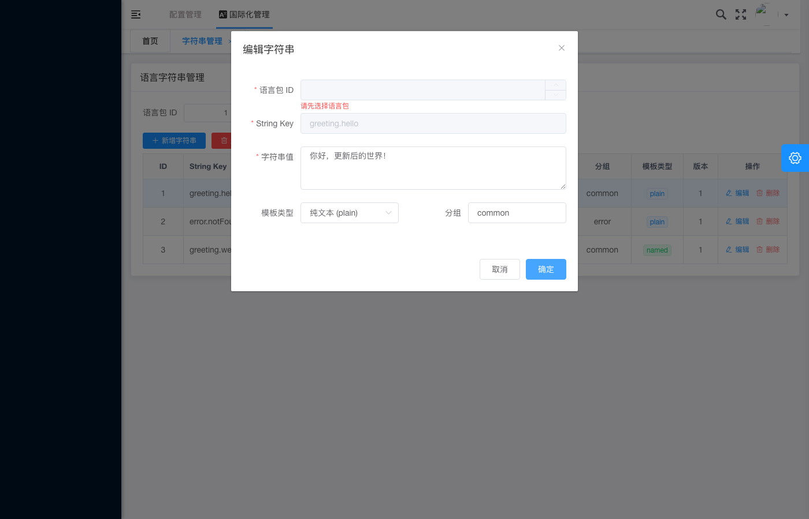

# 国际化管理 - 更新字符串成功后状态

## 基本信息

| 项目 | 内容 |
|---|---|
| 测试用例编号 | IA-04 |
| 截图时间 | 2026-05-28T08-31:54 |
| 页面类型 | 编辑字符串弹窗 |
| 模块 | 国际化管理（i18n） |
| 操作类型 | UPDATE（更新） |

## 页面描述

截图展示了**编辑字符串弹窗在更新操作过程中的状态**。弹窗标题为「编辑字符串」（区别于新增的「新增字符串」），表单中回显了已有数据，字符串值已被修改为新的内容，同时语言包 ID 字段出现了校验错误提示。

## 关键元素

### 弹窗信息
- **弹窗标题**：编辑字符串（🔑 区别于新增场景的「新增字符串」）
- **弹窗模式**：编辑模式（UPDATE）
- **关闭按钮**：右上角 × 图标

### 表单字段详情

| 字段名 | 字段值 | 状态 | 备注 |
|---|---|:---:|---|
| 语言包 ID | *(空)* | ❌ **红色错误** | 显示「请选择语言包」 |
| String Key | `greeting.hello` | ✅ 正常 | 只读/禁用状态（不可修改 Key） |
| 字符串值 | `你好，更新后的世界！` | ✅ 正常 | **已修改为新值** |
| 模板类型 | `纯文本 (plain)` | ✅ 正常 | 下拉选择 |
| 分组 | `common` | ✅ 正常 | 已填写 |

### 校验错误详情

#### 语言包 ID 字段
- **错误样式**：输入框下方显示红色文字
- **错误文案**：**请选择语言包**
- **可能原因**：
  1. 编辑模式下语言包 ID 字段被清空
  2. 编辑接口要求重新确认语言包归属
  3. 该字段在编辑模式下变为必填但未被正确回显原始值
  4. 组件初始化时未正确加载已有数据的语言包 ID

### 操作按钮
- **取消**：灰色按钮
- **确定**：蓝色主按钮

### 背景列表（半透明遮罩下可见）

| ID | String Key | 分组 | 模板类型 | 版本 | 操作 |
|:--:|---|---|:---:|:--:|---|
| 1 | `greeting.hel...` | common | `plain` | 1 | 编辑 删除 |
| 2 | `error.notFo...` | error | `plain` | 1 | 编辑 删除 |
| 3 | `greeting.we...` | common | `named` | 1 | 编辑 删除 |

## 预期行为

### 编辑流程
1. 用户在列表页点击某行记录的「编辑」按钮
2. 弹窗以「编辑字符串」标题打开
3. 表单回显该记录的现有数据（语言包 ID、String Key、字符串值等）
4. **String Key 通常为只读**（避免破坏引用关系）
5. 用户修改需要更新的字段（如字符串值）
6. 点击「确定」提交更新请求

### 当前异常分析
截图中出现**语言包 ID 为空且报错**的情况，属于异常状态：

| 检查点 | 预期 | 实际 | 状态 |
|---|---|---|:---:|
| 弹窗标题 | 「编辑字符串」 | 「编辑字符串」 | ✅ 正确 |
| String Key 回显 | 显示原值 `greeting.hello` | 显示 `greeting.hello` | ✅ 正确 |
| 字符串值回显 | 显示原值 | 显示**新值**「你好，更新后的世界！」 | ✅ 已修改 |
| 语言包 ID 回显 | 显示原值 `1` | **为空** + 报错 | ❌ **异常** |
| 模板类型回显 | 显示原值 `plain` | 显示 `plain` | ✅ 正确 |
| 分组回显 | 显示原值 | 显示 `common` | ✅ 正常 |

### Bug 定位
**语言包 ID 字段在编辑模式下未正确回显原始值**，导致：
- 触发前端必填校验，显示「请选择语言包」错误
- 用户需要手动重新选择语言包才能提交（影响体验）
- 如果用户不注意直接点确定，可能提交错误的语言包归属

## 测试验证要点

- [ ] 弹窗标题正确显示为「编辑字符串」（非「新增字符串」）
- [ ] String Key 字段正确回显且通常为只读
- [ ] 字符串值字段支持编辑并保留新输入值
- [ ] 语言包 ID 应自动回显原始值（当前 **失败**）
- [ ] 模板类型和分组字段正确回显
- [ ] 确认提交后调用 PUT/PATCH 接口（非 POST）
- [ ] 更新成功后列表对应记录刷新为新值

## 修复建议

```typescript
// 编辑弹窗打开时的数据回显逻辑
const openEditDialog = (record: StringRecord) => {
  form.setFieldsValue({
    localePackId: record.localePackId,  // ← 确保此字段被正确赋值
    stringKey: record.stringKey,
    stringValue: record.stringValue,
    templateType: record.templateType,
    group: record.group,
  });
};
```

## 严重等级

| 维度 | 评级 |
|---|:---:|
| Bug 严重度 | **P1** |
| 影响范围 | 编辑字符串功能 |
| 根因推测 | 表单初始化时遗漏语言包 ID 字段的赋值 |
| 用户体验 | 中等（需手动重选，但不阻断流程） |

## 关联截图


