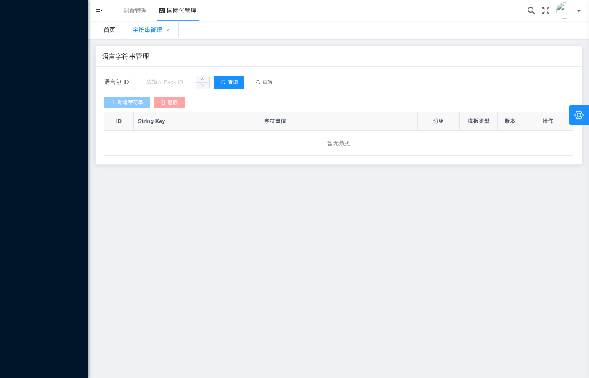

# 国际化管理 - 空 Body 更新场景初始化

## 基本信息

| 项目 | 内容 |
|---|---|
| 测试用例编号 | IA-05 |
| 截图时间 | 2026-05-28T08-31:58 |
| 页面类型 | 语言字符串管理列表页 - 空状态 |
| 模块 | 国际化管理（i18n） |
| 测试场景 | 空 Body / 空查询条件初始化 |

## 页面描述

截图展示了**语言字符串管理页面在无筛选条件和无数据时的初始空状态**。语言包 ID 输入框为空（显示占位符），数据列表区域显示「暂无数据」的空状态提示。这是用于测试边界场景（空 Body 请求、空查询条件）的页面快照。

## 关键元素

### 页面头部

#### 导航区域
- **一级导航**：配置管理
- **二级导航**：**国际化管理**（当前激活，蓝色高亮下划线）
- **Tab 标签**：字符串管理 ×（可关闭标签，表示当前在此 Tab 下）

#### 页面标题
- **标题文字**：语言字符串管理

### 查询条件区域

| 控件 | 当前状态 | 详情 |
|---|---|---|
| 语言包 ID 输入框 | **空** | 占位符文字：「请输入 Pack ID」 |
| 查询按钮 | 可点击 | 蓝色背景 |
| 重置按钮 | 可点击 | 灰色背景，带 ⊙ 图标 |

### 操作按钮区域

| 按钮 | 样式 | 功能 |
|---|---|---|
| + 新增字符串 | 蓝色主按钮 | 打开新增字符串弹窗 |
| 批量删除 | 红色按钮 | 批量删除选中记录（当前无数据时应禁用或隐藏） |

### 数据表格区域

#### 表头列定义
| 列名 | 说明 |
|---|---|
| ID | 记录唯一标识 |
| String Key | 字符串键名 |
| 字符串值 | 翻译文本内容 |
| 分组 | 字符串分组 |
| 模板类型 | plain / named |
| 版本 | 数据版本号 |
| 操作 | 编辑 / 删除 |

#### 空状态展示
- **空状态文案**：「暂无数据」
- **展示位置**：表格主体区域，居中显示
- **样式**：浅灰色文字
- **含义**：当前查询条件下无任何字符串记录

### 右侧浮动按钮
- **位置**：页面右侧中部
- **图标**：齿轮/设置图标（⚙️）
- **颜色**：蓝色圆形按钮
- **功能**：疑似为页面设置或快捷操作入口

## 场景分析

### 触发条件
此空状态可能由以下任一情况触发：

1. **首次进入页面**：用户刚导航至国际化管理模块，尚未输入任何查询条件
2. **语言包 ID 为空**：查询时未指定语言包 ID，后端返回空集合
3. **重置操作后**：用户点击「重置」按钮清空了查询条件
4. **空语言包**：指定的语言包下确实没有任何字符串记录
5. **空 Body 请求测试**：API 测试中发送不带参数的请求

### 与其他截图的对比

| 对比维度 | IA-05（本截图） | IA-01 成功后列表 |
|---|---|---|
| 语言包 ID | **空**（占位符） | `1` |
| 数据条数 | **0 条**（暂无数据） | 3 条 |
| 成功提示 | 无 | 有「操作成功」 |
| 页面状态 | 初始/空状态 | 有数据状态 |

## 预期行为

### 空状态下的交互规范
1. **空状态友好提示**：显示「暂无数据」文案，引导用户下一步操作
2. **新增按钮始终可用**：即使列表为空，「+ 新增字符串」按钮仍应可点击
3. **批量删除按钮状态**：无数据时应为**禁用状态**（避免无效操作）
4. **查询行为**：
   - 空条件下点击「查询」，应请求全量数据或返回空（取决于后端策略）
   - 建议前端在语言包 ID 为空时禁用「查询」按钮或给出提示
5. **重置行为**：点击「重置」应清空语言包 ID 并刷新列表为空状态

### 空 Body 请求的安全考虑
- 前端应在提交查询前校验语言包 ID 是否为空
- 后端应对空/缺失的 languagePackId 参数做防御性处理
- 避免 SQL 注入或全表扫描风险

## 测试验证要点

- [ ] 空状态下页面正常渲染，无 JS 报错
- [ ] 语言包 ID 输入框显示正确的占位符文字
- [ ] 表格区域显示「暂无数据」空状态提示
- [ ] 「+ 新增字符串」按钮在空状态下可用
- [ ] 「批量删除」按钮在空状态下应禁用或隐藏
- [ ] 表头列定义完整显示（ID / String Key / 字符串值 / 分组 / 模板类型 / 版本 / 操作）
- [ ] 空 Body 请求不会导致后端异常
- [ ] 输入有效的语言包 ID 后查询能正常返回数据

## 边界场景清单

| # | 场景 | 预期结果 |
|---|---|---|
| 1 | 首次进入页面 | 显示空状态，语言包 ID 为空 |
| 2 | 输入不存在的语言包 ID | 显示空状态 |
| 3 | 输入非数字的语言包 ID | 前端校验拦截或后端返回错误 |
| 4 | 输入超长字符串作为语言包 ID | 长度校验拦截 |
| 5 | 输入特殊字符 | 特殊字符过滤或转义 |
| 6 | 连续快速点击查询按钮 | 防抖/节流处理，无重复请求 |

## 关联截图

