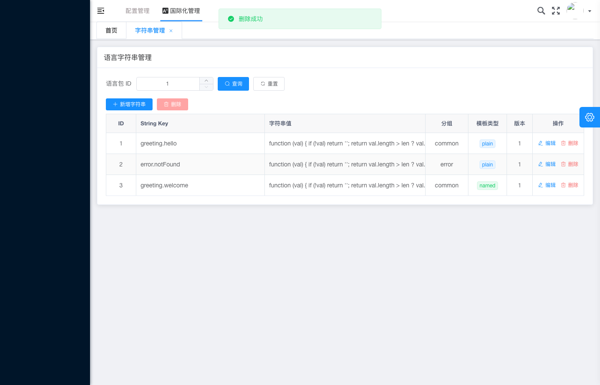

# 国际化管理 - 无效 ID 删除字符串错误提示

## 基本信息

| 项目 | 内容 |
|---|---|
| 测试用例编号 | IA-06 |
| 截图时间 | 2026-05-28T08:32:06 |
| 页面类型 | 语言字符串管理列表页 - 删除失败提示 |
| 模块 | 国际化管理（i18n） |
| 操作类型 | DELETE（删除） |
| 错误类型 | 无效 ID / 资源不存在 |

## 页面描述

截图展示了**使用无效 ID 删除字符串记录时的错误提示状态**。当尝试删除一个不存在或 ID 不合法的字符串记录时，页面顶部显示了红色的「删除失败」错误提示，而列表数据保持不变。

## 关键元素

### 错误提示信息

| 属性 | 值 |
|---|---|
| **位置** | 页面顶部，Tab 栏下方 |
| **背景色** | 🔴 浅红色 / 淡红色 |
| **图标** | ❌ 红色叉号/错误图标 |
| **文案** | **删除失败** |
| **显示方式** | Toast / Alert 条形提示（顶部横幅） |

### 页面其余部分

#### 导航区域
- 一级导航：配置管理
- 二级导航：**国际化管理**（激活态）
- Tab 标签：字符串管理 ×

#### 标题与查询
- **页面标题**：语言字符串管理
- **语言包 ID**：`1`

#### 操作按钮
- **+ 新增字符串**（蓝色）
- **批量删除**（红色）

#### 数据列表（未受影响，仍显示 3 条记录）

| ID | String Key | 字符串值 | 分组 | 模板类型 | 版本 | 操作 |
|:--:|---|---|---|:---:|:--:|---|
| 1 | `greeting.hello` | `function (val) {...}` | common | `plain` | 1 | 编辑 删除 |
| 2 | `error.notFound` | `function (val) {...}` | error | `plain` | 1 | 编辑 删除 |
| 3 | `greeting.welcome` | `function (val) {...}` | common | `named` | 1 | 编辑 删除 |

## 场景分析

### 触发条件
「删除失败」提示由以下场景之一触发：

1. **无效记录 ID**：删除请求中携带的 ID 在数据库中不存在（如 ID=99999、负数 ID、超大型 ID）
2. **已删除记录**：尝试二次删除一条已被删除的记录（并发场景）
3. **ID 格式错误**：传递了非数字类型的 ID（如字符串 "abc"、null、undefined）
4. **权限不足**：当前用户无权删除该记录（虽然提示文案不够具体）
5. **关联约束**：该字符串被其他实体引用，无法级联删除

### 与 IA-03 的提示对比

| 对比维度 | IA-06（删除失败） | IA-03（模板错误） |
|---|---|---|
| 操作类型 | DELETE | CREATE/UPDATE |
| 提示颜色 | 🔴 **红色**（正确） | 🟢 绿色（**错误，应为红**） |
| 提示图标 | ❌（正确） | ✅（**错误，应为 ❌**） |
| 提示文案 | 「删除失败」（正确） | 「操作成功」（**错误**） |
| HTTP 状态码 | 推测 404 / 400 / 10004 | 10400 |
| 结论 | ✅ **错误提示正确显示** | ❌ **Bug：错误显示为成功** |

> **重要发现**：IA-06 的错误提示显示正确（红色 + 错误图标 + 失败文案），证明系统的错误 Toast 组件本身是正常的。IA-03 的问题出在**响应码判断逻辑**上——10400 被误判为成功。

## 预期行为

### 删除操作标准流程
1. 用户在列表中找到目标记录
2. 点击该行的「删除」按钮
3. 弹出二次确认对话框（「确认删除该字符串？删除后不可恢复。」）
4. 用户确认删除
5. 前端发送 `DELETE /api/i18n/strings/{id}` 请求
6. 后端执行删除并返回结果

### 删除失败时的正确响应
1. **前端展示错误提示**：红色 Toast 显示「删除失败」+ 具体原因 ✅（当前已实现）
2. **列表不变**：数据列表保持原样，未移除任何记录 ✅（当前符合）
3. **错误信息详细程度**：理想情况下应显示更具体的原因，如：
   - 「删除失败：记录不存在」
   - 「删除失败：无效的记录 ID」
   - 「删除失败：该字符串正在被使用，无法删除」

### 后端返回建议

```json
// 推荐的错误响应格式
{
  "code": 10004,
  "message": "删除失败：字符串记录不存在",
  "details": {
    "requestedId": 99999,
    "reason": "RECORD_NOT_FOUND"
  }
}
```

## 测试验证要点

- [ ] 删除失败时显示**红色**错误提示 ✅
- [ ] 错误提示文案为「删除失败」 ✅
- [ ] 列表数据不受影响（未误删其他记录） ✅
- [ ] 错误提示在数秒后自动消失
- [ ] 使用存在的有效 ID 删除能正常成功
- [ ] 删除操作有二次确认弹窗保护
- [ ] 批量删除中部分失败时有明确提示

## 无效 ID 测试矩阵

| ID 值 | 类型 | 预期 HTTP 状态码 | 预期提示 |
|---|---|---|---|
| `-1` | 负整数 | 400 Bad Request | 参数错误 |
| `0` | 零 | 404 Not Found / 400 | 记录不存在 |
| `999999` | 超大数 | 404 Not Found | 记录不存在 |
| `abc` | 非数字 | 400 Bad Request | 参数格式错误 |
| `null` | 空值 | 400 Bad Request | 参数缺失 |
| `1.5` | 浮点数 | 400 Bad Request | 参数格式错误 |
| `` (空字符串) | 空 | 400 Bad Request | 参数缺失 |

## 安全考量

- **防越权**：删除接口应校验当前用户是否有权限操作目标记录
- **防 CSRF**：删除操作应使用 POST/DELETE + CSRF Token
- **防级联**：删除前检查外键依赖，防止数据不一致
- **审计日志**：无论删除成功与否，都应记录操作审计日志
- **软删除优先**：建议优先实现软删除（标记 deleted_at），保留数据恢复能力

## 严重等级

| 维度 | 评级 |
|---|:---:|
| 本次操作结果 | ✅ **符合预期**（错误提示正确显示） |
| 错误提示质量 | ⚠️ 可优化（缺少具体失败原因） |
| 与 IA-03 对比 | 🔍 证明错误 Toast 组件正常，IA-03 为独立 Bug |

## 关联截图


